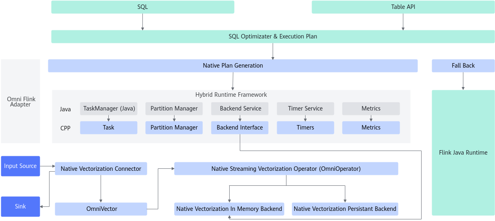
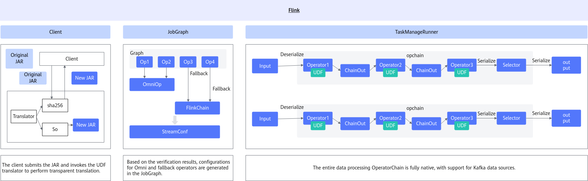
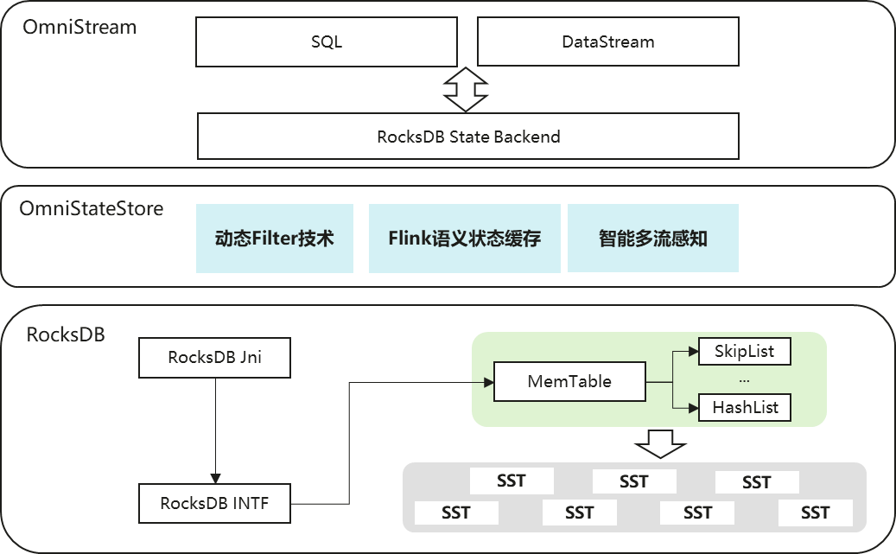

# OmniStream介绍<a name="ZH-CN_TOPIC_0000002549521549"></a>

## 最新消息<a name="ZH-CN_TOPIC_0000002517961774"></a>

- \[2026.03.30\]：发布OmniStream 1.2.0。增加UDF翻译工具所使用依赖的头文件安装内容，在有状态场景下使能OmniStateStore加速特性。
- \[2025.12.30\]：发布OmniStream 1.1.0。在SQL场景中，新增支持task级别算子回退机制；在DataStream场景中，KeyedCoProcess算子支持checkpoint、restore。
- \[2025.06.30\]：发布OmniStream 1.0.0。SQL：实现了Calc、GroupAgg、Join、Deduplicate、Rank、Window、Kafka Source/Sink算子加速；实现了高效数据组织方式OmniVec；实现了对内存和RocksDB状态后端的支持。 DataStream：实现了Kafka Source、Kafka Sink、Map、FlatMap、 Reduce、Filter算子加速；实现了UDF基础框架和UDF翻译基础库，支持UDF自动Native化框架成功运行DataStream Wordcount等有状态和无状态用例；实现了对内存状态后端的支持。


## 项目简介<a name="ZH-CN_TOPIC_0000002517961778"></a>

### 简介<a name="ZH-CN_TOPIC_0000002549641551"></a>

大数据OmniRuntime通过插件化的形式，端到端提升数据加载、数据计算和数据交换的性能，从而提升大数据分析性能。

随着互联网的发展，数据规模出现了爆炸式的增长，需要处理的数据量越来越大，CPU算力的增长远远滞后于数据的增长。大数据开源生态也越来越丰富，但多样化的计算引擎和开源组件也同时带来了全生命周期数据处理性能提升难的问题。不同的大数据引擎采用各自独特的优化策略和技术来提高性能和效率，但有些优化项会在多个引擎中重复应用，可能存在差异或冲突，导致计算性能下降。此外，重复应用相同的优化项可能导致资源竞争和冲突，降低整体计算性能。

大数据OmniRuntime是鲲鹏BoostKit大数据面向应用加速推出的一系列特性，通过插件化的形式，端到端提升数据加载、数据计算和数据交换的性能，从而提升大数据分析的性能。

OmniStream Flink Native化为OmniRuntime的特性之一。OmniStream Flink Native化是一种采用Native Code（C/C++）实现Flink SQL算子来提高查询性能的特性，通过对Flink引擎进行Native化改造，以实现性能的显著提升。

已适配的开源组件及版本为：Flink 1.16.3


### 架构介绍<a name="ZH-CN_TOPIC_0000002549521547"></a>

OmniStream Flink Native化特性通过Native Code（C/C++）重构Flink SQL与DataStream算子逻辑，以提升查询性能。

- 针对SQL，OmniStream采用C++结合向量化指令实现算子，通过向量化加速，提升SQL计算性能。
- 针对DataStream，OmniStream采用C++结合向量化指令实现算子，充分发挥Native Code性能优势，提升DataStream场景性能。

在有状态场景中，OmniStream支持基于Native化架构使能omniStateStore加速特性，通过降低RocksDB访问频次减少磁盘IO，以提升查询性能。

- 针对RocksDBValueState，通过状态缓存在内存中完成状态聚合，减少RocksDB访问频次。
- 针对RocksDBValueState，将memTable的数据结构修改为LinkHashList，提升状态点读点写效率。
- 针对RocksDBMapState，通过前缀filter过滤冗余磁盘查找操作，提升状态范围查询性能。
- 针对各状态类型，通过动态调整不同层级的filter大小过滤冗余磁盘查找操作，提升状态点读性能。

**SQL<a name="zh-cn_topic_0000002543922607_section6310183119441"></a>**

OmniStream Flink Native化特性采用Java适配层（Java Adapter）与C++核心层（CPP Core）双层架构设计。

- Java适配层由Java实现，主要用于生成Native的执行计划和不支持的场景回退Java Runtime。
- 核心层由C++实现，主要是实现各算子逻辑及数据传输等。

SQL/Table API输入的SQL查询首先会经过解析，生成对应的执行计划。Java适配层获取该执行计划并初始化CPP侧相关Task，生成对应的算子链。初始化结束后，Task开始运行，从Source源读取数据，经过一系列算子处理后最终通过Sink输出结果。

OmniStream Flink SQL Native化架构如[图 1](#architecture-of-omnistream-flink-sql-native)所示。<br><br>
**图 1** OmniStream Flink SQL Native化整体架构设计<a name="zh-cn_topic_0000002543922607_zh-cn_topic_0000002228744542_fig685102835814"></a><a id="architecture-of-omnistream-flink-sql-native"></a><br>


**DataStream<a name="zh-cn_topic_0000002543922607_section10781121012457"></a>**

DataStream API接收输入后，会将其解析为执行计划。Java适配层负责解析该计划，并初始化C++侧的相关Task，构建对应的算子链。初始化完成后，Task开始运行，从Source读取数据，经过一系列算子处理，最终通过Sink输出结果。
<br>
OmniStream Flink DataStream Native化架构如[图 2](#architecture-of-omnistream-flink-datastream-native)所示。<br>

**图 2** OmniStream Flink DataStream Native化整体架构设计<a name="zh-cn_topic_0000002543922607_fig918683363812"></a><a id="architecture-of-omnistream-flink-datastream-native"></a><br>


**OmniStateStore<a name="zh-cn_topic_0000002543922607_section10781121012457"></a>**

当omniStream的SQL或DataStream场景使用RocksDB状态后端时，将自动使能omniStateStore加速特性，通过状态聚合、状态过滤等技术降低RocksDB访问频次，减少磁盘IO开销，提升应用端到端吞吐。

OmniStream Flink DataStream Native化架构如[图 3](#architecture-of-omnistream-omniStateStore)所示。<br>

**图 3** OmniStream使能OmniStateStore加速特性整体架构设计<a name="zh-cn_topic_0000002543922607_zh-cn_topic_0000002228744542_fig685102835814"></a><a id="architecture-of-omnistream-omniStateStore"></a><br>

<a href="./figures/architecture-of-omnistream-omniStateStore.png"></a>

## 约束与限制
OmniStream Flink Native化的配置限制包括数据类型、算子支持、状态后端等，请合理规划任务并规避不支持的场景。

**SQL<a name="zh-cn_topic_0000002512242608_section9207153194615"></a>**

- 当前OmniStream Flink Native化版本支持Nexmark用例集，支持Nexmark中的数据类型及内置函数。
- 支持的数据类型：BIGINT、TIMESTAMP\(3\)和VARCHAR。
- 支持的表达式：+ - \* /。
- 支持的内置函数：LOWER、SPLIT\_INDEX、DATE\_FORMAT、MOD和COUNT\_CHAR。
- 支持的GroupAggregate聚合函数类型：SUM\(BIGINT\)、COUNT\(BIGINT\)、AVG \(BIGINT\)、MIN\(BIGINT\)、MIN\(VARCHAR\)、MAX \(BIGINT\)、MAX\(VARCHAR\)。
- Join算子的JoinKey只支持BIGINT类型，操作类型只支持InnerJoin。
- Deduplicate和Rank算子partition by只支持BIGINT类型，查询表的所有字段需要为支持的数据类型，且只支持ROW\_NUMBER函数。Rank的PARTITION BY仅支持一个字段，且类型为BIGINT。TOPN的ORDER BY支持一个字段BIGINT，并且是DESC。TOP1的ORDER BY支持最多两个字段，类型可以是BIGINT TIMESTAMP\(3\)，排序规则可以是DESC，ASC。
- Aggregate算子的group by列只支持BIGINT类型。
- LocalWindowAGG/GlobalWindowAGG算子聚合函数只支持COUNT、MAX函数，GroupWindowAGG算子聚合函数只支持COUNT函数。
- LocalWindowAGG/GlobalWindowAGG算子只支持滚动窗口TUMBLE、滑动窗口HOP。
- GroupWindowAGG算子只支持SESSION会话窗口。
- LookupJoin算子的外部表数据源仅支持CSV文件。
- 状态后端只支持内存和RocksDB。
- Flink会将状态存储在内存状态后端中，内存使用会随时间和处理数据量增长，OmniStream使用列式向量化架构优化性能，状态存储跟原生行为一致，处理速度比原生Flink更快，使用内存增长速度比原生快，提升性能的同时对于空间的需求也增大，因此当前Nexmark基准测试用例输入数据量最大只支持5千万数据。
- SQL场景暂不支持创建Checkpoint/Savepoint快照。
- SQL场景下，若使用KAFKA作为数据源，暂不支持以多并行度模式运行。

**DataStream<a name="zh-cn_topic_0000002512242608_section14862183194614"></a>**

详情请见[DataStream算子和UDF支持情况](zh-cn_topic_0000002512242732.md)。

- Source和Sink目前只支持Kafka数据源。
- 支持的算子有限：Map、FlatMap、GroupReduce、Filter、Source、Sink。
- Filter算子目前只支持RichFilterFunction。
- 仅支持使用RocksDB状态后端的场景下创建Checkpoint/Savepoint快照，相关配置项及命令与社区Flink保持一致。
- 暂不支持将Flink定时器（PriorityQueue）中的数据保存到Checkpoint/Savepoint快照中。

**OmniStateStore<a name="zh-cn_topic_0000002512242608_section14862183194614"></a>**

- 支持的加速特性：Flink语义状态缓存、动态Filter技术、智能多流感知技术。
- 上述加速特性在omniStream中默认开启，暂不支持加速特性关闭功能。

### 应用场景<a name="ZH-CN_TOPIC_0000002549521541"></a>

OmniStream Flink Native化特性协助用户在保持原有开发习惯和架构兼容性的基础上，有效提升Flink引擎的处理性能，特别是在大规模数据实时分析场景中，展现出更强的处理能力与更高的执行效率。

Apache Flink是一个开源的实时流处理引擎，适用于实时数据处理。随着业务的快速发展和数据量的急剧增长，在某些高负载场景下，Flink引擎性能瓶颈逐渐显现，尤其是在互联网场景下，其性能表现与竞品存在一定差距。OmniStream Flink Native化特性采用Native Code（C/C++）实现Flink SQL算子，提升查询执行效率。通过对Flink引擎进行Native化改造，实现性能的提升。

当前OmniStream Flink Native化支持Flink 1.16.3版本。用户提交的SQL语句在执行过程中会被解析为一系列算子，OmniStream Flink Native化特性提供的Native算子将替代原有Flink开源算子，直接执行，从而实现性能的大幅提升。

OmniStream Flink Native化特性协助用户在保持原有开发习惯和架构兼容性的基础上，有效提升Flink引擎的处理性能，特别是在大规模数据实时分析场景中，展现出更强的处理能力与更高的执行效率。
### 相关概念<a name="ZH-CN_TOPIC_0000002518121694"></a>

Nexmark：一个用于评估连续数据流上查询性能的基准套件，为流处理系统提供了公平和全面的性能基准测试，可以指导流系统的优化和性能比较。


## 目录结构<a name="ZH-CN_TOPIC_0000002518121690"></a>

项目全量目录层级如下：

```
├─cpp
│  ├─conf
│  ├─connector
│  ├─core
│  ├─datagen
│  ├─include
│  ├─jni
│  ├─runtime
│  ├─streaming
│  ├─tabler
│  ├─test
│  ├─third_party
│  ├─translate
│  └─zemo
├─docs
├─figures
├─public_sys-resources
├─README.md
├─README_en.md
└─scripts
```


## 版本说明<a name="ZH-CN_TOPIC_0000002549521545"></a>

每个版本的特性变更详细信息，请参见[release_notesy.md](./docs/zh/release_notes.md)


## 环境部署<a name="ZH-CN_TOPIC_0000002518121692"></a>

介绍OmniStream的环境依赖及安装方式，具体请参见[installation_guide.md](./docs/zh/installation_guide.md)


## 快速入门<a name="ZH-CN_TOPIC_0000002517961786"></a>

安装OmniStream后如何快速验证OmniStream是否生效，性能是否提升，具体请参见[quick_start.md](./docs/zh/quick_start.md)


## 学习文档<a name="ZH-CN_TOPIC_0000002549641549"></a>

|名称|路径|简介|
|--|--|--|
|快速入门|[quick_start.md](./docs/zh/quick_start.md)|提供快速使能并验证OmniStream加速能力的快速入门指导。|
|版本说明书|[release_notes.md](./docs/zh/release_notes.md)|提供OmniStream每个发布版本的基础信息和特性更新信息。|
|安装指南|[installation_guide.md](./docs/zh/installation_guide.md)|提供安装OmniStream的详细指导。|
|使用指南|[user_guide.md](./docs/zh/user_guide.md)|提供使用OmniStream的详细指导。|
|最佳实践|[best_practices.md](./docs/zh/best_practices.md)|提供OmniStream的实践案例。|
|常见问题|[faq.md](./docs/zh/faq.md)|提供OmniStream安装、使用过程的常见问题和解决方法。|
|视频课程|OmniRuntime特性大揭秘|提供操作视频，帮助开发者在鲲鹏服务器上了解、使能OmniRuntime特性。|


## 安全声明<a name="ZH-CN_TOPIC_0000002551517383"></a>

### 防病毒软件例行检查<a name="ZH-CN_TOPIC_0000002520637378"></a>

定期开展对集群和Spark组件的防病毒扫描，防病毒例行检查会帮助集群免受病毒、恶意代码、间谍软件以及恶意程序，降低系统瘫痪、信息泄露等风险。建议使用业界主流防病毒软件进行防病毒检查。


### 日志控制<a name="ZH-CN_TOPIC_0000002551637367"></a>

- 检查系统是否可以限制单个日志文件的大小。
- 检查日志空间占满后，是否存在机制进行清理。


### 漏洞修复<a name="ZH-CN_TOPIC_0000002520477388"></a>

为保证生产环境的安全，降低被攻击的风险，请开启防火墙，并定期修复以下漏洞。

- 操作系统漏洞
- JDK漏洞
- Hadoop及Spark漏洞
- ZooKeeper漏洞
- Kerberos漏洞
- OpenSSL漏洞
- 其他相关组件漏洞

    以CVE-2021-37137为例。

    漏洞描述：

    Netty 4.1.17版本存在两个Content-Length的http header可能会发生混淆的风险通告，漏洞编号：CVE-2021-37137。

    本系统使用hdfs-ceph（version 3.2.0）服务作为存算分离的存储对象，它因依赖aws-java-sdk-bundle-1.11.375.jar而涉及该漏洞。建议用户及时更新漏洞补丁进行防护，以免遭受黑客攻击。

    影响范围：

    Netty 4.1.68及以前版本。

    修复建议：

    目前厂商已发布升级补丁以修复漏洞，请参见[Github](https://github.com/netty/netty/security/advisories/GHSA-9vjp-v76f-g363)修复漏洞。


### SSH加固<a name="ZH-CN_TOPIC_0000002551517385"></a>

在部署安装过程中，需要通过SSH连接服务器。由于root用户拥有最高权限，直接使用root用户登录服务器可能会存在安全风险。建议您使用普通用户登录服务器进行安装部署，并建议您通过配置禁止root用户SSH登录的选项，来提升系统安全性。操作步骤：

用户登录系统后检查"/etc/ssh/sshd\_config"配置项"PermitRootLogin"。

- 如果显示no，说明禁止了root用户SSH登录。
- 如果显示yes，说明需要修改PermitRootLogin为no。


### 公网地址声明<a name="ZH-CN_TOPIC_0000002520637380"></a>

**表 1** 公网地址声明<a id="公网地址声明"></a>

<a name="zh-cn_topic_0000002547269015_table5591719574"></a>
<table><tbody><tr id="zh-cn_topic_0000002547269015_row13592819778"><th class="firstcol" valign="top" width="30%" id="mcps1.2.3.1.1"><p id="zh-cn_topic_0000002547269015_p559212199711"><a name="zh-cn_topic_0000002547269015_p559212199711"></a><a name="zh-cn_topic_0000002547269015_p559212199711"></a>开源软件/第三方软件</p>
</th>
<td class="cellrowborder" valign="top" width="70%" headers="mcps1.2.3.1.1 "><p id="zh-cn_topic_0000002547269015_p1259291919710"><a name="zh-cn_topic_0000002547269015_p1259291919710"></a><a name="zh-cn_topic_0000002547269015_p1259291919710"></a>GCC</p>
</td>
</tr>
<tr id="zh-cn_topic_0000002547269015_row959213199719"><th class="firstcol" valign="top" width="30%" id="mcps1.2.3.2.1"><p id="zh-cn_topic_0000002547269015_p25928193714"><a name="zh-cn_topic_0000002547269015_p25928193714"></a><a name="zh-cn_topic_0000002547269015_p25928193714"></a>类型</p>
</th>
<td class="cellrowborder" valign="top" width="70%" headers="mcps1.2.3.2.1 "><p id="zh-cn_topic_0000002547269015_p259214193711"><a name="zh-cn_topic_0000002547269015_p259214193711"></a><a name="zh-cn_topic_0000002547269015_p259214193711"></a>开源软件</p>
</td>
</tr>
<tr id="zh-cn_topic_0000002547269015_row15921819775"><th class="firstcol" valign="top" width="30%" id="mcps1.2.3.3.1"><p id="zh-cn_topic_0000002547269015_p145921119774"><a name="zh-cn_topic_0000002547269015_p145921119774"></a><a name="zh-cn_topic_0000002547269015_p145921119774"></a>公网IP地址/公网URL地址/域名/邮箱地址</p>
</th>
<td class="cellrowborder" valign="top" width="70%" headers="mcps1.2.3.3.1 "><p id="zh-cn_topic_0000002547269015_p8592141918714"><a name="zh-cn_topic_0000002547269015_p8592141918714"></a><a name="zh-cn_topic_0000002547269015_p8592141918714"></a><a href="https://gcc.gnu.org/bugs/" target="_blank" rel="noopener noreferrer">https://gcc.gnu.org/bugs/</a></p>
</td>
</tr>
<tr id="zh-cn_topic_0000002547269015_row559214191971"><th class="firstcol" valign="top" width="30%" id="mcps1.2.3.4.1"><p id="zh-cn_topic_0000002547269015_p1359219191070"><a name="zh-cn_topic_0000002547269015_p1359219191070"></a><a name="zh-cn_topic_0000002547269015_p1359219191070"></a>所在文件类型</p>
</th>
<td class="cellrowborder" valign="top" width="70%" headers="mcps1.2.3.4.1 "><p id="zh-cn_topic_0000002547269015_p1059214191475"><a name="zh-cn_topic_0000002547269015_p1059214191475"></a><a name="zh-cn_topic_0000002547269015_p1059214191475"></a>二进制</p>
</td>
</tr>
<tr id="zh-cn_topic_0000002547269015_row185922197711"><th class="firstcol" valign="top" width="30%" id="mcps1.2.3.5.1"><p id="zh-cn_topic_0000002547269015_p7593619372"><a name="zh-cn_topic_0000002547269015_p7593619372"></a><a name="zh-cn_topic_0000002547269015_p7593619372"></a>文件名</p>
</th>
<td class="cellrowborder" valign="top" width="70%" headers="mcps1.2.3.5.1 "><p id="zh-cn_topic_0000002547269015_p1559317198713"><a name="zh-cn_topic_0000002547269015_p1559317198713"></a><a name="zh-cn_topic_0000002547269015_p1559317198713"></a>libboostkit-omniop-vector-2.0.0-aarch64.so</p>
</td>
</tr>
<tr id="zh-cn_topic_0000002547269015_row0593141917711"><th class="firstcol" valign="top" width="30%" id="mcps1.2.3.6.1"><p id="zh-cn_topic_0000002547269015_p1459319197711"><a name="zh-cn_topic_0000002547269015_p1459319197711"></a><a name="zh-cn_topic_0000002547269015_p1459319197711"></a>用途描述</p>
</th>
<td class="cellrowborder" valign="top" width="70%" headers="mcps1.2.3.6.1 "><p id="zh-cn_topic_0000002547269015_p2059320191370"><a name="zh-cn_topic_0000002547269015_p2059320191370"></a><a name="zh-cn_topic_0000002547269015_p2059320191370"></a>对应的邮箱地址为GCC开源组件官网地址，为编译开源组件时被动引入，产品实际未使用。</p>
</td>
</tr>
<tr id="zh-cn_topic_0000002547269015_row259317197712"><th class="firstcol" valign="top" width="30%" id="mcps1.2.3.7.1"><p id="zh-cn_topic_0000002547269015_p195931919976"><a name="zh-cn_topic_0000002547269015_p195931919976"></a><a name="zh-cn_topic_0000002547269015_p195931919976"></a>软件包</p>
</th>
<td class="cellrowborder" valign="top" width="70%" headers="mcps1.2.3.7.1 "><p id="zh-cn_topic_0000002547269015_p12877016104"><a name="zh-cn_topic_0000002547269015_p12877016104"></a><a name="zh-cn_topic_0000002547269015_p12877016104"></a>BoostKit-omniop_2.0.0.zip</p>
<p id="zh-cn_topic_0000002547269015_p1959311194714"><a name="zh-cn_topic_0000002547269015_p1959311194714"></a><a name="zh-cn_topic_0000002547269015_p1959311194714"></a>boostkit-omniop-operator-2.0.0-aarch64-centos.tar.gz</p>
</td>
</tr>
</tbody>
</table>


## 免责声明<a name="ZH-CN_TOPIC_0000002549641559"></a>

**致OmniStream使用者**

- 本工具仅供调试和开发之用，使用者需自行承担使用风险，并理解以下内容：
    - 数据处理及删除：用户在使用本工具过程中产生的数据属于用户责任范畴。建议用户在使用完毕后及时删除相关数据，以防信息泄露。
    - 数据保密与传播：使用者了解并同意不得将通过本工具产生的数据随意外发或传播。对于由此产生的信息泄露、数据泄露或其他不良后果，本工具及其开发者概不负责。
    - 用户输入安全性：用户需自行保证输入的命令行的安全性，并承担因输入不当而导致的任何安全风险或损失。对于输入命令行不当所导致的问题，本工具及其开发者概不负责。

- 免责声明范围：本免责声明适用于所有使用本工具的个人或实体。使用本工具即表示您同意并接受本声明的内容，并愿意承担因使用该功能而产生的风险和责任，如有异议请停止使用本工具。
- 在使用本工具之前，请**谨慎阅读并理解以上免责声明的内容**。对于使用本工具所产生的任何问题或疑问，请及时联系开发者。

**致数据所有者**

如果您不希望您的模型或数据集等信息在OmniStream中被提及，或希望更新OmniStream中有关的描述，请在GitCode提交issue，我们将根据您的issue要求删除或更新您相关描述。衷心感谢您对OmniStream的理解和贡献。


## License<a name="ZH-CN_TOPIC_0000002518121688"></a>

OmniStream产品的使用许可证，具体请参见[LICENSE](LICENSE)文件。

docs目录下的文档适用CC-BY 4.0许可证，具体请参见[LICENSE](LICENSE)文件。


## 贡献声明<a name="ZH-CN_TOPIC_0000002549521553"></a>

1. 提交错误报告：如果您在OmniStream中发现了一个不存在安全问题的漏洞，请在OmniStream仓库中的Issues中搜索，以防该漏洞被重复提交，如果找不到漏洞可以创建一个新的Issues。如果发现了一个安全问题请不要将其公开，请参阅安全问题处理方式。提交错误报告时应该包含完整信息。
2. 安全问题处理：本项目中对安全问题处理的形式，请通过邮箱通知项目核心人员确认编辑。
3. 解决现有问题：通过查看仓库的Issues列表可以发现需要处理的问题信息，可以尝试解决其中的某个问题。
4. 如何提出新功能：请使用Issues的Feature标签进行标记，我们会定期处理和确认开发。
5. 开始贡献：
    1. Fork本项目的仓库。
    2. Clone到本地。
    3. 创建开发分支。
    4. 本地测试：提交前请通过所有单元测试，包括新增的测试用例。
    5. 提交代码。
    6. 新建Pull Request。
    7. 代码检视：您需要根据评审意见修改代码，并重新提交更新。此流程可能涉及多轮迭代。
    8. 当您的PR获得足够数量的检视者批准后，Committer会进行最终审核。
    9. 审核和测试通过后，CI会将您的PR合并入到项目的主干分支。


## 法律声明<a name="ZH-CN_TOPIC_0000002549521539"></a>


## 建议与交流<a name="ZH-CN_TOPIC_0000002549641561"></a>

欢迎大家为社区做贡献。如果有任何疑问或建议，请提交[Issues](https://gitcode.com/boostkit/omnistream)，我们会尽快回复。感谢您的支持。


## 致谢<a name="ZH-CN_TOPIC_0000002549641563"></a>

OmniStream由华为公司的下列部门联合贡献：

- 鲲鹏计算BoostKit开发部

感谢来自社区的每一个PR，欢迎贡献OmniStream！


