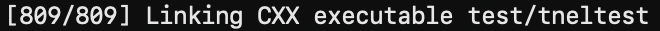

# Build Guide

## Building on openEuler

### Dependencies

| Software | Version |
| --- | --- |
| GCC | 10.3.1 |
| CMake | 3.22.0 |
| JDK | 17.0.18 |
| zlib | 1.2.8 |
| LLVM | 15 |
| googletest | 1.10.0 |
| jemalloc | 5.2.1 |
| nlohmann json | 3.11.3 |
| [libboundscheck](https://gitee.com/openeuler/libboundscheck.git) | V1.1.16 |
| OmniOperator | 20250630 |
| snappy | 1.1.10 |
| [RocksDB](https://gitee.com/mirrors/rocksdb.git) | 8.11.4 |
| BoostKit-kaccjson | 1.1.0 |
| BoostKit-ksl | 2.5.1 |
| [RE2](https://gitee.com/mirrors/re2.git) | 2023-09-01 |
| [xxHash](https://github.com/Cyan4973/xxHash.git) | 0.8.2 |
| [librdkafka](https://gitee.com/mirrors/librdkafka.git) | 2.6.1 |
| OmniRuntime | 1.3.0 |

### Prepare the build environment

The repository provides [build-compile-env-image.sh](../../scripts/build-compile-env-image.sh), based on the [Dockerfile](../../scripts/Dockerfile) and [install-dependencies.sh](../../scripts/install-dependencies.sh), to build a container image containing the dependencies above. Run `bash scripts/build-compile-env-image.sh --help` for usage information.

The following example uses openEuler 22.03 LTS SP4.

1. Build the container image:

    ```bash
    bash scripts/build-compile-env-image.sh openeuler-22.03-lts-sp4 aarch64
    ```

    The build takes approximately one hour, depending on the network and machine. The resulting image is available on the host with the default tag `omnistream-compile-env:openeuler-22.03-lts-sp4-aarch64-<date>`. Replace `<date>` with the build date, for example, `20260909`.

2. Start a container using the image:

    ```bash
    CONTAINER_NAME=omnistream-compile-env
    docker run -itd --name ${CONTAINER_NAME} --hostname ${CONTAINER_NAME} omnistream-compile-env:openeuler-22.03-lts-sp4-aarch64-<date>
    ```

### Build OmniStream

1. Enter the container:

    ```bash
    docker exec -it omnistream-compile-env bash --login
    ```

2. Clone and build OmniStream inside the container:

    ```bash
    mkdir -p /opt/buildtools && cd /opt/buildtools
    git clone https://gitcode.com/openeuler/OmniStream.git
    cd /opt/buildtools/OmniStream
    export HOME=/opt/buildtools
    cmake -S cpp -B cpp/build -G Ninja -DCMAKE_BUILD_TYPE=Release
    cmake --build cpp/build --parallel 32
    ```

Build result:



### Unit tests

After completing the build, run the unit tests:

```bash
cd /opt/buildtools/OmniStream/cpp/build/test
./tneltest
```

Test result:


