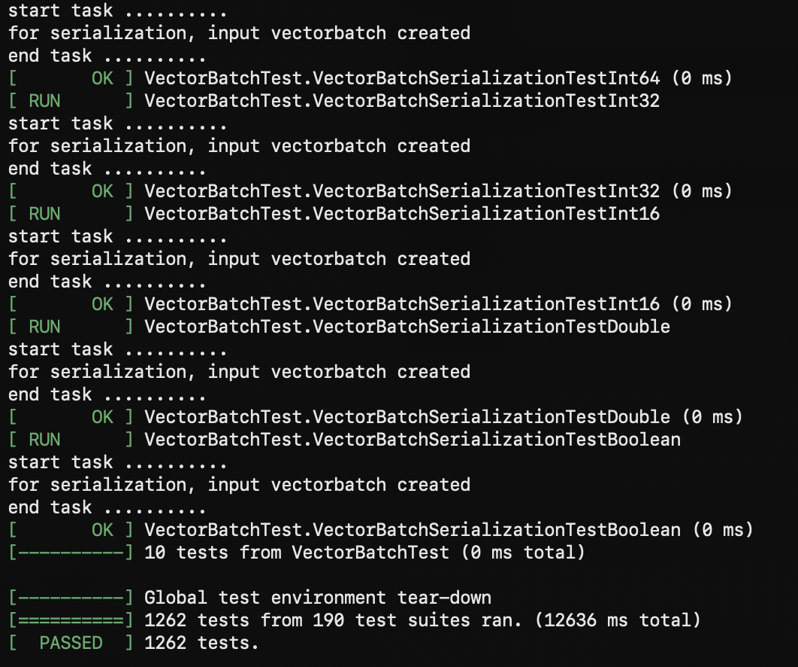

# Compilation Guide

<!-- md-trans-meta sourceCommit=unknown translatedAt=2026-09-23T06:40:09.978Z pushedAt=2026-09-23T06:52:38.716Z -->

## Applicable to OpenEuler OS

### Dependencies

<a name="table12473143919118"></a>
<table><thead align="left"><tr id="row154733396114"><th class="cellrowborder" valign="top" width="50%" id="mcps1.1.3.1.1"><p id="p5473143971116"><a name="p5473143971116"></a><a name="p5473143971116"></a>Software</p></th>
<th class="cellrowborder" valign="top" width="50%" id="mcps1.1.3.1.2"><p id="p1947393921119"><a name="p1947393921119"></a><a name="p1947393921119"></a>Version</p></th>
</tr>
</thead>
<tbody><tr id="row547315397112"><td class="cellrowborder" valign="top" width="50%" headers="mcps1.1.3.1.1 "><p id="p11473139161116"><a name="p11473139161116"></a><a name="p11473139161116"></a>GCC</p></td>
<td class="cellrowborder" valign="top" width="50%" headers="mcps1.1.3.1.2 "><p id="p1447333916113"><a name="p1447333916113"></a><a name="p1447333916113"></a>10.3.1</p></td>
</tr>
<tr id="row19473939121120"><td class="cellrowborder" valign="top" width="50%" headers="mcps1.1.3.1.1 "><p id="p847363915116"><a name="p847363915116"></a><a name="p847363915116"></a>CMake</p></td>
<td class="cellrowborder" valign="top" width="50%" headers="mcps1.1.3.1.2 "><p id="p15473239131119"><a name="p15473239131119"></a><a name="p15473239131119"></a>3.22.0</p></td>
</tr>
<tr id="row9474193915114"><td class="cellrowborder" valign="top" width="50%" headers="mcps1.1.3.1.1 "><p id="p1247463911110"><a name="p1247463911110"></a><a name="p1247463911110"></a>JDK</p></td>
<td class="cellrowborder" valign="top" width="50%" headers="mcps1.1.3.1.2 "><p id="p1347433931113"><a name="p1347433931113"></a><a name="p1347433931113"></a>17.0.18</p></td>
</tr>
<tr id="row647473913118"><td class="cellrowborder" valign="top" width="50%" headers="mcps1.1.3.1.1 "><p id="p3474153914116"><a name="p3474153914116"></a><a name="p3474153914116"></a>zlib</p></td>
<td class="cellrowborder" valign="top" width="50%" headers="mcps1.1.3.1.2 "><p id="p2474143961111"><a name="p2474143961111"></a><a name="p2474143961111"></a>1.2.8</p></td>
</tr>
<tr id="row12474183911120"><td class="cellrowborder" valign="top" width="50%" headers="mcps1.1.3.1.1 "><p id="p19474173917114"><a name="p19474173917114"></a><a name="p19474173917114"></a>LLVM</p></td>
<td class="cellrowborder" valign="top" width="50%" headers="mcps1.1.3.1.2 "><p id="p9474143931119"><a name="p9474143931119"></a><a name="p9474143931119"></a>15</p></td>
</tr>
<tr id="row114741039161113"><td class="cellrowborder" valign="top" width="50%" headers="mcps1.1.3.1.1 "><p id="p447410393119"><a name="p447410393119"></a><a name="p447410393119"></a>GoogleTest</p></td>
<td class="cellrowborder" valign="top" width="50%" headers="mcps1.1.3.1.2 "><p id="p447433981120"><a name="p447433981120"></a><a name="p447433981120"></a>1.10.0</p></td>
</tr>
<tr id="row17474173911111"><td class="cellrowborder" valign="top" width="50%" headers="mcps1.1.3.1.1 "><p id="p104741239191112"><a name="p104741239191112"></a><a name="p104741239191112"></a>jemalloc</p></td>
<td class="cellrowborder" valign="top" width="50%" headers="mcps1.1.3.1.2 "><p id="p18474183919116"><a name="p18474183919116"></a><a name="p18474183919116"></a>5.2.1</p></td>
</tr>
<tr id="row1474163919111"><td class="cellrowborder" valign="top" width="50%" headers="mcps1.1.3.1.1 "><p id="p8474039101118"><a name="p8474039101118"></a><a name="p8474039101118"></a>nlohmann json</p></td>
<td class="cellrowborder" valign="top" width="50%" headers="mcps1.1.3.1.2 "><p id="p3474739121110"><a name="p3474739121110"></a><a name="p3474739121110"></a>3.11.3</p></td>
</tr>
<tr id="row4474639131117"><td class="cellrowborder" valign="top" width="50%" headers="mcps1.1.3.1.1 "><p id="p647453931110"><a name="p647453931110"></a><a name="p647453931110"></a><a href="https://gitee.com/openeuler/libboundscheck.git">libboundscheck</a></p></td>
<td class="cellrowborder" valign="top" width="50%" headers="mcps1.1.3.1.2 "><p id="p147415395116"><a name="p147415395116"></a><a name="p147415395116"></a>1.1.16</p></td>
</tr>
<tr id="row124741539151110"><td class="cellrowborder" valign="top" width="50%" headers="mcps1.1.3.1.1 "><p id="p9474153919114"><a name="p9474153919114"></a><a name="p9474153919114"></a>OmniOperator</p></td>
<td class="cellrowborder" valign="top" width="50%" headers="mcps1.1.3.1.2 "><p id="p18474113921117"><a name="p18474113921117"></a><a name="p18474113921117"></a>20250630</p></td>
</tr>
<tr id="row547413394112"><td class="cellrowborder" valign="top" width="50%" headers="mcps1.1.3.1.1 "><p id="p16474203916115"><a name="p16474203916115"></a><a name="p16474203916115"></a>Snappy</p></td>
<td class="cellrowborder" valign="top" width="50%" headers="mcps1.1.3.1.2 "><p id="p1747443961114"><a name="p1747443961114"></a><a name="p1747443961114"></a>1.1.10</p></td>
</tr>
<tr id="row3474139111116"><td class="cellrowborder" valign="top" width="50%" headers="mcps1.1.3.1.1 "><p id="p94749399115"><a name="p94749399115"></a><a name="p94749399115"></a><a href="https://gitee.com/mirrors/rocksdb.git">RocksDB</a></p></td>
<td class="cellrowborder" valign="top" width="50%" headers="mcps1.1.3.1.2 "><p id="p174741339121113"><a name="p174741339121113"></a><a name="p174741339121113"></a>8.11.4</p></td>
</tr>
<tr id="row154740392119"><td class="cellrowborder" valign="top" width="50%" headers="mcps1.1.3.1.1 "><p id="p104741439191118"><a name="p104741439191118"></a><a name="p104741439191118"></a>BoostKit-kaccjson</p></td>
<td class="cellrowborder" valign="top" width="50%" headers="mcps1.1.3.1.2 "><p id="p1147423916119"><a name="p1147423916119"></a><a name="p1147423916119"></a>1.1.0</p></td>
</tr>
<tr id="row1147418391119"><td class="cellrowborder" valign="top" width="50%" headers="mcps1.1.3.1.1 "><p id="p847513911117"><a name="p847513911117"></a><a name="p847513911117"></a>BoostKit-ksl</p></td>
<td class="cellrowborder" valign="top" width="50%" headers="mcps1.1.3.1.2 "><p id="p64751439141116"><a name="p64751439141116"></a><a name="p64751439141116"></a>2.5.1</p></td>
</tr>
<tr><td><p><a href="https://gitee.com/mirrors/re2.git">RE2</a></p></td><td><p>2023-09-01</p></td></tr>
<tr><td><p><a href="https://github.com/Cyan4973/xxHash.git">xxHash</a></p></td><td><p>0.8.2</p></td></tr>
<tr><td><p><a href="https://gitee.com/mirrors/librdkafka.git">librdkafka</a></p></td><td><p>2.6.1</p></td></tr>
<tr><td><p>OmniRuntime</p></td><td><p>1.3.0</p></td></tr>
</tbody>
</table>

### Setting Up the Compilation Environment

Based on [Dockerfile](../../scripts/Dockerfile) and [install-dependencies.sh](../../scripts/install-dependencies.sh), the in-repository script [build-compile-env-image.sh](../../scripts/build-compile-env-image.sh) can quickly set up a container environment containing all the dependencies mentioned above. For specific usage, run `scripts/build-compile-env-image.sh --help`.

Taking the openEuler 22.03 LTS SP4 OS as an example, the usage is as follows:

1. Run the script to build a container image.

    ```bash
    bash scripts/build-compile-env-image.sh openeuler-22.03-lts-sp4 aarch64
    ```

    After the script finishes executing (which takes about 1 hour), the image is loaded into the host machine. The default image tag is `omnistream-compile-env:openeuler-22.03-lts-sp4-aarch64-<date>`, where `<date>` is the date when the image was built, for example, `20260909`.

2. Start the compilation environment based on the container image.

    ```bash
    CONTAINER_NAME=omnistream-compile-env
    docker run -itd \
      --name ${CONTAINER_NAME} \
      --hostname ${CONTAINER_NAME} \
      omnistream-compile-env:openeuler-22.03-lts-sp4-aarch64-<date>
    ```

### Compiling OmniStream

1. Access the container environment.

    ```bash
    docker exec -it omnistream-compile-env bash --login
    ```

2. Download and compile OmniStream in the container.

    ```bash
    mkdir -p /opt/buildtools && cd /opt/buildtools
    git clone https://gitcode.com/openeuler/OmniStream.git
    cd /opt/buildtools/OmniStream
    export HOME=/opt/buildtools
    cmake -S cpp -B cpp/build -G Ninja -DCMAKE_BUILD_TYPE=Release
    cmake --build cpp/build --parallel 32
    ```

The result is as follows:


### Unit Test

After completing the compilation above, run the unit test:

```bash
cd /opt/buildtools/OmniStream/cpp/build/test
./tneltest
```

The result is as follows:


