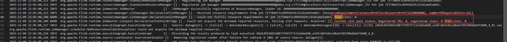
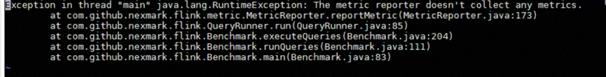

# FAQs

## Exception During Consecutive SQL Task Execution in Nexmark

**Symptom**

- Symptom 1: When the open source Nexmark component is used to continuously submit SQL tasks, executions from two consecutive rounds of SQL tasks may overlap. In this case, the resources occupied by the previous task are not released. Consequently, no resources are available for the next task. The keyword "free slot:0" is recorded in the Job Manager logs and the current task is canceled. As a result, the task fails to be executed.

    

- Symptom 2: There is a possibility that Nexmark fails to capture throughput data because the task is executed too fast. The message "The metric reporter doesn't collect any metrics" is displayed.

    

- Symptom 3: When SQL tasks are continuously submitted and large-state SQL statements \(such as NexMark Q9\) run for an extended period, Java out-of-memory \(OOM\) errors may occur.

    

**Key Process and Cause Analysis**

- Symptom 1: The Nexmark open source software has a logic bug and does not correctly process the release time sequence.
- Symptom 2: The Nexmark open source software has a logic bug, while OmniStream can properly execute SQL tasks.
- Symptom 3: This is a native issue in Flink and is not caused by OmniStream.

**Conclusion and Solution**

- Symptom 1: Submit the task again.
- Symptom 2: Ignore the message and no action is required.
- Symptom 3: Restart the entire Flink cluster and submit the task again.
