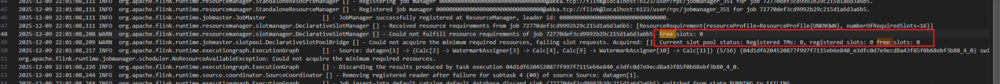
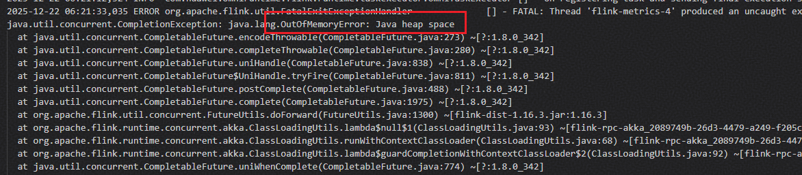

# FAQs<a name="EN-US_TOPIC_0000002549644861"></a>

<!-- md-trans-meta sourceCommit=d6a9adfefba914e1a0f3e2b01f9084be89be68a6 translatedAt=2026-08-27T02:22:47.467Z pushedAt=2026-08-27T02:57:57.187Z -->

## Exception During Consecutive Nexmark SQL Task Execution<a name="EN-US_TOPIC_0000002549644857"></a>

**Symptom<a name="en-us_topic_0000002533267891_section758133012554"></a>**

- Symptom 1: When the open-source Nexmark component is used to continuously submit SQL tasks, executions from two consecutive rounds of SQL tasks may overlap. In this case, the resources occupied by the previous task are not released. Consequently, no resources are available for the next task. The keyword `free slot:0` is recorded in the JobManager logs and the current task is canceled. As a result, the task fails to be executed.

    

- Symptom 2: There is a possibility that Nexmark fails to capture throughput data because the task is executed too fast. The message "The metric reporter doesn't collect any metrics" is displayed.

    

- Symptom 3: When SQL tasks are submitted continuously and large-state SQL such as Nexmark Q9 runs for an extended period, Java out of memory (OOM) errors may occur with a certain probability.

    

**Key Process and Cause Analysis<a name="en-us_topic_0000002533267891_section145813300553"></a>**

- Symptom 1: The Nexmark open-source software has a logic bug and does not correctly process the release time sequence.

- Symptom 2: The Nexmark open-source software has a logic bug, while OmniStream can properly execute SQL tasks.

- Symptom 3: This is a native Flink issue, not caused by OmniStream.

**Conclusion and Solution<a name="en-us_topic_0000002533267891_section93441811202317"></a>**

- Symptom 1: Submit the task again.

- Symptom 2: Ignore the message and no action is required.

- Symptom 3: Restart the entire Flink cluster and submit the task again.

## JVM GC Parameter Loss<a name="ZH-CN_TOPIC_0000002549644857"></a>

**Symptom<a name="zh-cn_topic_0000002533267891_section758133012554"></a>**

After OmniStream is enabled, the original G1GC parameter of the Flink TaskManager is lost, causing a JVM OOM error.

**Key Process and Cause Analysis<a name="zh-cn_topic_0000002533267891_section145813300553"></a>**

When the Flink TaskManager is starting, the system checks for the `JVM_OPTS` environment variable. If this environment variable is not configured, the system creates it and adds the G1GC parameter before the Flink TaskManager starts. Otherwise, the system starts the TaskManager using the configured `JVM_OPTS`. After OmniStream is enabled, `JVM_OPTS` is automatically generated, causing the G1GC parameter to be lost.

**Conclusion and Solution<a name="zh-cn_topic_0000002533267891_section93441811202317"></a>**

Refer to the following command to manually add the TaskManager G1GC parameter to the `flink-conf.yaml` configuration file.

```yaml
env.java.opts.taskmanager: -XX:+UseG1GC
```
