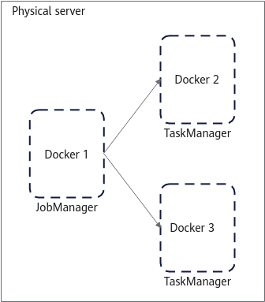
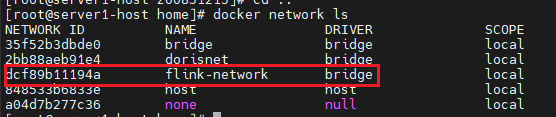
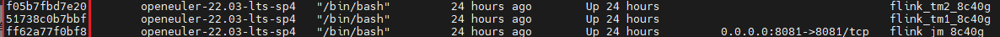
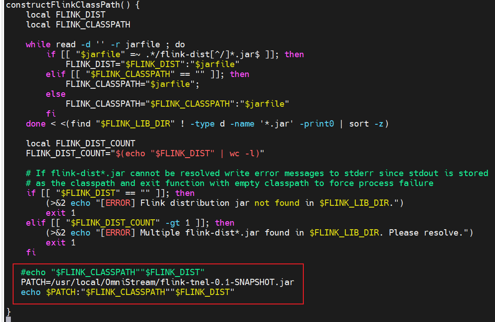

# Installation Guide<a name="EN-US_TOPIC_0000002517504838"></a>

## Installation Overview<a name="EN-US_TOPIC_0000002548944711"></a>

### Network Planning<a name="EN-US_TOPIC_0000002549064701"></a>

OmniStream adopts a single-node, containerized deployment model, running Flink within Docker containers.

A total of three Docker containers are deployed, whose specifications are all 8c32g. One container runs the Job Manager and the other two run the Task Manager.  [Figure 1](#en-us_topic_0000002263664085_fig2900236105214)  shows the networking diagram.

**Figure  1**  Networking diagram<a name="en-us_topic_0000002263664085_fig2900236105214"></a>  <br>


### Environment Requirements<a name="EN-US_TOPIC_0000002517344922"></a>

Before installing OmniStream, prepare the hardware and software environments to facilitate subsequent installation operations.

**Hardware Requirements<a name="en-us_topic_0000002228744546_section7861618121914"></a>**

[**Table  1**  Hardware requirements](#hardware_requirements)  lists the hardware requirements.

**Table  1**  Hardware requirements<a id="hardware_requirements"></a>

|Item|Node|
|--|--|
|Processor|New Kunpeng 920 processor model|
|Memory size|384 GB (12 x 32 GB)|
|Memory frequency|2666MHz|
|Network|Service network: 10GE</br>Management network: 1GE|
|Drive|System drive: 1 x RAID 0 (1 x 1.2 TB SAS HDD)</br>Data drive: 12 x RAID 0 (12 x 8 TB SATA HDD)|
|RAID controller card|LSI SAS3508|


**OS and Software Requirements<a name="en-us_topic_0000002228744546_section412511315357"></a>**

[**Table 2** OS and software requirements](#os_and_software_requirements) lists the OS and software requirements.

**Table 2** OS and software requirements<a id="os_and_software_requirements"></a>

|Item| Version                                                 | Description                                                                                                                                                                                 |
|--|---------------------------------------------------------|---------------------------------------------------------------------------------------------------------------------------------------------------------------------------------------------|
|OS| [openEuler 22.03 LTS SP4](https://dl-cdn.openeuler.openatom.cn/openEuler-22.03-LTS-SP4/ISO/aarch64/openEuler-22.03-LTS-SP4-everything-debug-aarch64-dvd.iso)| None                                                                                                                                                                                        |
|JDK| [BiSheng JDK 1.8 (BiSheng JDK 1.8.0_342 recommended)](https://mirror.iscas.ac.cn/kunpeng/archive/compiler/bisheng_jdk/bisheng-jdk-8u342-linux-aarch64.tar.gz) | Deploy the JDK in all containers.                                                                                                                                                           |
|Flink| [1.16.3](https://archive.apache.org/dist/flink/flink-1.16.3/flink-1.16.3-bin-scala_2.12.tgz)<br>[1.17.1](https://archive.apache.org/dist/flink/flink-1.17.1/flink-1.17.1-bin-scala_2.12.tgz)<br>[1.20.0](https://archive.apache.org/dist/flink/flink-1.20.0/flink-1.20.0-bin-scala_2.12.tgz)                 | See [Flink Deployment Guide (CentOS & openEuler)](https://www.hikunpeng.com/document/detail/en/kunpengbds/ecosystemEnable/Flink/kunpengflink_04_0001.html). Deploy Flink in all containers. |
|Docker| [19.03.15](https://www.hikunpeng.com/document/detail/zh/kunpengbds/appAccelFeatures/sqlqueryaccelf/kunpengbds_omniruntime_20_0911.html)                                            | None                                                                                                                                                                                        |
|Nexmark| [v0.2.0](https://www.hikunpeng.com/document/detail/zh/kunpengbds/appAccelFeatures/sqlqueryaccelf/kunpengbds_omniruntime_20_0914.html)                                              | Perform compilation by following the [official instructions](https://github.com/nexmark/nexmark). Deploy Nexmark in all containers.                                                                                           |
|Python| [3.9.9](https://www.hikunpeng.com/document/detail/zh/kunpengbds/appAccelFeatures/sqlqueryaccelf/kunpengbds_omniruntime_20_0915.html)                                               | Deploy Python on the container or physical machine from which the job is submitted.                                                                                                         |
|yaml-cpp| [0.6.3](https://www.hikunpeng.com/document/detail/zh/kunpengbds/appAccelFeatures/sqlqueryaccelf/kunpengbds_omniruntime_20_0916.html)                                               | Deploy it on the container or physical machine from which the job is submitted.                                                                                                             |
|GCC| [10.3.1](https://repo.openeuler.openatom.cn/openEuler-22.03-LTS-SP4/update/aarch64/Packages/gcc-10.3.1-66.oe2203sp4.aarch64.rpm)                                              | None                                                                                                                                                                                        |
|Maven| [3.8.7](https://archive.apache.org/dist/maven/maven-3/3.8.7/binaries/apache-maven-3.8.7-bin.zip)                                               | Use it to generate the JAR package of UDF test cases.                                                                                                                                       |
|Jemalloc| [5.3.0](https://github.com/jemalloc/jemalloc/archive/refs/tags/5.3.0.tar.gz)                                               | Use it to provide the header file used for UDF translation.                                                                                                                                 |
|OmniOperator| [master](https://atomgit.com/openeuler/OmniOperator/tree/master)                                 | Use it to provide the header file used for UDF translation.                                                                                                                                 |
|Xxhash| [0.8.2](https://github.com/Cyan4973/xxHash/tree/v0.8.2)                                               | Use it to provide the header file used for UDF translation.                                                                                                                                 |
|nlohmann json| [3.11.3](https://github.com/nlohmann/json/tree/v3.11.3)                                              | Use it to provide the header file used for UDF translation.                                                                                                                                 |


**Obtaining the Software Packages<a name="software"></a>**

[**Table  3** OmniStream software packages](#software_packages) describes the OmniStream software packages and how to obtain them.

**Table  3** OmniStream software packages<a id="software_packages"></a>

|Software Name| Package Name                                     |Release Type|Description| How to Obtain                                                                                                                                                                                                                                                        |
|--|--------------------------------------------------|--|--|----------------------------------------------------------------------------------------------------------------------------------------------------------------------------------------------------------------------------------------------------------------------|
|OmniStream package| BoostKit-omniruntime-omnistream-1.2.0.zip        |Open source|OmniStream software installation package.| [Link](https://gitcode.com/openeuler/OmniStream/releases/download/tag_BoostKit_26.0.RC1.B031_001/BoostKit-omniruntime-omnistream-1.2.0.zip)                                                                                                                              |
|UDF translator| UNT-1.0-35.noarch.rpm                            |Open source|UDF translator RPM package. After the installation is complete, the UDF translator is added to the /opt directory.| [Link](https://eur.openeuler.openatom.cn/results/cutie-deng/UNT/openeuler-22.03_LTS_SP4-aarch64/00110412-UNT/UNT-1.0-35.noarch.rpm)                                                                                                                                  |
|AI4C| AI4C-1.0.4-8.aarch64.rpm                         |Open source|A framework that allows the compiler to integrate machine learning–driven optimization technologies. Install the RPM package.| [Link](https://gitee.com/kunpengcompute/boostkit-bigdata/releases/download/25.1.RC1-OmniStream-release/AI4C-1.0.4-8.aarch64.rpm)                                                                                                                                     |
|KACC_JSON| BoostKit-kaccjson_1.1.0.zip                      |Closed source|Self-developed C++ implementation package used to replace GSON in UDF translation. This ZIP package contains the adaptation layer and KACC_JSON implementation, and also contains header files and a static library. Obtain the **Dependency_library_OmniStream.zip** file and decompress it.| [Link](https://gitcode.com/openeuler/OmniStream/releases/download/tag_BoostKit_26.0.RC1.B031_001/Dependency_library_OmniStream.zip)                                                                                                                                      |
|KSL| BoostKit-ksl_2.5.1.zip                           |Closed source|Regular expression acceleration library, which contains the ReplaceAll function for optimizing the basic string library and contains header files and a static library.| [Contact Huawei technical support.](https://www.hikunpeng.com/boostkit/library/system?subtab=Hyperscan&version=2.5.1)                                                                                                                                                |
|Dependency Library| Dependency_library_Default |Open source|Library file on which OmniStream depends. Obtain the **Dependency_library_OmniStream.zip** file and decompress it. | [Link 1](https://gitcode.com/openeuler/OmniStream/releases/download/tag_BoostKit_26.0.RC1.B031_001/Dependency_library_OmniStream.zip)|


**Verifying the Software Package Integrity<a name="en-us_topic_0000002228744546_section156811729327"></a>**

After downloading a software package from the Kunpeng community, verify the software package to ensure that it is consistent with the original one on the website.

Verify a software package as follows:

1. Obtain the digital certificate and software.
2. Obtain the  [verification tool and guide](https://support.huawei.com/enterprise/en/tool/pgp-verify-TL1000000054).
3. Verify the package integrity by following the procedure described in the  _OpenPGP Signature Verification Guide_  obtained from the URL.


## Installing the Feature<a name="EN-US_TOPIC_0000002549064703"></a>

### Installing the Basic Environment<a name="EN-US_TOPIC_0000002549064713"></a>

#### Installing Docker<a name="EN-US_TOPIC_0000002549064717"></a>

Install Docker and deploy multiple containers to set up the Flink environment. If the server cannot connect to the Internet, configure a local yum repository according to your environment to ensure a smooth installation.

1. Install Docker and import the basic image. For details, see  [Docker Installation Guide \(CentOS & openEuler\) ](https://www.hikunpeng.com/document/detail/en/kunpengcpfs/ecosystemEnable/Docker/kunpengdocker_03_0001.html).

    ```bash
    cd /opt
    wget --no-check-certificate https://mirrors.huaweicloud.com/openeuler/openEuler-22.03-LTS-SP4/docker_img/aarch64/openEuler-docker.aarch64.tar.xz
    docker load < openEuler-docker.aarch64.tar.xz
    ```

2. Create a network in bridge mode.

    ```bash
    docker network create -d bridge flink-network
    ```

    Check whether the network is created successfully.

    ```bash
    docker network ls
    ```

    

3. Create and start three Docker containers.

    The containers have the 8c32g specification, and are named  **flink\_jm\_8c32g**,  **flink\_tm1\_8c32g**, and  **flink\_tm2\_8c32g**. After all containers are started, the command execution process automatically exits.

    ```bash
    docker run -it -d --name flink_jm_8c32g --cpus=8 --memory=32g --network flink-network openeuler-22.03-lts-sp4 /bin/bash 
    docker run -it -d --name flink_tm1_8c32g --cpus=8 --memory=32g --network flink-network openeuler-22.03-lts-sp4 /bin/bash 
    docker run -it -d --name flink_tm2_8c32g --cpus=8 --memory=32g --network flink-network openeuler-22.03-lts-sp4 /bin/bash 
    ```

4. Query the container IDs.

    ```bash
    docker ps
    ```

    The first column in the following figure shows the container IDs.

    

5. Log in to all containers, enable the SSH service in the containers, and configure password-free login.
    1. Log in to the containers in sequence and perform  [5.b](#en-us_topic_0000002228584730_li791415596401)  to  [5.g](#li1581214912220).

        ```bash
        docker exec -it flink_jm_8c32g /bin/bash
        docker exec -it flink_tm1_8c32g /bin/bash
        docker exec -it flink_tm2_8c32g /bin/bash
        ```

    2. <a name="en-us_topic_0000002228584730_li791415596401"></a>Install the SSH service dependency, password change dependency, command editing dependency, command search dependency, and network management dependency. If other dependencies are missing in the image, install them by yourself.

        ```bash
        yum -y install openssh-clients openssh-server passwd vim findutils net-tools libXext libXrender gcc cmake make gcc-c++ unzip wget libXtst
        ```

    3. Generate an RSA key.

        ```bash
        ssh-keygen -A
        ```

    4. Enable the SSH service in the container.

        ```bash
        /usr/sbin/sshd -D &
        ```

    5. Set a password for the container.

        ```bash
        # Set the password of the current user. Remember the password.
        passwd
        ```

    6. Generate an RSA key again. When a message is displayed, press  **Enter**.

        ```bash
        ssh-keygen -t rsa
        ```

    7. <a name="li1581214912220"></a>Exit the container.

        ```bash
        exit
        ```

    8. On the  **flink\_jm\_8c32g**  container, enable SSH password-free login to other containers.

        ```bash
        docker exec -it flink_jm_8c32g /bin/bash
        ssh-copy-id -i ~/.ssh/id_rsa.pub root@flink_tm1_8c32g
        ssh-copy-id -i ~/.ssh/id_rsa.pub root@flink_tm2_8c32g
        ```

#### Installing the JDK<a name="EN-US_TOPIC_0000002517344928"></a>

Install and configure the BiSheng JDK to provide a runtime environment for the Flink cluster.

1. Go to the  **/usr/local**  path on the physical machine and download the  **bisheng-jdk-8u342-linux-aarch64.tar.gz**  file.

    ```bash
    cd /usr/local
    wget --no-check-certificate https://mirror.iscas.ac.cn/kunpeng/archive/compiler/bisheng_jdk/bisheng-jdk-8u342-linux-aarch64.tar.gz
    ```

2. Extract  **bisheng-jdk-8u342-linux-aarch64.tar.gz**  in the  **/usr/local**  path and change the owner and owner group of the extracted JDK directory to  **root**.

    ```bash
    tar -zxvf bisheng-jdk-8u342-linux-aarch64.tar.gz
    chown -R root /usr/local/bisheng-jdk1.8.0_342
    chgrp -R root /usr/local/bisheng-jdk1.8.0_342
    ```

#### Installing Flink<a name="EN-US_TOPIC_0000002517504826"></a>

Deploy and configure Flink on physical machines to run in multiple Docker containers, allowing Flink jobs to be submitted and executed.

1. Go to the  **/usr/local**  directory on the physical machine and download the Flink software package.

    ```bash
    cd /usr/local
    wget --no-check-certificate https://archive.apache.org/dist/flink/flink-1.16.3/flink-1.16.3-bin-scala_2.12.tgz
    ```

    > **NOTE:** 
    >**flink-1.16.3-bin-scala\_2.12.tgz**  is an example of the Flink software package name. If you are using a different Flink version, replace the example with the actual package name.

2. Extract the  **flink-1.16.3-bin-scala\_2.12.tgz**  package in the  **/usr/local**  path and create a soft link for later version replacement.

    ```bash
    tar -zxvf flink-1.16.3-bin-scala_2.12.tgz
    chown -R root:root flink-1.16.3
    ln -s flink-1.16.3 flink
    ```

    > **NOTE:** 
    >**flink-1.16.3**  is an example of the Flink software directory. If you are using a different Flink version, replace the example with the actual directory.

3. Configure the  **masters**  and  **workers**  files of Flink.
    1. Open the  **/usr/local/flink/conf/masters**  file.

        ```bash
        vi /usr/local/flink/conf/masters
        ```

    2. Press  **i**  to enter the insert mode and change the content of  **masters**  to the  **flink\_jm\_8c32g**  container ID  **8081**. For example:

        ```bash
        4a376b30106b:8081
        ```

    3. Press  **Esc**, type  **:wq!**, and press  **Enter**  to save the file and exit.
    4. Open the  **/usr/local/flink/conf/workers**  file.

        ```bash
        vi /usr/local/flink/conf/workers
        ```

    5. Press  **i**  to enter the insert mode, and change the content of  **workers**  to the IDs of the  **flink\_tm1\_8c32g**  and  **flink\_tm2\_8c32g**  containers. For example, configure four TaskManagers for each of two Docker containers.

        ```bash
        c3ddf10d0353
        c3ddf10d0353
        c3ddf10d0353
        c3ddf10d0353
        c3bbdbcc1ae1
        c3bbdbcc1ae1
        c3bbdbcc1ae1
        c3bbdbcc1ae1
        ```

    6. Press  **Esc**, type  **:wq!**, and press  **Enter**  to save the file and exit.
    7. Open the  **/usr/local/flink/conf/flink-conf.yaml**  file.

        ```bash
        vi /usr/local/flink/conf/flink-conf.yaml
        ```

    8. Press  **i**  to enter the insert mode, replace the configuration with the following, and change the value of  **jobmanager.rpc.address**  to the ID of the  **flink\_jm\_8c32g**  container ID. It is recommended that the total number of slots be greater than the degree of parallelism. For example:

        ```bash
        taskmanager.memory.process.size: 8G
        jobmanager.rpc.address: 4a376b30106b
        jobmanager.rpc.port: 6123
        jobmanager.memory.process.size: 8G
        taskmanager.memory.process.size: 8G
        taskmanager.numberOfTaskSlots: 2
        parallelism.default: 16
        rest.port: 8081
        rest.bind-port: 8081
        io.tmp.dirs: /tmp
        #pipeline.operator-chaining: true
        #execution:runtime-mode: STREAMING
        #jobmanager.execution.failover-strategy: region
        #table.optimizer.agg-phase-strategy: ONE_PHASE
        #pipeline.object-reuse: true
        #==============================================================================
        # JVM
        #==============================================================================
        # JVM options for GC
        #env.java.opts: -verbose:gc -XX:NewRatio=3 -XX:+PrintGCDetails -XX:+PrintGCDateStamps -XX:ParallelGCThreads=4
        ```

    9. Press  **Esc**, type  **:wq!**, and press  **Enter**  to save the file and exit.

#### Installing Nexmark<a name="EN-US_TOPIC_0000002549064707"></a>

Install and configure Nexmark to verify and test Flink.

1. Download  **nexmark-flink.tgz**  to the  **/opt**  directory on the physical machine and extract it.

    ```bash
    cd /opt
    wget --no-check-certificate https://github.com/nexmark/nexmark/releases/download/v0.2.0/nexmark-flink.tgz
    tar xzf nexmark-flink.tgz
    mv nexmark-flink nexmark
    chown -R root:root nexmark
    ```

2. Modify the Nexmark configuration file  **/opt/nexmark/conf/nexmark.yaml**.
    1. Open the file.

        ```bash
        vi /opt/nexmark/conf/nexmark.yaml
        ```

    2. Press  **i**  to enter the insert mode and modify the file as follows: Change the value of  **nexmark.metric.reporter.host**  to the ID of the  **flink\_jm\_8c32g**  container.

        ```bash
        ################################################################################
        #  Licensed to the Apache Software Foundation (ASF) under one
        #  or more contributor license agreements.  See the NOTICE file
        #  distributed with this work for additional information
        #  regarding copyright ownership.  The ASF licenses this file
        #  to you under the Apache License, Version 2.0 (the
        #  "License"); you may not use this file except in compliance
        #  with the License.  You may obtain a copy of the License at
        #
        #      http://www.apache.org/licenses/LICENSE-2.0
        #
        #  Unless required by applicable law or agreed to in writing, software
        #  distributed under the License is distributed on an "AS IS" BASIS,
        #  WITHOUT WARRANTIES OR CONDITIONS OF ANY KIND, either express or implied.
        #  See the License for the specific language governing permissions and
        # limitations under the License.
        ################################################################################
        
        #==============================================================================
        # Rest & web frontend
        #==============================================================================
        
        # The metric reporter server host.
        nexmark.metric.reporter.host: 4a376b30106b
        # The metric reporter server port.
        nexmark.metric.reporter.port: 9098
        
        #==============================================================================
        # Benchmark workload configuration (events.num)
        #==============================================================================
        
        nexmark.workload.suite.100m.events.num: 50000000
        nexmark.workload.suite.100m.tps: 10000000
        nexmark.workload.suite.100m.queries: "q0,q1,q2,q3,q4,q5,q7,q8,q9,q10,q11,q12,q13,q14,q15,q16,q17,q18,q19,q20,q21,q22"
        nexmark.workload.suite.100m.queries.cep: "q0,q1,q2,q3"
        nexmark.workload.suite.100m.warmup.duration: 120s
        nexmark.workload.suite.100m.warmup.events.num: 50000000
        nexmark.workload.suite.100m.warmup.tps: 10000000
        
        #==============================================================================
        # Benchmark workload configuration (tps, legacy mode)
        # Without events.num and with monitor.duration
        # NOTE: The numerical value of TPS is unstable
        #==============================================================================
        
        # When to monitor the metrics, default 3min after job is started
        # nexmark.metric.monitor.delay: 3min
        # How long to monitor the metrics, default 3min, i.e. monitor from 3min to 6min after job is started
        # nexmark.metric.monitor.duration: 3min
        
        # nexmark.workload.suite.10m.tps: 10000000
        # nexmark.workload.suite.10m.queries: "q0,q1,q2,q3,q4,q5,q7,q8,q9,q10,q11,q12,q13,q14,q15,q16,q17,q18,q19,q20,q21,q22"
        
        #==============================================================================
        # Workload for data generation
        #==============================================================================
        
        nexmark.workload.suite.datagen.tps: 1000000
        nexmark.workload.suite.datagen.queries: "insert_kafka"
        nexmark.workload.suite.datagen.queries.cep: "insert_kafka"
        
        #==============================================================================
        # Flink REST
        #==============================================================================
        
        flink.rest.address: 4a376b30106b
        flink.rest.port: 8081
        
        #==============================================================================
        # Kafka config
        #==============================================================================
        
        # kafka.bootstrap.servers: ***:9092
        ```

    3. Press  **Esc**, type  **:wq!**, and press  **Enter**  to save the file and exit.

#### Installing Python<a name="EN-US_TOPIC_0000002517344926"></a>

Install the Python RPM package in the  **flink\_jm\_8c32g**  container.

```bash
wget --no-check-certificate https://repo.openeuler.org/openEuler-preview/openEuler-22.03-LTS-SP4-HP-preview/OS/aarch64/Packages/python3-setuptools-59.4.0-5.oe2203sp4.noarch.rpm
rpm -ivh python3-setuptools-59.4.0-5.oe2203sp4.noarch.rpm
rm -rf /usr/bin/python
ln -s /usr/bin/python3 /usr/bin/python
```


#### Installing yaml-cpp<a name="EN-US_TOPIC_0000002548944719"></a>

Install the yaml-cpp RPM package in the  **flink\_jm\_8c32g**  container.

```bash
wget --no-check-certificate https://repo.openeuler.org/openEuler-preview/openEuler-22.03-LTS-SP4-HP-preview/OS/aarch64/Packages/yaml-cpp-0.6.3-2.oe2203sp4.aarch64.rpm
rpm -ivh yaml-cpp-0.6.3-2.oe2203sp4.aarch64.rpm
```


#### Installing Necessary Dependencies<a name="EN-US_TOPIC_0000002517344930"></a>

Install other software packages on which the feature depends.

1. Install the JSON dependency package on the physical machine.

    ```bash
    wget -P /usr/local/flink/lib/ https://repo.maven.apache.org/maven2/org/json/json/20240303/json-20240303.jar
    ```

2. Install the Gson dependency package on the physical machine.

    ```bash
    wget -P /usr/local/flink/lib/ https://repo.maven.apache.org/maven2/com/google/code/gson/gson/2.11.0/gson-2.11.0.jar
    ```

3. Install other dependency packages.
    1. Obtain the dependency packages  **Dependency_library_OmniStream.zip** obtained from  [**Table  3** OmniStream software packages](#software_packages)  and extract it to the  **/opt**  directory.

        ```bash
        unzip Dependency_library_OmniStream.zip -d /opt
        cp /opt/Dependency_library_Default /opt/Dependency_library  
        chmod -R 550 /opt/Dependency_library/*
        ```

    2. Obtain  **nexmark-flink-0.3-SNAPSHOT.jar**  from  **Dependency\_library**, copy it to the  **flink/lib**  directory, and use it to replace  **nexmark-flink-0.2-SNAPSHOT.jar**  in  **nexmark/lib**.

        ```bash
        cp /opt/Dependency_library/nexmark-flink-0.3-SNAPSHOT.jar /usr/local/flink/lib
        rm -rf /opt/nexmark/lib/nexmark-flink-0.2-SNAPSHOT.jar
        cp /opt/Dependency_library/nexmark-flink-0.3-SNAPSHOT.jar /opt/nexmark/lib/
        ```

        After the preceding operations are complete, the  **flink/lib**  directory is scanned and the dependency package is loaded automatically during Flink startup. No additional installation commands are required.


### Installing OmniStream<a name="EN-US_TOPIC_0000002549064711"></a>

In independent deployment mode, you can install the precompiled OmniStream binary package and integrate it into Flink as a plugin.

1. Create the  **/usr/local/OmniStream**  directory on the physical machine to store OmniStream binary files.

    Extract the  **BoostKit-omniruntime-omnistream-1.2.0.zip**  installation package obtained from  [**Table  3** OmniStream software packages](#software_packages)  to the  **/usr/local/OmniStream**  directory.

    ```bash
    unzip BoostKit-omniruntime-omnistream-1.2.0.zip
    mkdir -p /usr/local/OmniStream
    cp -r OmniStream_Default/* /usr/local/OmniStream/
    chmod -R 550 /usr/local/OmniStream/*
    ```

2. <a name="en-us_topic_0000002263584129_li146334222212"></a>Check the extracted files.

    ```bash
    ls
    ```

    After the binary package is extracted, the JAR package, SO files, basic library, and  **include**  directory are obtained.

    ```bash
    flink-tnel-0.1-SNAPSHOT.jar
    libtnel.so
    libboundscheck.so
    libboostkit-omniop-codegen-2.1.0-aarch64.so
    libboostkit-omniop-operator-2.1.0-aarch64.so
    libboostkit-omniop-vector-2.1.0-aarch64.so
    libre2.so.11
    libbasictypes
    include
    ```

3. Edit the Flink configuration file  **/usr/local/flink/bin/config.sh**.
    1. Open the file.

        ```bash
        vi /usr/local/flink/bin/config.sh
        ```

    2. Press  **i**  to enter the insert mode, find the  **constructFlinkClassPath\(\)**  function, comment out the  **echo**  line, and add a new  **PATCH**  path.

        ```bash
        # echo "$FLINK_CLASSPATH""$FLINK_DIST"
        PATCH=/usr/local/OmniStream/flink-tnel-0.1-SNAPSHOT.jar
        echo $PATCH:"$FLINK_CLASSPATH""$FLINK_DIST"
        ```

        The updated configuration file is as follows:

        

    3. Press  **Esc**, type  **:wq!**, and press  **Enter**  to save the file and exit.

4. Edit the Flink configuration file  **/usr/local/flink/conf/flink-conf.yaml**.
    1. Open the file.

        ```bash
        vi /usr/local/flink/conf/flink-conf.yaml
        ```

    2. Press  **i**  to enter the insert mode. In  **env.java.opts**, add the  **libtnel.so**  file path, that is, the path to the  **.so**  files extracted in  [2](#en-us_topic_0000002263584129_li146334222212).

        ```bash
        env.java.opts: -Djava.library.path=/usr/local/OmniStream/
        ```

    3. Press  **Esc**, type  **:wq!**, and press  **Enter**  to save the file and exit.

### Installing the UDF Translator<a name="EN-US_TOPIC_0000002517504824"></a>

**Installing the UDF Translator RPM Package<a name="section5466185845817"></a>**

1. Obtain the UDF translator RPM package from [**Table  3** OmniStream software packages](#software_packages) and upload it to the  **/opt**  directory on the physical machine.
2. Install the RPM package in the  **flink\_jm\_8c32g**  container. The default installation path is  **/opt**.

    ```bash
    rpm -ivh UNT-1.0-35.noarch.rpm
    ```

    After the command is executed, the  **/opt/udf-trans-opt**  directory is automatically created.

    > **NOTE:** 
    >If the  **/opt/udf-trans-opt**  directory is not created, run the following command to manually create it:
    >```bash
    >mkdir /opt/udf-trans-opt
    >```

3. Copy the basic library directory installed in  [Installing OmniStream](#installing-omnistream)  to the  **/opt/udf-trans-opt**  directory.

    ```bash
    docker cp /usr/local/OmniStream/libbasictypes flink_jm_8c32g:/opt/udf-trans-opt
    ```

**Installing UDF Dependencies<a name="section1041811513598"></a>**

1. Upload and extract KACC\_JSONUpload and decompress the KACC\_JSON package on the physical machine..

    Obtain the  **BoostKit-kacccjson_1.1.0.zip**  package from  [**Table  3** OmniStream software packages](#software_packages), upload it to the  **/opt**  directory on the physical machine, and extract it.

    ```bash
    cd /opt/
    unzip BoostKit-kacccjson_1.1.0.zip
    ```

2. Copy the KACC\_JSON header files and static libraries to the  **/opt/udf-trans-opt/libbasictypes**  directory of the UDF translator in the  **flink\_jm\_8c32g**  container.

    ```bash
    docker exec flink_jm_8c32g mkdir -p /opt/udf-trans-opt/libbasictypes/include 
    docker exec flink_jm_8c32g mkdir -p /opt/udf-trans-opt/libbasictypes/lib
    docker cp include/kacc_json flink_jm_8c32g:/opt/udf-trans-opt/libbasictypes/include/
    docker cp include/kacc_gson_shell flink_jm_8c32g:/opt/udf-trans-opt/libbasictypes/include/
    docker cp libkaccgson.a flink_jm_8c32g:/opt/udf-trans-opt/libbasictypes/lib/
    ```

3. Download and extract the KSL installation package.
    1. Obtain the  **BoostKit-ksl\_2.5.1.zip**  package from  [**Table  3** OmniStream software packages](#software_packages), upload it to the  **/opt**  directory on the physical machine, extract it, and copy it to the  **flink\_jm\_8c32g**  container.

        ```bash
        cd /opt
        unzip BoostKit-ksl_2.5.1.zip
        docker cp boostkit-ksl-2.5.1-1.aarch64.rpm flink_jm_8c32g:/opt/udf-trans-opt/
        ```

    2. Enter the  **flink\_jm\_8c32g**  container and install the KSL RPM package.

        ```bash
        docker exec -it flink_jm_8c32g bash
        cd /opt/udf-trans-opt/
        rpm -ivh boostkit-ksl-2.5.1-1.aarch64.rpm
        ```

4. Install the OmniStream dependency header files on the physical machine.
    1. Extract the  **depend.zip**  package obtained from  [**Table  3** OmniStream software packages](#software_packages)  to the  **/usr/local/OmniStream/depend**  directory.

        ```bash
        mkdir -p /usr/local/OmniStream/depend/
        unzip depend.zip -d /usr/local/OmniStream/depend/
        docker cp /usr/local/OmniStream/libbasictypes/OmniStream flink_jm_8c32g:/opt/udf-trans-opt/libbasictypes/include/
        docker cp /usr/local/OmniStream/libbasictypes/include/core flink_jm_8c32g:/opt/udf-trans-opt/libbasictypes/include/
        docker cp /usr/local/OmniStream/libbasictypes/include/runtime flink_jm_8c32g:/opt/udf-trans-opt/libbasictypes/include/
        docker cp /usr/local/OmniStream/libbasictypes/include/streaming flink_jm_8c32g:/opt/udf-trans-opt/libbasictypes/include/
        docker cp /usr/local/OmniStream/libbasictypes/include/table flink_jm_8c32g:/opt/udf-trans-opt/libbasictypes/include/
        docker cp /usr/local/OmniStream/libbasictypes/include/third_party flink_jm_8c32g:/opt/udf-trans-opt/libbasictypes/include/
        ```

    2. Install jemalloc.
        1. Download [jemalloc-5.3.0.tar.gz](https://github.com/jemalloc/jemalloc/archive/refs/tags/5.3.0.tar.gz) and upload it to the management node.

           ```bash
           cd /opt/omni-operator/
           tar zxvf jemalloc-5.3.0.tar.gz
           mv jemalloc-5.3.0 jemalloc
           ```

           > **NOTE:**
           >The **/opt/omni-operator/jemalloc** directory can be customized.
        2. Go to the **jemalloc** directory, run the script, and install the generated file.

            ```bash
            cd jemalloc
            ./autogen.sh --disable-initial-exec-tls
            make -j2
            ```
          
        3. Copy **/opt/omni-operator/jemalloc/lib/libjemalloc.so.2** to the **/opt/omni-operator/lib** directory.

            ```bash
            cp /opt/omni-operator/jemalloc/lib/libjemalloc.so.2 /opt/omni-operator/lib/
            ```

    3. Download OmniOperator and copy all the OmniOperator source code to the header file reference directory of the container UDF tool.

        ```bash
        cd /usr/local/OmniStream/depend/
        git clone https://atomgit.com/openeuler/OmniOperator.git -b master
        mv OmniOperator OmniOperatorJIT 
        docker cp /usr/local/OmniStream/depend/OmniOperatorJIT flink_jm_8c32g:/opt/udf-trans-opt/libbasictypes/include/
        ```

    4. Download xxhash and copy  **xxhash.h**  to the header file reference directory of the UDF tool.

        ```bash
        cd /usr/local/OmniStream/depend/
        git clone https://github.com/Cyan4973/xxHash.git
        cd xxHash && git checkout tags/v0.8.2
        docker cp /usr/local/OmniStream/depend/xxhash.h flink_jm_8c32g:/opt/udf-trans-opt/libbasictypes/include/
        ```

    5. Download nlohmann json and copy the  **include/nlohmann**  directory in the local code to the header file reference directory of the container UDF tool.

        ```bash
        cd /usr/local/OmniStream/depend/
        git clone https://github.com/nlohmann/json.git -b v3.11.3
        docker cp /usr/local/OmniStream/depend/nlohmann/include/nlohmann flink_jm_8c32g:/opt/udf-trans-opt/libbasictypes/include/
        ```

5. Install the libboundscheck header file  **/opt/udf-trans-opt/libbasictypes**.
    1. Go to the  **flink\_jm\_8c32g**  container, create the  **/opt/udf-trans-opt/libbasictypes/include/libboundscheck**  directory, and exit the container.

        ```bash
        docker exec -it flink_jm_8c32g bash
        mkdir -p /opt/udf-trans-opt/libbasictypes/include/libboundscheck/
        exit
        ```

    2. Copy the  **include**  directory installed in  [Installing OmniStream](#installing-omnistream)  to the  **/opt/udf-trans-opt/libbasictypes/include/libboundscheck**  directory in the  **flink\_jm\_8c32g**  container.

        ```bash
        docker cp /usr/local/OmniStream/include flink_jm_8c32g:/opt/udf-trans-opt/libbasictypes/include/libboundscheck
        ```


### Installing AI4C<a name="EN-US_TOPIC_0000002517344924"></a>

Upload the dependency package  **AI4C-1.0.4-8.aarch64.rpm**  obtained from  [**Table  3** OmniStream software packages](#software_packages)  to the  **/opt**  directory in the  **flink\_jm\_8c32g**  container.

```bash
docker cp AI4C-1.0.4-8.aarch64.rpm flink_jm_8c32g:/opt
docker exec -it flink_jm_8c32g bash
cd /opt
rpm -ivh --nodeps AI4C-1.0.4-8.aarch64.rpm
```


### Deploying into Containers<a name="EN-US_TOPIC_0000002549064715"></a>

After installing and configuring basic software on the physical machine, complete  [Installing the Basic Environment](#environment-requirements)  and  [Installing OmniStream](#installing-omnistream)  to containerize the feature.

1. Copy the directories of Nexmark, JDK, Flink, third-party dependencies, and OmniStream to all containers.

    ```bash
    docker cp /opt/nexmark flink_jm_8c32g:/usr/local/
    docker cp /usr/local/flink-1.16.3 flink_jm_8c32g:/usr/local/
    docker cp /usr/local/bisheng-jdk1.8.0_342 flink_jm_8c32g:/usr/local/
    docker cp /opt/Dependency_library/Dependency_library_Default flink_jm_8c32g:/opt/Dependency_library
    docker cp /usr/local/OmniStream flink_jm_8c32g:/usr/local/
    
    docker cp /opt/nexmark flink_tm1_8c32g:/usr/local/
    docker cp /usr/local/flink-1.16.3 flink_tm1_8c32g:/usr/local/
    docker cp /usr/local/bisheng-jdk1.8.0_342 flink_tm1_8c32g:/usr/local/
    docker cp /opt/Dependency_library/Dependency_library_Default flink_tm1_8c32g:/opt/Dependency_library
    docker cp /usr/local/OmniStream flink_tm1_8c32g:/usr/local/
    
    docker cp /opt/nexmark flink_tm2_8c32g:/usr/local/
    docker cp /usr/local/flink-1.16.3 flink_tm2_8c32g:/usr/local/
    docker cp /usr/local/bisheng-jdk1.8.0_342 flink_tm2_8c32g:/usr/local/
    docker cp /opt/Dependency_library/Dependency_library_Default flink_tm2_8c32g:/opt/Dependency_library
    docker cp /usr/local/OmniStream flink_tm2_8c32g:/usr/local/
    ```

2. Access the containers in sequence and perform  [3](#en-us_topic_0000002263664073_li8865185893116).

    ```bash
    docker exec -it flink_jm_8c32g /bin/bash
    docker exec -it flink_tm1_8c32g /bin/bash
    docker exec -it flink_tm2_8c32g /bin/bash
    ```

3. <a name="en-us_topic_0000002263664073_li8865185893116"></a>Set environment variables for Flink, JDK, Nexmark, and LLVM in each container.
    1. Open the  **/etc/profile**  file.

        ```bash
        vi /etc/profile
        ```

    2. Press  **i**  to enter the insert mode and add the following content:

        ```bash
        export JAVA_HOME=/usr/local/bisheng-jdk1.8.0_342
        export PATH=$JAVA_HOME/bin:$PATH
        export FLINK_HOME=/usr/local/flink-1.16.3
        export PATH=$FLINK_HOME/bin:$PATH
        export NEXMARK=/usr/local/nexmark
        export PATH=$NEXMARK/bin:$PATH
        export LD_PRELOAD=/opt/Dependency_library/libjemalloc.so.2:$LD_PRELOAD
        export LD_LIBRARY_PATH=$LD_LIBRARY_PATH:$JAVA_HOME/jre/lib/aarch64:$JAVA_HOME/lib:$JAVA_HOME/jre/lib/aarch64/server
        export LD_LIBRARY_PATH=/usr/local/OmniStream:/opt/Dependency_library/:$LD_LIBRARY_PATH
        ```

    3. Press  **Esc**, type  **:wq!**, and press  **Enter**  to save the file and exit.
    4. Make the environment variables take effect.

        ```bash
        source /etc/profile
        ```

    5. Exit the container.

        ```bash
        exit
        ```


