# Quick Start

This document uses the ARM version of openEuler 22.03 LTS SP4 as an example to describe how to install and verify OmniStream.

## Introduction

OmniStream Flink Native is an OmniRuntime feature. It implements Flink SQL and DataStream operators in native C/C++ code to improve execution efficiency while preserving the existing Flink development model and architecture.

OmniStream currently supports Flink 1.16.3. For its architecture, supported operators, and limitations, see the [project introduction](../../README_en.md).

## Quick Installation

Follow these steps to install and configure the required components inside an openEuler container.

### 1. Install Docker

Run the following commands to install and start Docker:

```bash
yum install -y docker
systemctl start docker
```

Verify the installation:

```bash
docker version
```

Installation information:

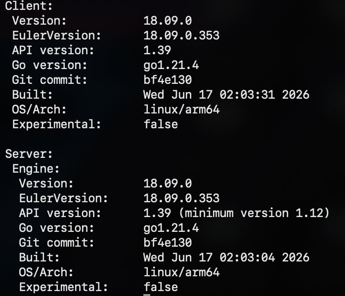

### 2. Import the openEuler image

Download and import the image:

```bash
wget --no-check-certificate https://mirrors.huaweicloud.com/openeuler/openEuler-22.03-LTS-SP4/docker_img/aarch64/openEuler-docker.aarch64.tar.xz
docker load -i openEuler-docker.aarch64.tar.xz
```

Verify that the image was imported:

```bash
docker images
```

>  **Note:**
>
> An image entry named `openeuler-22.03-lts-sp4` in the output indicates that the import succeeded.

### 3. Create and enter the container

1) Check whether port 30211 is already in use on the host:

    ```bash
    ss -tuln | grep -w 30211
    ```

    >  **Note:**
    >
    > No output means the port is available. If it is occupied, replace 30211 in the following command with another available port.

2) Create the container:

    ```bash
    CONTAINER_NAME=YourContainName
    docker run -itd --name $CONTAINER_NAME --hostname $CONTAINER_NAME --privileged=true -p 0.0.0.0:30211:8081 openeuler-22.03-lts-sp4 /bin/bash
    ```

    >  **Notice:**
    >
    > `YourContainName` is an example container name. Replace it as needed. Container port 8081 is mapped to host port 30211 for access to the Flink Web UI.

3) Enter the container:

    ```bash
    docker exec -it YourContainName /bin/bash --login
    ```

>  **Note:**
>
> Run all remaining commands as `root` inside the container.

### 4. Install basic dependencies

Install the following dependencies:

```bash
yum install -y wget findutils unzip libXext libX11 libXrender libXtst libXi
```

>  **Notice:**
>
> If your network requires a proxy, configure it according to your environment.

### 5. Install the JDK

1) Install the JDK:

    ```bash
    mkdir -p /usr/local
    cd /usr/local
    JDK_TAR="bisheng-jdk-17.0.18-b13-linux-aarch64.tar.gz"
    wget --no-check-certificate "https://mirrors.huaweicloud.com/kunpeng/archive/compiler/bisheng_jdk/${JDK_TAR}"
    JDK_DIR=$(tar -tf "${JDK_TAR}" | head -1 | cut -d/ -f1)
    tar -zxf "${JDK_TAR}"
    chown -R root:root "/usr/local/${JDK_DIR}"
    ln -sfn "/usr/local/${JDK_DIR}" /usr/local/java
    rm -f "${JDK_TAR}"
    ```

2) Configure the JDK environment variables:

    ```bash
    echo 'export JAVA_HOME=/usr/local/java' >> /etc/profile
    echo 'export PATH=$JAVA_HOME/bin:$PATH' >> /etc/profile
    echo 'export C_INCLUDE_PATH=$JAVA_HOME/include:$JAVA_HOME/include/linux:$C_INCLUDE_PATH' >> /etc/profile
    echo 'export CPLUS_INCLUDE_PATH=$JAVA_HOME/include:$JAVA_HOME/include/linux:$CPLUS_INCLUDE_PATH' >> /etc/profile
    echo 'export LIBRARY_PATH=$JAVA_HOME/lib:$JAVA_HOME/lib/server:$LIBRARY_PATH' >> /etc/profile
    echo 'export LD_LIBRARY_PATH=$JAVA_HOME/lib:$JAVA_HOME/lib/server:$LD_LIBRARY_PATH' >> /etc/profile
    source /etc/profile
    ```

3) Verify the JDK installation:

    ```bash
    java -version
    ```

    Command output:

    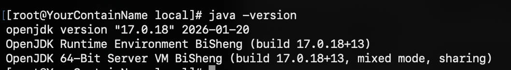

### 6. Install Flink

1) Install Flink:

    ```bash
    mkdir -p /usr/local
    cd /usr/local
    FLINK_TAR="flink-1.16.3-bin-scala_2.12.tgz"
    wget --no-check-certificate "https://mirrors.huaweicloud.com/apache/flink/flink-1.16.3/${FLINK_TAR}"
    FLINK_DIR=$(tar -tf "${FLINK_TAR}" | head -1 | cut -d/ -f1)
    tar -zxf "${FLINK_TAR}"
    chown -R root:root "/usr/local/${FLINK_DIR}"
    ln -sfn "/usr/local/${FLINK_DIR}" /usr/local/flink
    rm -f "${FLINK_TAR}"
    echo 'export FLINK_HOME=/usr/local/flink' >> /etc/profile
    source /etc/profile
    ```

2) Download the JSON and Gson dependencies:

    ```bash
    cd "$FLINK_HOME/lib"
    wget --no-check-certificate https://repo.maven.apache.org/maven2/org/json/json/20240303/json-20240303.jar
    wget --no-check-certificate https://repo.maven.apache.org/maven2/com/google/code/gson/gson/2.11.0/gson-2.11.0.jar
    ```

3) Check the downloaded dependencies:

    ```bash
    ls -la "$FLINK_HOME/lib" | grep -E "json|gson"
    ```

    Dependency files:

    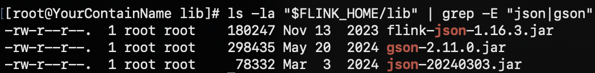

4) Verify the Flink installation:

    ```bash
    "$FLINK_HOME/bin/flink" --version
    ```

    Command output:

    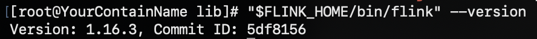

### 7. Install OmniStream and its dependencies

1) Download the following packages for the current version from the [OmniStream releases page](https://gitcode.com/openeuler/OmniStream/releases):

    - `BoostKit-omniruntime-omnistream-{version}.zip`
    - `Dependency_library_OmniStream.zip`

    The following commands use OmniStream 1.3.0 as an example:

    ```bash
    mkdir -p /opt/omnistream-packages
    cd /opt/omnistream-packages
    wget --no-check-certificate https://gitcode.com/openeuler/OmniStream/releases/download/tag_BoostKit_26.1.RC1.B030_001/BoostKit-omniruntime-omnistream-1.3.0.zip
    wget --no-check-certificate https://gitcode.com/openeuler/OmniStream/releases/download/tag_BoostKit_26.1.RC1.B030_001/Dependency_library_OmniStream.zip
    unzip BoostKit-omniruntime-omnistream-1.3.0.zip
    unzip Dependency_library_OmniStream.zip
    ```

2) Install the dependency libraries:

    ```bash
    DEPENDENCY_DIR=$(find /opt/omnistream-packages -type d -name Dependency_library_Default -print -quit)
    test -n "${DEPENDENCY_DIR}"
    mkdir -p /opt/Dependency_library
    cp -rf "${DEPENDENCY_DIR}/"* /opt/Dependency_library/
    chmod -R 550 /opt/Dependency_library/*
    ```

    Check the dependency directory:

    ```bash
    ls -la /opt/Dependency_library
    ```

    Installed dependencies:

    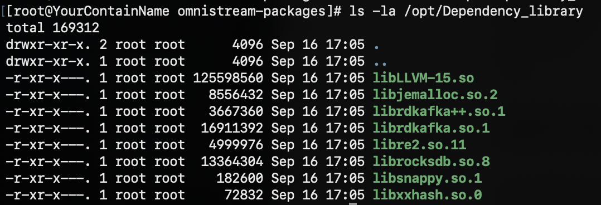

3) Install OmniStream:

    ```bash
    OMNISTREAM_DIR=$(find /opt/omnistream-packages -type d -name OmniStream_Default -print -quit)
    test -n "${OMNISTREAM_DIR}"
    mkdir -p /usr/local/OmniStream
    cp -rf "${OMNISTREAM_DIR}/"* /usr/local/OmniStream/
    chmod -R 550 /usr/local/OmniStream/*
    ```

    Check the OmniStream files:

    ```bash
    ls -la /usr/local/OmniStream
    ```

    Installed files:

    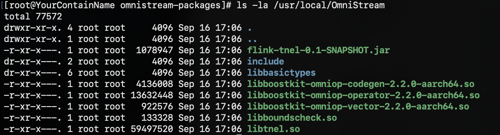

4) Configure the native library search path:

    ```bash
    echo 'export LD_LIBRARY_PATH=/opt/Dependency_library:/usr/local/OmniStream:$LD_LIBRARY_PATH' >> /etc/profile
    source /etc/profile
    ```

5) Check the dependencies of `libtnel.so`:

    ```bash
    ldd /usr/local/OmniStream/libtnel.so | grep "not found"
    ```

    >  **Note:**
    >
    > No output means that all dependencies were found.

### 8. Configure Flink

1) Open the Flink configuration script:

    ```bash
    vi "$FLINK_HOME/bin/config.sh"
    ```

    Locate `constructFlinkClassPath`, comment out its original `echo` command, and add the following lines at the end of the function:

    ```bash
# echo "$FLINK_CLASSPATH""$FLINK_DIST"
PATCH=/usr/local/OmniStream/flink-tnel-0.1-SNAPSHOT.jar
echo $PATCH:"$FLINK_CLASSPATH""$FLINK_DIST"
```

Press `Esc`, enter `:wq`, and press `Enter`.

Updated class path:

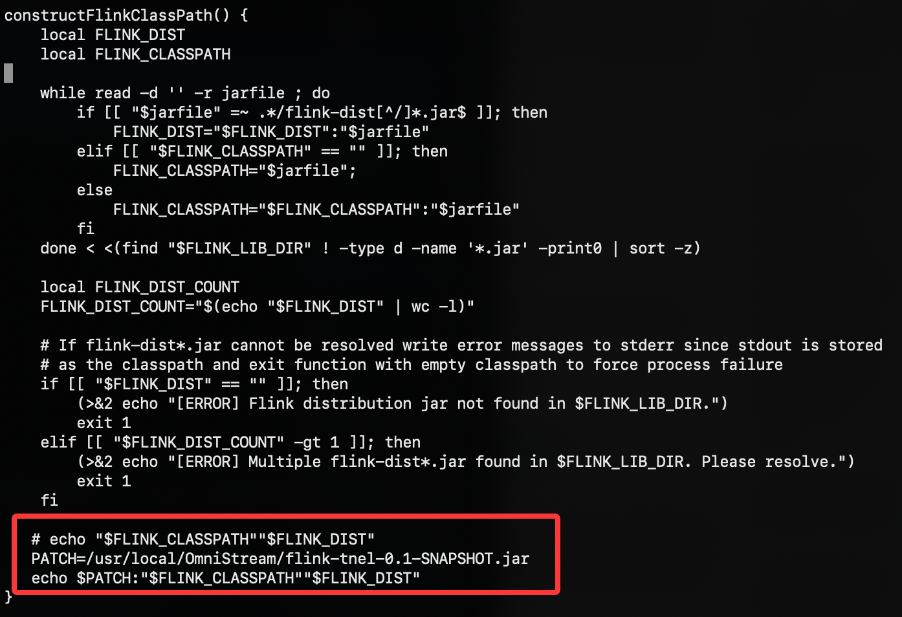

Open the Flink configuration file:

```bash
vi "$FLINK_HOME/conf/flink-conf.yaml"
```

Add the following configuration at the end of the file:

```yaml
env.java.opts: -Djava.library.path=/usr/local/OmniStream:/opt/Dependency_library --add-opens java.base/java.lang=ALL-UNNAMED --add-opens java.base/java.io=ALL-UNNAMED --add-opens java.base/java.util=ALL-UNNAMED --add-opens java.base/java.util.concurrent=ALL-UNNAMED --add-opens java.base/sun.nio.ch=ALL-UNNAMED --add-opens java.base/java.net=ALL-UNNAMED --add-opens java.base/sun.security.ssl=ALL-UNNAMED --add-exports java.base/sun.net.dns=ALL-UNNAMED --add-exports java.base/sun.net.util=ALL-UNNAMED --add-opens=java.base/java.lang=ALL-UNNAMED --add-opens java.base/java.lang.invoke=ALL-UNNAMED --add-opens java.base/java.util.concurrent.atomic=ALL-UNNAMED --add-opens java.base/java.nio=ALL-UNNAMED --add-opens java.base/java.math=ALL-UNNAMED --add-opens java.base/java.text=ALL-UNNAMED --add-opens java.base/java.time=ALL-UNNAMED
```

Press `Esc`, enter `:wq`, and press `Enter`.

>  **Notice:**
>
> Keep this configuration on one physical line. Do not split the arguments across multiple lines.

Updated JVM options:

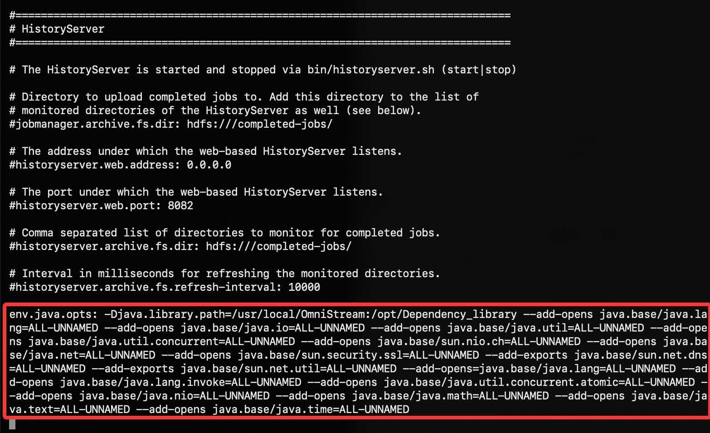

### 9. Install Nexmark

1) Run the following commands to install Nexmark:

    ```bash
    cd /usr/local
    wget --no-check-certificate https://github.com/nexmark/nexmark/releases/download/v0.2.0/nexmark-flink.tgz
    tar -zxf nexmark-flink.tgz
    mv nexmark-flink nexmark
    chown -R root:root /usr/local/nexmark
    rm -f nexmark-flink.tgz
    cp /usr/local/nexmark/lib/nexmark-flink-0.2-SNAPSHOT.jar "$FLINK_HOME/lib/"
    ```

2) Open the Nexmark configuration script:

    ```bash
    vi /usr/local/nexmark/bin/config.sh
    ```

    Append the following configuration:

    ```bash
    export JAVA_TOOL_OPTIONS="-Djava.library.path=/usr/local/OmniStream:/opt/Dependency_library --add-opens=java.base/java.lang=ALL-UNNAMED --add-opens=java.base/java.io=ALL-UNNAMED --add-opens=java.base/java.util=ALL-UNNAMED --add-opens=java.base/java.util.concurrent=ALL-UNNAMED --add-opens=java.base/sun.nio.ch=ALL-UNNAMED --add-opens=java.base/java.net=ALL-UNNAMED --add-opens=java.base/sun.security.ssl=ALL-UNNAMED --add-exports=java.base/sun.net.dns=ALL-UNNAMED --add-exports=java.base/sun.net.util=ALL-UNNAMED --add-opens=java.base/java.lang.invoke=ALL-UNNAMED --add-opens=java.base/java.util.concurrent.atomic=ALL-UNNAMED --add-opens=java.base/java.nio=ALL-UNNAMED --add-opens=java.base/java.math=ALL-UNNAMED --add-opens=java.base/java.text=ALL-UNNAMED --add-opens=java.base/java.time=ALL-UNNAMED"
    ```

    Press `Esc`, enter `:wq`, and press `Enter`.

    >  **Notice:**
    >
    > Keep this configuration on one physical line. Do not split the arguments across multiple lines.

    Updated Nexmark JVM options:

    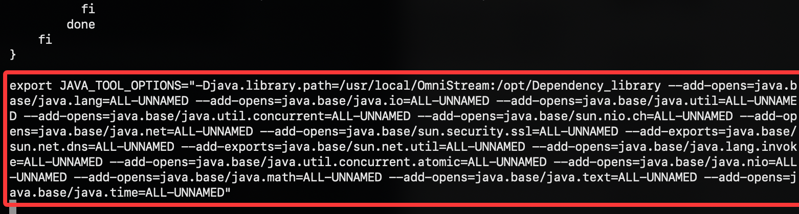

## Quick Start

Start Flink and initialize Nexmark, then run Q0 to verify that OmniStream is enabled.

### 1. Start Flink

1) Start the cluster:

    ```bash
    source /etc/profile
    "$FLINK_HOME/bin/start-cluster.sh"
    ```

2) Check the Flink processes:

    ```bash
    jps
    ```

    Flink processes:

    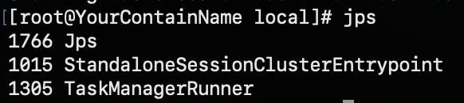

    >  **Note:**
    >
    > The output must contain `StandaloneSessionClusterEntrypoint` and `TaskManagerRunner`, indicating that Flink started successfully.

### 2. Initialize Nexmark

1) Initialize the cluster:

    ```bash
    bash /usr/local/nexmark/bin/setup_cluster.sh
    ```

2) Check the processes:

    ```bash
    jps
    ```

    Process check:

    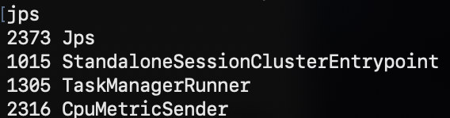

    >  **Note:**
    >
    > The output must contain `CpuMetricSender`, indicating that Nexmark initialization succeeded.

### 3. Run Q0

Run the following command:

```bash
bash /usr/local/nexmark/bin/run_query.sh q0
```

Execution result:

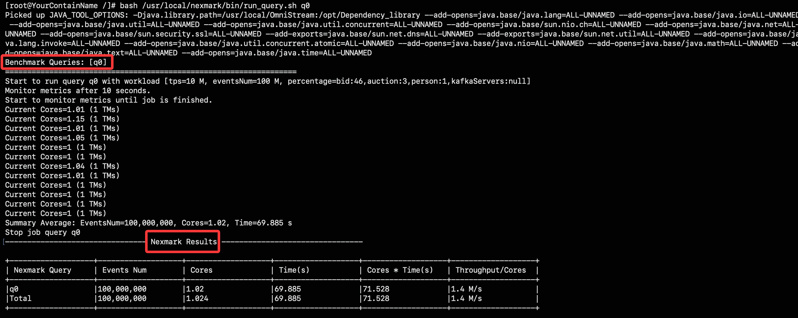

### 4. Verify OmniStream

Search the logs:

```bash
grep "welcome to native" "$FLINK_HOME"/log/*
```

Command output:

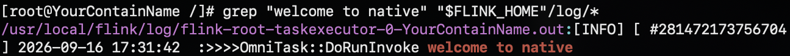

>  **Note:**
>
> The log entry `OmniTask::DoRunInvoke welcome to native` indicates that OmniStream is enabled.

## FAQ

The following issues may occur during installation and verification.

### Flink processes exit immediately after startup

Run `ldd /usr/local/OmniStream/libtnel.so | grep "not found"` to check the native dependencies, and install any missing libraries.

### Flink reports that the configuration cannot be parsed

`flink-conf.yaml` uses the `key: value` format. `env.java.opts` and all its arguments must be on one physical line. Do not split the `--add-opens` or `--add-exports` arguments across lines.

### Q0 reports `{"jobs":[]}`

Run `grep -nE "ERROR|Exception|Caused by" /usr/local/nexmark/log/nexmark-flink.log`. If the log contains `InaccessibleObjectException`, verify that `JAVA_TOOL_OPTIONS` is configured in `/usr/local/nexmark/bin/config.sh`.

## More Information

For additional features and detailed instructions, see the following guides:

- [Build Guide](./compile_guide.md)
- [Installation Guide](./installation_guide.md)
- [User Guide](./user_guide.md)
- [FAQ](./faq.md)

# Disclaimer

This code repository contributes to the Flink open-source project solely for performance optimization. It strictly adheres to the coding style and methods, as well as security design of the native open-source software. Any vulnerability and security issues of the software shall be resolved by the corresponding upstream communities according to their response mechanisms. Please pay attention to the notifications and version updates released by the upstream communities. The Kunpeng computing community does not assume any responsibility for software vulnerabilities and security issues.
