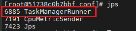
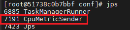

# User Guide<a name="EN-US_TOPIC_0000002518121100"></a>

## Using the Feature<a name="EN-US_TOPIC_0000002549520803"></a>

### Supported SQL Operators and Expressions<a name="EN-US_TOPIC_0000002549640813"></a>

This section describes the scope, restrictions, and usage rules of SQL operators and expressions \(including data types\) supported by the OmniStream Flink Native feature in Flink versions 1.16.3, 1.17.1, and 1.20.0.

[Table 2](#table158332034445)  and  [Table 3](#table161274333443)  list the operators, expressions, and functions supported by OmniStream. Symbols are used to indicate whether the operators and expressions are supported. For details about the symbols, see  [Table 1](#table86091491368).

> **NOTICE:** 
>-   [Table 2](#table158332034445)  and  [Table 3](#table161274333443)  display the data types supported by or involved in OmniStream. The data types that are not displayed in the two tables are not supported by OmniStream.
>-   If you use operators and expressions that are not supported by OmniStream, the execution plan will be rolled back to native execution, which deteriorates the performance.
>-   When you use the SQL Client interactive user interface to execute SQL statements, you are advised to export the execution result to the data table whose connector is  **blackhole**. For details, see the execution mode of Nexmark Q0.
>-   Due to memory restrictions, only the Calc and LookupJoin operators are supported by default. To support other operators, set export  **FLINK\_PERFORMANCE**  to  **false**  to enable environment variables.

**Table  1**  Meanings of symbols in the operator and expression support tables

|Symbol|Description|
|--|--|
|S|Indicates that the operator or expression is supported.|
|PS|Indicates that the operator or expression is partially supported, with some restrictions. For details about the restrictions, see .|
|NS|Indicates that the operator or expression is not supported.|
|NA|Indicates that the operator or expression is not involved. This scenario does not exist in open source Flink.|
|[Blank Cell]|Indicates a scenario that is irrelevant or needs to be confirmed.|


**Table  2**  Supported operators

|Operator|BIGINT|VARCHAR|TIMESTAMP(3)|
|--|--|--|--|
|Calc|S|S|S|
|Sink|S|S|S|
|Csv Source|S|S|S|
|Kafka Source|S|S|S|
|Kafka Sink|S|S|S|
|Join|PS|PS|PS|
|LookupJoin|PS|PS|PS|
|GroupAggregate|PS|PS|PS|
|LocalGroupAggregate|PS|PS|PS|
|GlobalGroupAggregate|PS|PS|PS|
|IncrementalGroupAggregate|PS|PS|PS|
|LocalWindowAggregate|PS|PS|PS|
|GlobalWindowAggregate|PS|PS|PS|
|GroupWindowAggregate|PS|PS|PS|
|WindowAggregate|PS|PS|PS|
|WindowJoin|PS|PS|PS|
|Deduplicate|PS|PS|PS|
|Expand|PS|PS|PS|
|Rank|PS|PS|PS|


**Table  3**  Supported expressions

|Expression|Function Type|BIGINT|VARCHAR|NULL|TIMESTAMP(3)|
|--|--|--|--|--|--|
|*|Scalar functions|S|NS|S|S|
|+|Scalar functions|S|NS|S|S|
|-|Scalar functions|S|NS|S|S|
|/|Scalar functions|S|NS|S|S|
|LOWER|Scalar functions|NA|S|NA|NA|
|SPLIT_INDEX|Scalar functions|S|S|NA|NA|
|DATE_FORMAT|Scalar functions|NA|NA|NA|S|
|COUNT_CHAR|Scalar functions|NA|S|NA|NA|
|HOUR|Scalar functions|S|NA|NS|S|
|REGEX_EXTRACT|Scalar functions|NA|S|NS|NA|


This section describes the scope, restrictions, and usage rules of SQL operators and expressions \(including data types\) supported by the OmniStream Flink Native feature in Flink versions 1.16.3, 1.17.1, and 1.20.0.
### Supported DataStream Operators and UDFs<a name="EN-US_TOPIC_0000002517961054"></a>

This section describes the scope of support, restrictions, and performance impact of the OmniStream Flink Native feature on DataStream operators and user-defined functions \(UDFs\) in Flink 1.16.3.

> **NOTICE:** 
>If you use DataStream operators and UDFs that are not supported by OmniStream, the execution plan will be rolled back to native execution, which deteriorates the performance.

- The DataStream operators supported by OmniStream include Kafka Source, Kafka Sink, Map, Reduce, FlatMap, and Filter.
- The UDF trustlist is provided from multiple dimensions, including data transfer objects, function types, UDF dependency classes and interfaces, Java type translation, and Java statement translation. For details, see  [UDF Trustlist](#section92601228172312).

**UDF Trustlist<a name="section92601228172312"></a>**

The supported data transfer objects include Long, String, and Tuple2<String, Long\>.

[Table 1](#table108991738122316)  lists the supported dependency classes and APIs. For other restrictions, contact Huawei technical support. The supported expressions may vary depending on the environment configuration. If you have any questions, contact local Huawei technical support.

**Table  1**  Supported expressions

|Java Class|Java Class Interface|
|--|--|
|Arrays|static <T> List<T> asList(Array)|
|HashMap (The hashCode and equals methods must be implemented for all accessed elements.)|Object get(Object key)Object put(Object key, Object value)void putAll(HashMap m)boolean containsKey(Object key)int size()bool remove (Object key) (Different from Java interfaces, variables cannot be used to carry return values.)Set<Map.Entry<Object,Object>> entrySet()Set<Object> keySet()HashMap clone()|
|Iterator|boolean hasNext()Object next()|
|ArrayList|Object get(int index)void clear()void add(Object e)Iterator iterator()boolean contains(Object o)int size()boolean isEmpty()|
|LinkedList|Object getFirst()Object getLast()void addLast(Object e)void addFirst(Object e)|
|Map.Entry (The hash and equals methods must be implemented for elements in mapentry.)|Object getKey()Object getValue()void setValue(Object value) (Different from Java interfaces, variables cannot be used to carry return values.)|
|HashSet (The hash and equals methods must be implemented for accessed elements.)|boolean addAll(ArrayList list)boolean add(Object e)boolean remove(Object o)boolean contains(Object o)int size()void clear()Iterator iterator()|
|StringBuilder|StringBuilder append(String str)String toString()|
|Array (Only one-dimensional arrays of the object type are supported. Basic arrays and multi-dimensional arrays are not supported.)|SizeGet elementsPut elements (in sequence)|
|Integer|String toString()bool equals(Integer *obj) overrideint intValue()static Integer valueOf(String s)static Integer valueOf(int i)|
|Boolean|static Boolean valueOf(boolean b)boolean booleanValue()|
|Long|int hashCode()boolean equals(Long obj)String toString()Long clone()long longValue()static Long valueOf(String s)static Long valueOf(long l)|
|Object|int hashCode()bool equals(Object *obj)String toString()Object *clone()|
|String|int hashCode()boolean equals(String anObject)String toString()Object *clone()String replace(String target, String replacement)Array split(String regex) (Character strings can be split. Regular expressions are not supported.)String replaceAll(String regex, String replacement)int lastIndexOf(String str)int length()String substring(int beginIndex)String substring(int beginIndex, int endIndex)boolean contains(String s)boolean endsWith(String suffix)boolean startsWith(String prefix)|
|Gson|String toJson(HashMap<String,String> map)Map fromJson(String json, Type typeOf) (Only the String to Map type conversion is supported.)|
|JsonObject|JsonObject getAsJsonObject(String memberName) (Only String constants are supported.)|
|JsonParser|static JsonObject parseString(String json)|
|JsonPrimitive|boolean getAsBoolean()|
|JsonElement|JsonObject getAsJsonObject()double getAsDouble()float getAsFloat()int getAsInt()long getAsLong()short getAsShort()boolean getAsBoolean()String getAsString()boolean isJsonNull()String toString()String toString()|
|JsonArray|Iterator<JsonElement> iterator()|


This section describes the scope of support, restrictions, and performance impact of the OmniStream Flink Native feature on DataStream operators and user-defined functions \(UDFs\) in Flink 1.16.3.
### Enabling OmniStream for SQL<a name="EN-US_TOPIC_0000002549640821"></a>

This section describes how to start a Flink cluster and enable OmniStream in SQL scenarios.

1. Access the  **flink\_jm\_8c32g**  container and start the Flink cluster.

    ```
    docker exec -it flink_jm_8c32g /bin/bash
    source /etc/profile
    cd /usr/local/flink-1.16.3/bin
    ./start-cluster.sh
    ```

    > **NOTICE:** 
    >Each time you exit and access the container again, you need to run the  **source /etc/profile**  command to reload the environment variables. This ensures that the dependencies are properly detected when running tasks.

2. Check whether the Job Manager and Task Manager are started successfully.
    1. Check the  **flink\_jm\_8c32g**  container for the  **StandaloneSessionClusterEntrypoint**  process.

        ```
        source /etc/profile
        jps
        ```

        If the  **StandaloneSessionClusterEntrypoint**  process exists, the Job Manager is started successfully.

        

    2. Access the  **flink\_tm1\_8c32g**  and  **flink\_tm2\_8c32g**  containers and check for the  **TaskManagerRunner**  process. The following commands use the  **flink\_tm1\_8c32g**  container as an example:

        ```
        docker exec -it flink_tm1_8c32g /bin/bash
        source /etc/profile
        jps
        ```

        If the  **TaskManagerRunner**  process exists, the Task Manager is started successfully.

        

3. Start Nexmark in the  **flink\_jm\_8c32g**  container.

    ```
    docker exec -it flink_jm_8c32g /bin/bash
    source /etc/profile
    cd /usr/local/nexmark/bin
    ./setup_cluster.sh
    ```

4. Access the  **flink\_tm1\_8c32g**  and  **flink\_tm2\_8c32g**  containers and check whether Nexmark is started successfully. The following commands use the  **flink\_tm1\_8c32g**  container as an example:

    ```
    docker exec -it flink_tm1_8c32g /bin/bash
    source /etc/profile
    jps
    exit
    ```

    If the  **CpuMetricSender**  process exists, Nexmark is started successfully.

    

5. Execute the Nexmark test case  **Query0**  in the  **flink\_jm\_8c32g**  container.

    ```
    docker exec -it flink_jm_8c32g /bin/bash
    source /etc/profile
    cd /usr/local/nexmark/bin
    sh run_query.sh q0
    exit
    ```

    View the execution result. The expected result is that the test case runs successfully without any errors.

    

6. View the latest  **.out**  log file of Flink in the container that hosts the Task Manager.

    ```
    docker exec -it flink_tm1_8c32g /bin/bash
    cd /usr/local/flink-1.16.3/log
    ```

    - If the log contains "Shared Memory Metric Manager Loading Succeed", the native SO library has been loaded.
    - If the log contains "welcome to native", OmniStream has been enabled successfully.

    

This section describes how to start a Flink cluster and enable OmniStream in SQL scenarios.
### Enabling OmniStream for DataStream<a name="EN-US_TOPIC_0000002518120974"></a>

This section describes how to start a Flink cluster and enable OmniStream in DataStream scenarios.

1. If DataStream tasks are running in a multi-Task Manager environment, add  **omni.batch: true**  to the  **flink-conf.yaml**  file to improve shuffle efficiency and achieve better performance.
    1. Open the  **/usr/local/flink/conf/flink-conf.yaml**  file.

        ```
        vi /usr/local/flink/conf/flink-conf.yaml
        ```

    2. Press  **i**  to enter the insert mode and add the following content to the file:

        ```
        omni.batch: true
        ```

    3. Press  **Esc**, type  **:wq!**, and press  **Enter**  to save the file and exit.

2. Access the  **flink\_jm\_8c32g**  container and start the Flink cluster.

    ```
    docker exec -it flink_jm_8c32g /bin/bash
    source /etc/profile
    cd /usr/local/flink-1.16.3/bin
    ./start-cluster.sh
    ```

    > **NOTICE:** 
    >Each time you exit and access the container again, you need to run the  **source /etc/profile**  command to reload the environment variables. This ensures that the dependencies are properly detected when running tasks.

3. Check whether the Job Manager and Task Manager are started successfully.
    1. Check the  **flink\_jm\_8c32g**  container for the  **StandaloneSessionClusterEntrypoint**  process.

        ```
        source /etc/profile
        jps
        ```

        If the  **StandaloneSessionClusterEntrypoint**  process exists, the Job Manager is started successfully.

        

    2. Access the  **flink\_tm1\_8c32g**  and  **flink\_tm2\_8c32g**  containers and check for the  **TaskManagerRunner**  process. The following commands use the  **flink\_tm1\_8c32g**  container as an example:

        ```
        docker exec -it flink_tm1_8c32g /bin/bash
        source /etc/profile
        jps
        ```

        If the  **TaskManagerRunner**  process exists, the Task Manager is started successfully.

        

4. Create and configure the Kafka consumer and producer configuration files.
    1. Access the  **flink\_tm1\_8c32g**  container.

```
docker exec -it flink_tm1_8c32g /bin/bash
```

    2. <a name="li71941829175515"></a>Create an  **/opt/conf**  directory.

```
mkdir /opt/conf
cd /opt/conf
```

    3. Create the Kafka consumer configuration file  **kafka\_consumer.conf**.

        ```
        fetch.queue.backoff.ms=20
        group.id=omni
        max.poll.records=10000
        ```

    4. <a name="li191941296556"></a>Create the Kafka producer configuration file  **kafka\_producer.conf**.

        ```
        queue.buffering.max.messages=2000000
        queue.buffering.max.kbytes=20971520
        queue.buffering.max.ms=5
        linger.ms=5
        batch.num.messages=200000
        batch.size=3145728
        max.push.records=10000
        ```

    5. Access the  **flink\_tm2\_8c32g**  container and perform steps  [4.b](#li71941829175515)  to  [4.d](#li191941296556).

        ```
        docker exec -it flink_tm1_8c32g /bin/bash
        ```

5. Start ZooKeeper and Kafka on the physical machine. For details, see  [Kafka Deployment Guide](https://www.hikunpeng.com/document/detail/en/kunpengbds/ecosystemEnable/Kafka/kunpengkafka_04_0011.html).
6. Use Kafka to create topics and generate data.

    > **NOTE:** 
    >Replace all the example IP addresses of physical machines in the commands or scripts with the actual IP addresses of the Kafka servers.

    1. Create topics for the source and sink.

        ```
        cd /usr/local/kafka
        bin/kafka-topics.sh --create --bootstrap-server IP_address_of_Kafka_server's_physical_machine:9092 --replication-factor 1 --partitions 1 --topic source_abcd
        bin/kafka-topics.sh --create --bootstrap-server IP_address_of_Kafka_server's_physical_machine:9092 --replication-factor 1 --partitions 1 --topic result
        ```

    2. Save the following content as the script file  **producer.sh**.

        ```
        #!/bin/bash
        
        # Kafka installation directory (Replace the example directory with the actual one.)
        KAFKA_HOME="/usr/local/kafka"
        TOPIC_NAME="source_abcd"  # Kafka topic name
        BROKER="IP_address:9092"  # IP address of the Kafka broker server
        MESSAGE_COUNT=10             # Number of sent messages
        
        # Check whether Kafka console-producer.sh exists.
        if [ ! -f "$KAFKA_HOME/bin/kafka-console-producer.sh" ]; then
            echo "Error: kafka-console-producer.sh was not found. Check the KAFKA_HOME path."
            exit 1
        fi
        
        # Generate a random character string and send it to Kafka.
        for ((i=1; i<=$MESSAGE_COUNT; i++)); do
            # Generate four random letters (case-sensitive) + Space + 1.
            RAND_STR=$(cat /dev/urandom | tr -dc 'a-d' | fold -w 4 | head -n 1)
            MESSAGE="${RAND_STR} 1"  # Format: 4 letters + Space + 1
        
        # Invoke the Kafka producer to send messages.
            echo "$MESSAGE" | "$KAFKA_HOME/bin/kafka-console-producer.sh" \
                --bootstrap-server "$BROKER" \
                --topic "$TOPIC_NAME"
            echo "Sent: $MESSAGE"
        done
        ```

    3. Run the script to generate test data and write it to the source topic.

        ```
        ./producer.sh
        ```

7. Build a job JAR package.
    1. Go to the  **/opt**  directory of the physical machine and create the  **/opt/job/src/main/java/com/huawei/boostkit**  directory.

        ```
        mkdir -p /opt/job/src/main/java/com/huawei/boostkit
        cd /opt/job/
        ```

    2. Create a Java file for the Flink Job.
        1. Open  **/opt/job/src/main/java/com/huawei/boostkit/FlinkWordCount.java**.

            ```
            vi /opt/job/src/main/java/com/huawei/boostkit/FlinkWordCount.java
            ```

        2. Press  **i**  to enter the insert mode and add the following content:

            ```
            package com.huawei.boostkit;
            
            import org.apache.flink.api.common.eventtime.WatermarkStrategy;
            import org.apache.flink.api.common.serialization.SimpleStringSchema;
            import org.apache.flink.connector.base.DeliveryGuarantee;
            import org.apache.flink.connector.kafka.sink.KafkaRecordSerializationSchema;
            import org.apache.flink.connector.kafka.sink.KafkaSink;
            import org.apache.flink.connector.kafka.source.KafkaSource;
            import org.apache.flink.connector.kafka.source.enumerator.initializer.OffsetsInitializer;
            import org.apache.flink.streaming.api.datastream.DataStream;
            import org.apache.flink.streaming.api.datastream.SingleOutputStreamOperator;
            import org.apache.flink.streaming.api.environment.StreamExecutionEnvironment;
            import org.apache.kafka.clients.consumer.ConsumerConfig;
            import org.apache.kafka.clients.producer.ProducerConfig;
            import org.apache.kafka.common.serialization.ByteArrayDeserializer;
            
            import java.util.Properties;
            
            public class FlinkWordCount {
                public static void main(String[] args) throws Exception {
                    String broker = "ip:port";
                    String sourceTopic = "source_abcd";
                    String targetTopic = "result";
                    StreamExecutionEnvironment env = StreamExecutionEnvironment.getExecutionEnvironment();
                    env.setParallelism(1);
                    Properties properties = new Properties();
                    properties.put(ConsumerConfig.BOOTSTRAP_SERVERS_CONFIG, broker);
                    properties.put(ConsumerConfig.AUTO_OFFSET_RESET_CONFIG, "earliest");
                    properties.setProperty(ConsumerConfig.KEY_DESERIALIZER_CLASS_CONFIG,
                        ByteArrayDeserializer.class.getCanonicalName());
                    properties.put(ConsumerConfig.VALUE_DESERIALIZER_CLASS_CONFIG,
                        ByteArrayDeserializer.class.getCanonicalName());
                    KafkaSource<String> kafkaSource = KafkaSource.<String>builder()
                        .setBootstrapServers(broker)
                        .setTopics(sourceTopic)
                        .setGroupId("your-group-id")
                        .setStartingOffsets(OffsetsInitializer.earliest())
                        .setValueOnlyDeserializer(new SimpleStringSchema())
                        .setProperties(properties)
                        .build();
                    
                    properties.put(ProducerConfig.BOOTSTRAP_SERVERS_CONFIG, broker);
                    properties.setProperty(ProducerConfig.KEY_SERIALIZER_CLASS_CONFIG,
                        "org.apache.kafka.common.serialization.ByteArraySerializer");
                    properties.put(ProducerConfig.VALUE_SERIALIZER_CLASS_CONFIG,
                        "org.apache.kafka.common.serialization.ByteArraySerializer");
                    properties.put(ProducerConfig.ACKS_CONFIG, "0");
                    properties.put(ProducerConfig.COMPRESSION_TYPE_CONFIG, "lz4");
                    properties.put(ProducerConfig.CLIENT_ID_CONFIG, "DataGenerator");
                    KafkaSink<String> sink = KafkaSink.<String>builder()
                        .setBootstrapServers(broker)
                        .setRecordSerializer(
                            KafkaRecordSerializationSchema.builder()
                                .setTopic(targetTopic)
                                .setValueSerializationSchema(new SimpleStringSchema())
                                .build())
                        .setDeliveryGuarantee(DeliveryGuarantee.AT_LEAST_ONCE)
                        .setKafkaProducerConfig(properties)
                        .build();
                    DataStream<String> source;
                    source = env.fromSource(kafkaSource, WatermarkStrategy.noWatermarks(), "Kafka Source").disableChaining();
                    SingleOutputStreamOperator<String> result = source.map(line ->
                        line
                    );
                    result.sinkTo(sink);
                    result.disableChaining();
                    env.execute("Wordcount");
                }
            }
            ```

        3. Press  **Esc**, type  **:wq!**, and press  **Enter**  to save the file and exit.

    3. Create a  **pom.xml**  file.
        1. Open  **/opt/job/pom.xml**.

            ```
            vi /opt/job/pom.xml
            ```

        2. Press  **i**  to enter the insert mode and add the following content:

            ```
            <?xml version="1.0" encoding="UTF-8"?>
            <project xmlns="http://maven.apache.org/POM/4.0.0"
                     xmlns:xsi="http://www.w3.org/2001/XMLSchema-instance"
                     xsi:schemaLocation="http://maven.apache.org/POM/4.0.0 http://maven.apache.org/xsd/maven-4.0.0.xsd">
                <modelVersion>4.0.0</modelVersion>
            
                <groupId>com.huawei.boostkit</groupId>
                <artifactId>ziliao</artifactId>
                <version>1.0-SNAPSHOT</version>
                <packaging>jar</packaging>
            
                <properties>
                   <flink.version>1.16.3</flink.version>
                   <maven.compiler.source>1.8</maven.compiler.source>
                   <maven.compiler.target>1.8</maven.compiler.target>
                </properties>
            
                <dependencies>
                   <!-- Flink dependencies -->
                   <dependency>
                      <groupId>org.apache.flink</groupId>
                      <artifactId>flink-java</artifactId>
                      <version>${flink.version}</version>
                      <exclusions>
                         <exclusion>
                            <groupId>org.lz4</groupId>
                            <artifactId>lz4</artifactId>
                         </exclusion>
                      </exclusions>
                   </dependency>
                   <dependency>
                      <groupId>org.apache.flink</groupId>
                      <artifactId>flink-streaming-java</artifactId>
                      <version>${flink.version}</version>
                      <exclusions>
                         <exclusion>
                            <groupId>org.lz4</groupId>
                            <artifactId>lz4</artifactId>
                         </exclusion>
                      </exclusions>
                   </dependency>
                   <dependency>
                      <groupId>org.apache.flink</groupId>
                      <artifactId>flink-clients</artifactId>
                      <version>${flink.version}</version>
                      <exclusions>
                         <exclusion>
                            <groupId>org.lz4</groupId>
                            <artifactId>lz4</artifactId>
                         </exclusion>
                      </exclusions>
                   </dependency>
                   <dependency>
                      <groupId>org.apache.flink</groupId>
                      <artifactId>flink-connector-kafka</artifactId>
                      <version>${flink.version}</version>
                      <exclusions>
                         <exclusion>
                            <groupId>org.lz4</groupId>
                            <artifactId>lz4</artifactId>
                         </exclusion>
                      </exclusions>
                   </dependency>
                   <dependency>
                      <groupId>org.apache.kafka</groupId>
                      <artifactId>kafka-clients</artifactId>
                      <version>2.5.0</version>
                      <exclusions>
                         <exclusion>
                            <groupId>org.lz4</groupId>
                            <artifactId>lz4</artifactId>
                         </exclusion>
                      </exclusions>
                   </dependency>
                   <dependency>
                      <groupId>org.apache.flink</groupId>
                      <artifactId>flink-statebackend-rocksdb</artifactId>
                      <version>1.16.3</version>
                   </dependency>
                </dependencies>
            
                <build>
                   <plugins>
                      <plugin>
                         <groupId>org.apache.maven.plugins</groupId>
                         <artifactId>maven-assembly-plugin</artifactId>
                         <version>3.3.0</version>
                         <configuration>
                            <descriptorRefs>
                               <descriptorRef>jar-with-dependencies</descriptorRef>
                            </descriptorRefs>
                         </configuration>
                         <executions>
                            <execution>
                               <id>make-assembly</id>
                               <phase>package</phase>
                               <goals>
                                  <goal>single</goal>
                               </goals>
                            </execution>
                         </executions>
                      </plugin>
                   </plugins>
                </build>
            
            </project>
            ```

        3. Press  **Esc**, type  **:wq!**, and press  **Enter**  to save the file and exit.

    4. After the  **mvn clean package**  command is executed, the  **ziliao-1.0-SNAPSHOT-jar-with-dependencies.jar**  file is generated in the  **target**  directory. Upload the JAR package to the  **/usr/local/flink**  directory in the  **flink\_jm\_8c32g**  container.

        ```
        mvn clean package
        docker cp /opt/job/target/ziliao-1.0-SNAPSHOT-jar-with-dependencies.jar flink_jm_8c32g:/usr/local/flink
        ```

8. Export environment variables from the  **flink\_jm\_8c32g**  container.

    ```
    export CPLUS_INCLUDE_PATH=${JAVA_HOME}/include/:${JAVA_HOME}/include/linux:/opt/udf-trans-opt/libbasictypes/include:/opt/udf-trans-opt/libbasictypes/OmniStream/include:/opt/udf-trans-opt/libbasictypes/include/libboundscheck:/opt/udf-trans-opt/libbasictypes/OmniStream/core/include:/usr/local/ksl/include:$CPLUS_INCLUDE_PATH
    export C_INCLUDE_PATH=${JAVA_HOME}/include/:${JAVA_HOME}/include/linux:/opt/udf-trans-opt/libbasictypes/include:/opt/udf-trans-opt/libbasictypes/OmniStream/include:/opt/udf-trans-opt/libbasictypes/include/libboundscheck:/opt/udf-trans-opt/libbasictypes/OmniStream/core/include:/usr/local/ksl/include:$C_INCLUDE_PATH
    export LIBRARY_PATH=${JAVA_HOME}/jre/lib/aarch64:${JAVA_HOME}/jre/lib/aarch64/server:/opt/udf-trans-opt/libbasictypes/lib:/usr/local/ksl/lib:$LIBRARY_PATH
    export LD_LIBRARY_PATH=${JAVA_HOME}/jre/lib/aarch64:${JAVA_HOME}/jre/lib/aarch64/server:/opt/udf-trans-opt/libbasictypes/lib:/usr/local/ksl/lib:$LD_LIBRARY_PATH
    ```

9. Modify the UDF configuration file.
    1. Set the test case package name \(**udf\_package**\) and main class name \(**main\_class**\).

        ```
        vim /opt/udf-trans-opt/udf-translator/conf/udf_tune.properties
        ```

    2. Press  **i**  to enter the insert mode and modify  **udf\_package**  and  **main\_class**  as follows:

        ```
        udf_package=com.huawei.boostkit
        main_class=com.huawei.boostkit.FlinkWordCount
        ```

    3. Press  **Esc**, type  **:wq!**, and press  **Enter**  to save the file and exit.

10. Translate the test case JAR package.

    ```
    sh /opt/udf-trans-opt/udf-translator/bin/udf_translate.sh /usr/local/flink/ziliao-1.0-SNAPSHOT-jar-with-dependencies.jar flink
    ```

11. Submit the job from the  **flink\_jm\_8c32g**  container.

    ```
    cd /usr/local/flink
    bin/flink run -c com.huawei.boostkit.FlinkWordCount ziliao-1.0-SNAPSHOT-jar-with-dependencies.jar
    ```

12. View the sink topic data.
    1. Consume Kafka data and check whether the job is running properly.

        ```
        cd /usr/local/kafka
        bin/kafka-console-consumer.sh --bootstrap-server IP_address_of_Kafka_server's_physical_machine:9092 --topic result --from-beginning
        ```

        

13. In the  **flink\_jm\_8c32g**  container, view the latest Flink client log  **flink-root-client-xxx.log**.

    ```
    cd /usr/local/flink-1.16.3/log
    ```

    If no error information is displayed, OmniStream is enabled successfully.

    

This section describes how to start a Flink cluster and enable OmniStream in DataStream scenarios.


## Maintaining the Feature<a name="EN-US_TOPIC_0000002517961044"></a>

**Upgrading the Software<a name="section1255684918527"></a>**

> **NOTICE:** 
>The upgrade cannot be performed using the tool. Therefore, you need to download the installation package and reinstall the software.

Contact Huawei technical support to download the OmniStream software installation package for the upgrade.

**Uninstalling the Software<a name="section1939611410533"></a>**

> **NOTICE:** 
>-   This step is optional and is not mandatory for deploying OmniStream.
>-   Before uninstalling OmniStream, ensure that the Flink engine is not executing any tasks.

The following steps assume that the installation directories are  **/opt/Dependency\_library**  and  **/usr/local/OmniStream**.

1. Delete software dependency packages from  **/opt/Dependency\_library**  and  **/usr/local/OmniStream**.
2. Modify the  **config.sh**  file in the  **Flink bin**  directory to restore the default Flink configuration.

    Specifically, restore the values set in  [en-us\_topic\_0000002518120970.md\#en-us\_topic\_0000002263584129\_en-us\_topic\_0000001467846504\_li6176059914](en-us_topic_0000002518120970.md#en-us_topic_0000002263584129_en-us_topic_0000001467846504_li6176059914)  to their original values.

3. Modify the  **flink-conf.yaml**  file in the  **Flink conf**  directory to restore the default Flink configuration.

    Specifically, restore the values set in  [en-us\_topic\_0000002518120970.md\#en-us\_topic\_0000002263584129\_li4699113149](en-us_topic_0000002518120970.md#en-us_topic_0000002263584129_li4699113149)  to their original values.


