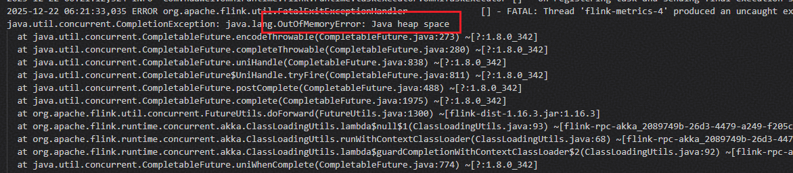

# 常见问题<a name="ZH-CN_TOPIC_0000002549644861"></a>

## Nexmark连续SQL任务执行异常的解决方法<a name="ZH-CN_TOPIC_0000002549644857"></a>

**问题现象描述<a name="zh-cn_topic_0000002533267891_section758133012554"></a>**

- 现象一：使用开源Nexmark组件连续提交SQL任务时，有概率出现前后两轮任务执行重叠现象。此时上一轮任务占据资源未释放，导致下一轮任务无资源可用。JobManager日志中打印`free slot:0`关键字，同时将任务取消，导致任务最终执行失败。

  

- 现象二：Nexmark有概率因任务执行过快而导致未能抓取到吞吐量数据，提示`The metric reporter doesn't collect any metrics`。

  

- 现象三：连续提交SQL任务并长时间运行Nexmark Q9等大状态SQL时，有概率引发Java OOM（out of memory，内存不足）问题。

  

**关键过程、根本原因分析<a name="zh-cn_topic_0000002533267891_section145813300553"></a>**

- 现象一：Nexmark开源软件存在逻辑缺陷，未正确处理任务释放时序。
- 现象二：Nexmark开源软件存在逻辑缺陷，OmniStream可以正常完成SQL任务的执行。
- 现象三：属Flink原生问题，非OmniStream导致。

**结论、解决方案及效果<a name="zh-cn_topic_0000002533267891_section93441811202317"></a>**

- 现象一：重新提交任务。
- 现象二：忽略提示，无需处理。
- 现象三：需要重启整个Flink集群，并重新提交任务。

## JVM GC 参数丢失的解决办法<a name="ZH-CN_TOPIC_0000002549644857"></a>

**问题现象描述<a name="zh-cn_topic_0000002533267891_section758133012554"></a>**

现象：在使能omniStream后，flink taskManager原本的G1GC参数丢失，导致JVM发生内存溢出（oom）。

**关键过程、根本原因分析<a name="zh-cn_topic_0000002533267891_section145813300553"></a>**

flink taskManager 在启动时会检测是否配置了JVM_OPTS环境变量。如果没有配置，则创建JVM_OPTS并添加G1GC参数启动taskManager，否则使用配置的JVM_OPTS启动taskManager。在使能OmniStream后会自动生成JVM_OPTS，导致G1GC参数丢失。

**结论、解决方案及效果<a name="zh-cn_topic_0000002533267891_section93441811202317"></a>**

参考如下指令，在flink-conf.yaml配置文件中手动添加 taskManager G1GC参数。

```yaml
env.java.opts.taskmanager: -XX:+UseG1GC
```
