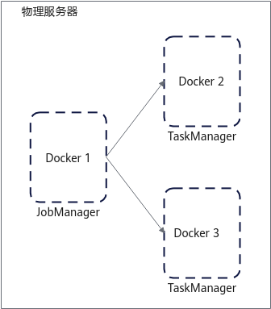

# 安装指南<a name="ZH-CN_TOPIC_0000002517504838"></a>

## 安装简介<a name="ZH-CN_TOPIC_0000002548944711"></a>

### 组网规划<a name="ZH-CN_TOPIC_0000002549064701"></a>

OmniStream Flink Native化采用单机容器化部署方案，使用Docker容器运行Flink。

一共部署3个Docker容器，容器规格均为8c32g，其中1个容器运行Job Manager，另外2个容器运行Task Manager。组网规划如[**图 1** 组网规划](#组网规划)所示。

**图 1** 组网规划<a name="zh-cn_topic_0000002263664085_fig2900236105214"></a><a id="组网规划"></a><br>


### 环境要求<a name="ZH-CN_TOPIC_0000002517344922"></a>

安装OmniStream Flink Native化特性前，请参见本节内容，提前准备软硬件安装环境，以确保后续安装操作顺利进行。

**硬件要求<a name="zh-cn_topic_0000002228744546_section7861618121914"></a>**

节点硬件要求如[**表 1** 硬件要求](#硬件要求)所示。

**表 1** 硬件要求<a id="硬件要求"></a>

|硬件环境|节点|
|--|--|
|处理器|鲲鹏920新型号处理器|
|内存大小|384GB（12 * 32GB）|
|内存频率|2666MHz|
|网络|业务网络10GE</br>管理网络1GE|
|硬盘|系统盘：1 * RAID 0（1 * 1.2TB SAS HDD）</br>数据盘：12 * RAID 0（12 * 8TB SATA HDD）|
|RAID控制卡|LSI SAS3508|

**操作系统和软件要求<a name="zh-cn_topic_0000002228744546_section412511315357"></a>**

操作系统和软件要求如[**表 2** 操作系统和软件要求](#操作系统和软件要求)所示。

**表 2** 操作系统和软件要求<a id="操作系统和软件要求"></a>

|项目| 版本                                                                                                                                                                                                                                                                                           | 说明                                                                                                                                                                |
|--|----------------------------------------------------------------------------------------------------------------------------------------------------------------------------------------------------------------------------------------------------------------------------------------------|-------------------------------------------------------------------------------------------------------------------------------------------------------------------|
|操作系统| [openEuler 22.03 LTS SP4](https://dl-cdn.openeuler.openatom.cn/openEuler-22.03-LTS-SP4/ISO/aarch64/openEuler-22.03-LTS-SP4-everything-debug-aarch64-dvd.iso)                                                                                                                                 | 无特殊要求。                                                                                                                                                            |
|JDK| [毕昇JDK 1.8（建议使用毕昇JDK 1.8.0_342）](https://mirror.iscas.ac.cn/kunpeng/archive/compiler/bisheng_jdk/bisheng-jdk-8u342-linux-aarch64.tar.gz)                                                                                                                                                     | JDK需要部署到所有容器内。                                                                                                                                                    |
|Flink| [1.16.3](https://archive.apache.org/dist/flink/flink-1.16.3/flink-1.16.3-bin-scala_2.12.tgz)<br>[1.17.1](https://archive.apache.org/dist/flink/flink-1.17.1/flink-1.17.1-bin-scala_2.12.tgz)<br>[1.20.0](https://archive.apache.org/dist/flink/flink-1.20.0/flink-1.20.0-bin-scala_2.12.tgz) | 部署指南请参见[《Flink 部署指南（CentOS&openEuler）》](https://www.hikunpeng.com/document/detail/zh/kunpengbds/ecosystemEnable/Flink/kunpengflink_04_0001.html)。Flink需要部署到所有容器内。 |
|Docker| [19.03.15](https://www.hikunpeng.com/document/detail/zh/kunpengbds/appAccelFeatures/sqlqueryaccelf/kunpengbds_omniruntime_20_0911.html)                                                                                                                                                      | 无特殊说明。                                                                                                                                                            |
|Nexmark| [v0.2.0](https://www.hikunpeng.com/document/detail/zh/kunpengbds/appAccelFeatures/sqlqueryaccelf/kunpengbds_omniruntime_20_0914.html)                                                                                                                                                        | 请按照[官网说明](https://github.com/nexmark/nexmark)进行编译，Nexmark需要部署到所有容器内。                                                                                                                                |
|Python| [3.9.9](https://www.hikunpeng.com/document/detail/zh/kunpengbds/appAccelFeatures/sqlqueryaccelf/kunpengbds_omniruntime_20_0915.html)                                                                                                                                                         | Python需要部署到提交作业的容器或者物理机上。                                                                                                                                         |
|yaml-cpp| [0.6.3](https://www.hikunpeng.com/document/detail/zh/kunpengbds/appAccelFeatures/sqlqueryaccelf/kunpengbds_omniruntime_20_0916.html)                                                                                                                                                         | 需要安装到提交作业的容器或者物理机上。                                                                                                                                               |
|GCC| [10.3.1](https://repo.openeuler.openatom.cn/openEuler-22.03-LTS-SP4/update/aarch64/Packages/gcc-10.3.1-66.oe2203sp4.aarch64.rpm)                                                                                                                                                             | 无特殊说明。                                                                                                                                                            |
|Maven| [3.8.7](https://archive.apache.org/dist/maven/maven-3/3.8.7/binaries/apache-maven-3.8.7-bin.zip)                                                                                                                                                                                             | 用于生成UDF验证用例JAR包。                                                                                                                                                  |
|Jemalloc| [5.3.0](https://github.com/jemalloc/jemalloc/archive/refs/tags/5.3.0.tar.gz)                                                                                                                                                                                                                 | 用于提供UDF翻译使用的头文件。                                                                                                                                                  |
|OmniOperator| [master](https://atomgit.com/openeuler/OmniOperator/tree/master)                                                                                                                                                                                                                                                                      | 用于提供UDF翻译使用的头文件。                                                                                                                                                  |
|Xxhash| [0.8.2](https://github.com/Cyan4973/xxHash/tree/v0.8.2)                                                                                                                                                                                                                                                                                    | 用于提供UDF翻译使用的头文件。                                                                                                                                                  |
|nlohmann json| [3.11.3](https://github.com/nlohmann/json/tree/v3.11.3)                                                                                                                                                                                                                                                                                   | 用于提供UDF翻译使用的头文件。                                                                                                                                                  |

**软件安装包获取<a name="zh-cn_topic_0000002228744546_section189181357102011"></a>**

安装OmniStream Flink Native化特性所需软件安装包及其获取方式如[**表 3** 软件获取列表](#软件获取列表)所示。

**表 3** 软件获取列表<a id="软件获取列表"></a>

|名称| 包名                                               |发布类型|说明| 获取地址                                                                                                                                                                                                                                                               |
|--|--------------------------------------------------|--|--|--------------------------------------------------------------------------------------------------------------------------------------------------------------------------------------------------------------------------------------------------------------------|
|OmniStream压缩包| BoostKit-omniruntime-omnistream-1.2.0.zip        |开源|OmniStream Flink Native化特性软件安装包。| [获取链接](https://gitcode.com/openeuler/OmniStream/releases/download/tag_BoostKit_26.0.RC1.B031_001/BoostKit-omniruntime-omnistream-1.2.0.zip)                                                                                                                            |
|UDF翻译工具| UNT-1.0-35.noarch.rpm                            |开源|UDF翻译工具RPM包，安装后在/opt路径下新增UDF翻译工具。| [获取链接](https://eur.openeuler.openatom.cn/results/cutie-deng/UNT/openeuler-22.03_LTS_SP4-aarch64/00110412-UNT/UNT-1.0-35.noarch.rpm)                                                                                                                                |
|AI4C| AI4C-1.0.4-8.aarch64.rpm                         |开源|支持编译器集成机器学习驱动的优化技术的框架。RPM包直接安装。| [获取链接](https://gitee.com/kunpengcompute/boostkit-bigdata/releases/download/25.1.RC1-OmniStream-release/AI4C-1.0.4-8.aarch64.rpm)                                                                                                                                   |
|KACC_JSON| BoostKit-kaccjson_1.1.0.zip                      |闭源|自主创新的用于UDF翻译中替换GSON的C++版实现，该ZIP包含适配层和KACC_JSON核心实现，内含若干头文件和静态库。</br>该文件从Dependency_library_OmniStream.zip解压获得。| [获取链接](https://gitcode.com/openeuler/OmniStream/releases/download/tag_BoostKit_26.0.RC1.B031_001/Dependency_library_OmniStream.zip)                                                                                                                                    |
|KSL| BoostKit-ksl_2.5.1.zip                           |闭源|正则加速库，该zip包含ReplaceAll用于优化String基础库，内含头文件和1个静态库。| [获取链接](https://www.hikunpeng.com/boostkit/library/system?subtab=Hyperscan&version=2.5.1)                                                                                                                                                                           |
|依赖库| Dependency_library_Default |开源|OmniStream Flink Native化运行时所依赖的库文件。</br>该文件夹从Dependency_library_OmniStream.zip解压获得。| [获取链接](https://gitcode.com/openeuler/OmniStream/releases/download/tag_BoostKit_26.0.RC1.B031_001/Dependency_library_OmniStream.zip) |

**软件安装包完整性校验<a name="zh-cn_topic_0000002228744546_section156811729327"></a>**

从鲲鹏社区获取的软件安装包，下载软件安装包后需要校验软件安装包，确保与网站上的原始软件安装包一致。

校验方法：

1. 获取软件数字证书和软件安装包。
2. [获取校验工具和校验方法](https://support.huawei.com/enterprise/zh/tool/pgp-verify-TL1000000054)。
3. 参见上述链接下载的《OpenPGP签名验证指南》进行软件安装包完整性检查。

## 安装特性<a name="ZH-CN_TOPIC_0000002549064703"></a>

### 安装基础环境<a name="ZH-CN_TOPIC_0000002549064713"></a>

#### 安装Docker<a name="ZH-CN_TOPIC_0000002549064717"></a>

安装Docker并部署多个容器以搭建Flink环境。如果服务器无法连接外网，请根据实际情况配置本地Yum源，确保安装过程顺利。

1. 请参见《[Docker 安装指南（CentOS&openEuler）](https://www.hikunpeng.com/document/detail/zh/kunpengcpfs/ecosystemEnable/Docker/kunpengdocker_03_0001.html)》安装Docker，并导入基础镜像。

    ```bash
    cd /opt
    wget --no-check-certificate https://mirrors.huaweicloud.com/openeuler/openEuler-22.03-LTS-SP4/docker_img/aarch64/openEuler-docker.aarch64.tar.xz
    docker load < openEuler-docker.aarch64.tar.xz
    ```

2. 创建bridge模式网络。

    ```bash
    docker network create -d bridge flink-network
    ```

    确认网络是否创建成功。

    ```bash
    docker network ls
    ```

    

3. 创建并启动3个Docker容器。

    创建的容器规格为8c32g，分别命名为flink\_jm\_8c32g、flink\_tm1\_8c32g、flink\_tm2\_8c32g。所有容器启动完成后自动退出命令执行流程。

    ```bash
    docker run -it -d --name flink_jm_8c32g --cpus=8 --memory=32g --network flink-network openeuler-22.03-lts-sp4 /bin/bash 
    docker run -it -d --name flink_tm1_8c32g --cpus=8 --memory=32g --network flink-network openeuler-22.03-lts-sp4 /bin/bash 
    docker run -it -d --name flink_tm2_8c32g --cpus=8 --memory=32g --network flink-network openeuler-22.03-lts-sp4 /bin/bash 
    ```

4. 查询容器ID。

    ```bash
    docker ps
    ```

    下图中第一列为容器ID。

    

5. 登录所有容器，容器内启动SSH服务，并配置免密登录。
    1. 依次登录容器，执行步骤[5.b](#zh-cn_topic_0000002228584730_li791415596401)～[5.g](#li1581214912220)。

        ```bash
        docker exec -it flink_jm_8c32g /bin/bash
        docker exec -it flink_tm1_8c32g /bin/bash
        docker exec -it flink_tm2_8c32g /bin/bash
        ```

    2. <a name="zh-cn_topic_0000002228584730_li791415596401"></a>安装SSH服务依赖、修改密码依赖、编辑命令依赖、查找命令依赖、网络管理依赖，如镜像有其他依赖缺失请自行安装。

        ```bash
        yum -y install openssh-clients openssh-server passwd vim findutils net-tools libXext libXrender gcc cmake make gcc-c++ unzip wget libXtst
        ```

    3. 生成RSA密钥。

        ```bash
        ssh-keygen -A
        ```

    4. 启动容器内SSH服务。

        ```bash
        /usr/sbin/sshd -D &
        ```

    5. 为容器设置密码。

        ```bash
        # 通过passwd命令设置当前用户密码，密码请自行记忆
        passwd
        ```

    6. 再次生成RSA密钥，遇到提示时，按`Enter`。

        ```bash
        ssh-keygen -t rsa
        ```

    7. <a name="li1581214912220"></a>退出容器。

        ```bash
        exit
        ```

    8. 在flink\_jm\_8c32g容器上配置对其他容器的SSH免密登录。

        ```bash
        docker exec -it flink_jm_8c32g /bin/bash
        ssh-copy-id -i ~/.ssh/id_rsa.pub root@flink_tm1_8c32g
        ssh-copy-id -i ~/.ssh/id_rsa.pub root@flink_tm2_8c32g
        ```

#### 安装JDK<a name="ZH-CN_TOPIC_0000002517344928"></a>

安装并配置毕昇JDK，为运行Flink集群提供运行时环境。

1. 进入物理机的`/usr/local`目录并下载bisheng-jdk-8u342-linux-aarch64.tar.gz。

    ```bash
    cd /usr/local
    wget --no-check-certificate https://mirror.iscas.ac.cn/kunpeng/archive/compiler/bisheng_jdk/bisheng-jdk-8u342-linux-aarch64.tar.gz
    ```

2. 进入`/usr/local`目录并解压bisheng-jdk-8u342-linux-aarch64.tar.gz，且将解压后的JDK目录的所属用户、所属用户组变更为`root`。

    ```bash
    tar -zxvf bisheng-jdk-8u342-linux-aarch64.tar.gz
    chown -R root /usr/local/bisheng-jdk1.8.0_342
    chgrp -R root /usr/local/bisheng-jdk1.8.0_342
    ```

#### 安装Flink<a name="ZH-CN_TOPIC_0000002517504826"></a>

在物理机上部署并配置Flink，使其能够运行在多个Docker容器中，以便后续可以提交并运行Flink作业。

1. 进入物理机的`/usr/local`目录并下载Flink软件部署包。

    ```bash
    cd /usr/local
    wget --no-check-certificate https://archive.apache.org/dist/flink/flink-1.16.3/flink-1.16.3-bin-scala_2.12.tgz
    ```

    > **说明：** 
    >flink-1.16.3-bin-scala\_2.12.tgz为Flink软件包名称，如果使用的是其他版本的Flink，请根据实际情况修改。

2. 到`/usr/local`目录解压flink-1.16.3-bin-scala\_2.12.tgz，建立软链接，便于后期版本更换。

    ```bash
    tar -zxvf flink-1.16.3-bin-scala_2.12.tgz
    chown -R root:root flink-1.16.3
    ln -s flink-1.16.3 flink
    ```

    > **说明：** 
    >flink-1.16.3为Flink软件目录名称，如果使用的是其他版本的Flink，请根据实际情况修改。

3. 配置Flink的masters和workers文件。
    1. 打开`/usr/local/flink/conf/masters`文件。

        ```bash
        vi /usr/local/flink/conf/masters
        ```

    2. 按`i`进入编辑模式，将masters内容修改为容器flink\_jm\_8c32g的容器ID:8081，例如：

        ```bash
        4a376b30106b:8081
        ```

    3. 按`Esc`键，输入 **:wq!**，按`Enter`保存并退出编辑。
    4. 打开`/usr/local/flink/conf/workers`文件。

        ```bash
        vi /usr/local/flink/conf/workers
        ```

    5. 按`i`进入编辑模式，将workers内容修改为flink\_tm1\_8c32g、flink\_tm2\_8c32g容器的容器ID，例如（2个Docker容器，每个Docker 4个Task Manager配置）：

        ```bash
        c3ddf10d0353
        c3ddf10d0353
        c3ddf10d0353
        c3ddf10d0353
        c3bbdbcc1ae1
        c3bbdbcc1ae1
        c3bbdbcc1ae1
        c3bbdbcc1ae1
        ```

    6. 按`Esc`键，输入 **:wq!**，按`Enter`保存并退出编辑。
    7. 打开`/usr/local/flink/conf/flink-conf.yaml`文件。

        ```bash
        vi /usr/local/flink/conf/flink-conf.yaml
        ```

    8. 按`i`进入编辑模式，替换为如下配置，并将jobmanager.rpc.address修改为容器flink\_jm\_8c32g的容器ID，建议配置的slot总数大于并行度，例如：

        ```bash
        taskmanager.memory.process.size: 8G
        jobmanager.rpc.address: 4a376b30106b
        jobmanager.rpc.port: 6123
        jobmanager.memory.process.size: 8G
        taskmanager.memory.process.size: 8G
        taskmanager.numberOfTaskSlots: 2
        parallelism.default: 16
        rest.port: 8081
        rest.bind-port: 8081
        io.tmp.dirs: /tmp
        #pipeline.operator-chaining: true
        #execution:runtime-mode: STREAMING
        #jobmanager.execution.failover-strategy: region
        #table.optimizer.agg-phase-strategy: ONE_PHASE
        #pipeline.object-reuse: true
        #==============================================================================
        # JVM
        #==============================================================================
        # JVM options for GC
        #env.java.opts: -verbose:gc -XX:NewRatio=3 -XX:+PrintGCDetails -XX:+PrintGCDateStamps -XX:ParallelGCThreads=4
        ```

    9. 按`Esc`键，输入 **:wq!**，按`Enter`保存并退出编辑。

#### 安装Nexmark<a name="ZH-CN_TOPIC_0000002549064707"></a>

安装和配置Nexmark，用于验证和测试Flink。

1. 下载nexmark-flink.tgz到物理机`/opt`目录中并解压。

    ```bash
    cd /opt
    wget --no-check-certificate https://github.com/nexmark/nexmark/releases/download/v0.2.0/nexmark-flink.tgz
    tar xzf nexmark-flink.tgz
    mv nexmark-flink nexmark
    chown -R root:root nexmark
    ```

2. 修改Nexmark配置文件`/opt/nexmark/conf/nexmark.yaml`。
    1. 打开文件。

        ```bash
        vi /opt/nexmark/conf/nexmark.yaml
        ```

    2. 按`i`进入编辑模式，将文件内容替换为如下。并修改nexmark.metric.reporter.host为flink\_jm\_8c32g容器的ID。

        ```bash
        ################################################################################
        #  Licensed to the Apache Software Foundation (ASF) under one
        #  or more contributor license agreements.  See the NOTICE file
        #  distributed with this work for additional information
        #  regarding copyright ownership.  The ASF licenses this file
        #  to you under the Apache License, Version 2.0 (the
        #  "License"); you may not use this file except in compliance
        #  with the License.  You may obtain a copy of the License at
        #
        #      http://www.apache.org/licenses/LICENSE-2.0
        #
        #  Unless required by applicable law or agreed to in writing, software
        #  distributed under the License is distributed on an "AS IS" BASIS,
        #  WITHOUT WARRANTIES OR CONDITIONS OF ANY KIND, either express or implied.
        #  See the License for the specific language governing permissions and
        # limitations under the License.
        ################################################################################
        
        #==============================================================================
        # Rest & web frontend
        #==============================================================================
        
        # The metric reporter server host.
        nexmark.metric.reporter.host: 4a376b30106b
        # The metric reporter server port.
        nexmark.metric.reporter.port: 9098
        
        #==============================================================================
        # Benchmark workload configuration (events.num)
        #==============================================================================
        
        nexmark.workload.suite.100m.events.num: 50000000
        nexmark.workload.suite.100m.tps: 10000000
        nexmark.workload.suite.100m.queries: "q0,q1,q2,q3,q4,q5,q7,q8,q9,q10,q11,q12,q13,q14,q15,q16,q17,q18,q19,q20,q21,q22"
        nexmark.workload.suite.100m.queries.cep: "q0,q1,q2,q3"
        nexmark.workload.suite.100m.warmup.duration: 120s
        nexmark.workload.suite.100m.warmup.events.num: 50000000
        nexmark.workload.suite.100m.warmup.tps: 10000000
        
        #==============================================================================
        # Benchmark workload configuration (tps, legacy mode)
        # Without events.num and with monitor.duration
        # NOTE: The numerical value of TPS is unstable
        #==============================================================================
        
        # When to monitor the metrics, default 3min after job is started
        # nexmark.metric.monitor.delay: 3min
        # How long to monitor the metrics, default 3min, i.e. monitor from 3min to 6min after job is started
        # nexmark.metric.monitor.duration: 3min
        
        # nexmark.workload.suite.10m.tps: 10000000
        # nexmark.workload.suite.10m.queries: "q0,q1,q2,q3,q4,q5,q7,q8,q9,q10,q11,q12,q13,q14,q15,q16,q17,q18,q19,q20,q21,q22"
        
        #==============================================================================
        # Workload for data generation
        #==============================================================================
        
        nexmark.workload.suite.datagen.tps: 1000000
        nexmark.workload.suite.datagen.queries: "insert_kafka"
        nexmark.workload.suite.datagen.queries.cep: "insert_kafka"
        
        #==============================================================================
        # Flink REST
        #==============================================================================
        
        flink.rest.address: 4a376b30106b
        flink.rest.port: 8081
        
        #==============================================================================
        # Kafka config
        #==============================================================================
        
        # kafka.bootstrap.servers: ***:9092
        ```

    3. 按`Esc`键，输入 **:wq!**，按`Enter`保存并退出编辑。

#### 安装Python<a name="ZH-CN_TOPIC_0000002517344926"></a>

在flink\_jm\_8c32g中，通过RPM包安装Python。

```bash
wget --no-check-certificate https://repo.openeuler.org/openEuler-preview/openEuler-22.03-LTS-SP4-HP-preview/OS/aarch64/Packages/python3-setuptools-59.4.0-5.oe2203sp4.noarch.rpm
rpm -ivh python3-setuptools-59.4.0-5.oe2203sp4.noarch.rpm
rm -rf /usr/bin/python
ln -s /usr/bin/python3 /usr/bin/python
```

#### 安装yaml-cpp<a name="ZH-CN_TOPIC_0000002548944719"></a>

在flink\_jm\_8c32g中，通过RPM包安装yaml-cpp。

```bash
wget --no-check-certificate https://repo.openeuler.org/openEuler-preview/openEuler-22.03-LTS-SP4-HP-preview/OS/aarch64/Packages/yaml-cpp-0.6.3-2.oe2203sp4.aarch64.rpm
rpm -ivh yaml-cpp-0.6.3-2.oe2203sp4.aarch64.rpm
```

#### 安装必要依赖<a name="ZH-CN_TOPIC_0000002517344930"></a>

安装运行时依赖的其他软件包。

1. 在物理机运行以下命令，安装JSON依赖包。

    ```bash
    wget -P /usr/local/flink/lib/ https://repo.maven.apache.org/maven2/org/json/json/20240303/json-20240303.jar
    ```

2. 在物理机运行以下命令，安装Gson依赖包。

    ```bash
    wget -P /usr/local/flink/lib/ https://repo.maven.apache.org/maven2/com/google/code/gson/gson/2.11.0/gson-2.11.0.jar
    ```

3. 安装其他依赖包。
    1. 请参见[**表 3** 软件获取列表](#软件获取列表)获取依赖包Dependency_library_OmniStream.zip，解压到`/opt`路径。

        ```bash
        unzip Dependency_library_OmniStream.zip -d /opt
        cp /opt/Dependency_library_Default /opt/Dependency_library        
        chmod -R 550 /opt/Dependency_library/*
        ```

### 安装OmniStream<a name="ZH-CN_TOPIC_0000002549064711"></a>

在Flink独立部署模式中，可以通过安装预先编译好的OmniStream Flink Native化二进制包，将其以插件的形式集成到Flink中。

1. 在物理机上创建目录`/usr/local/OmniStream`，用于存放OmniStream Flink Native化的二进制文件。

    将从[**表 3** 软件获取列表](#软件获取列表)中获取的BoostKit-omniruntime-omnistream-1.3.0.zip安装包解压到`/usr/local/OmniStream`目录下。

    ```bash
    unzip BoostKit-omniruntime-omnistream-1.3.0.zip
    mkdir -p /usr/local/OmniStream
    cp -r OmniStream_Default/* /usr/local/OmniStream/
    chmod -R 550 /usr/local/OmniStream/*
    ```

2. <a name="zh-cn_topic_0000002263584129_li146334222212"></a>查看解压文件。

    ```bash
    ls
    ```

    解压二进制包后主要得到如下JAR包、so文件和基础库、头文件目录include。

    ```bash
    flink-tnel-0.1-SNAPSHOT.jar
    libtnel.so
    libboundscheck.so
    libboostkit-omniop-codegen-2.2.0-aarch64.so
    libboostkit-omniop-operator-2.2.0-aarch64.so
    libboostkit-omniop-vector-2.2.0-aarch64.so
    libre2.so.11
    libbasictypes
    include
    ```

3. 编辑Flink的配置文件 `/usr/local/flink/bin/config.sh`。
<a id="editconfigsh"></a>
    1. 打开文件。

        ```bash
        vi /usr/local/flink/bin/config.sh
        ```

    2. 按`i`进入编辑模式，找到constructFlinkClassPath\(\)函数，注释掉原有的echo行，并添加新的PATCH路径。

        ```bash
        # echo "$FLINK_CLASSPATH""$FLINK_DIST"
        PATCH=/usr/local/OmniStream/flink-tnel-0.1-SNAPSHOT.jar
        echo $PATCH:"$FLINK_CLASSPATH""$FLINK_DIST"
        ```

        修改后的配置文件如下图。

        

    3. 按`Esc`键，输入 **:wq!**，按`Enter`保存并退出编辑。

4. 编辑Flink的配置文件 `/usr/local/flink/conf/flink-conf.yaml`。<a id="editconfigyaml"></a>
    1. 打开文件。

        ```bash
        vi /usr/local/flink/conf/flink-conf.yaml
        ```

    2. 按`i`进入编辑模式，添加libtnel.so文件所在的路径到env.java.opts中，即[2](#zh-cn_topic_0000002263584129_li146334222212)中解压后so文件所在的目录。

        ```bash
        env.java.opts: -Djava.library.path=/usr/local/OmniStream/
        ```

    3. 按`Esc`键，输入 **:wq!**，按`Enter`保存并退出编辑。

### 安装UDF翻译工具<a name="ZH-CN_TOPIC_0000002517504824"></a>

**安装UDF翻译工具RPM包<a name="section5466185845817"></a>**

1. 从[**表 3** 软件获取列表](#软件获取列表)中获取UDF翻译工具的RPM包，将RPM包上传至物理机的`/opt`目录。
2. 在容器flink\_jm\_8c32g中安装该RPM包，安装路径默认为`/opt`。

    ```bash
    rpm -ivh UNT-1.0-35.noarch.rpm
    ```

    命令执行完成后会自动创建`/opt/udf-trans-opt`目录。

    > **说明：** 
    >如果没有创建`/opt/udf-trans-opt`目录，请执行以下命令手动创建。
    >```bash
    >mkdir /opt/udf-trans-opt
    >```

3. 将[安装OmniStream](#安装omnistream)中安装后的基础库目录复制到`/opt/udf-trans-opt`。

    ```bash
    docker cp /usr/local/OmniStream/libbasictypes flink_jm_8c32g:/opt/udf-trans-opt
    ```

**安装UDF依赖<a name="section1041811513598"></a>**

1. 在物理机上传并解压KACC\_JSON。

    从[**表 3** 软件获取列表](#软件获取列表)中获取BoostKit-kaccjson\_1.1.0.zip，上传该压缩包至物理机的`/opt`目录，并解压。

    ```bash
    cd /opt/
    unzip BoostKit-kaccjson_1.1.0.zip
    ```

2. 将KACC\_JSON头文件和静态库复制到flink\_jm\_8c32g容器中的UDF翻译工具路径`/opt/udf-trans-opt/libbasictypes`。

    ```bash
    docker exec flink_jm_8c32g mkdir -p /opt/udf-trans-opt/libbasictypes/include 
    docker exec flink_jm_8c32g mkdir -p /opt/udf-trans-opt/libbasictypes/lib
    docker cp include/kacc_json flink_jm_8c32g:/opt/udf-trans-opt/libbasictypes/include/
    docker cp include/kacc_gson_shell flink_jm_8c32g:/opt/udf-trans-opt/libbasictypes/include/
    docker cp libkaccgson.a flink_jm_8c32g:/opt/udf-trans-opt/libbasictypes/lib/
    ```

3. 下载KSL并解压安装。
    1. 从[**表 3** 软件获取列表](#软件获取列表)获取BoostKit-ksl\_2.5.1.zip，上传该压缩包至物理机的`/opt`目录，解压并复制RPM包到flink\_jm\_8c32g容器中。

        ```bash
        cd /opt
        unzip BoostKit-ksl_2.5.1.zip
        docker cp boostkit-ksl-2.5.1-1.aarch64.rpm flink_jm_8c32g:/opt/udf-trans-opt/
        ```

    2. 进入flink\_jm\_8c32g容器并安装KSL的RPM包。

        ```bash
        docker exec -it flink_jm_8c32g bash
        cd /opt/udf-trans-opt/
        rpm -ivh boostkit-ksl-2.5.1-1.aarch64.rpm
        ```

4. 在物理机安装OmniStream依赖头文件。
    1. 将依赖头文件拷贝到flink_jm_8c32g:/opt/udf-trans-opt/libbasictypes/include/目录下。

        ```bash
        docker cp /usr/local/OmniStream/libbasictypes/OmniStream flink_jm_8c32g:/opt/udf-trans-opt/libbasictypes/include/
        docker cp /usr/local/OmniStream/libbasictypes/include/core flink_jm_8c32g:/opt/udf-trans-opt/libbasictypes/include/
        docker cp /usr/local/OmniStream/libbasictypes/include/runtime flink_jm_8c32g:/opt/udf-trans-opt/libbasictypes/include/
        docker cp /usr/local/OmniStream/libbasictypes/include/streaming flink_jm_8c32g:/opt/udf-trans-opt/libbasictypes/include/
        docker cp /usr/local/OmniStream/libbasictypes/include/table flink_jm_8c32g:/opt/udf-trans-opt/libbasictypes/include/
        docker cp /usr/local/OmniStream/libbasictypes/include/third_party flink_jm_8c32g:/opt/udf-trans-opt/libbasictypes/include/
        ```

    2. 安装jemalloc。
        1. 下载[jemalloc-5.3.0.tar.gz](https://github.com/jemalloc/jemalloc/archive/refs/tags/5.3.0.tar.gz)，并上传到管理节点。

           ```bash
           cd /opt/omni-operator/
           tar zxvf jemalloc-5.3.0.tar.gz
           mv jemalloc-5.3.0 jemalloc
           ```

           >**说明：**
           >`/opt/omni-operator/jemalloc`目录用户可自行定义。

        2. 进入`jemalloc`目录，运行脚本并安装。

            ```bash
            cd jemalloc
            ./autogen.sh --disable-initial-exec-tls
            make -j2
            ```

        3. 拷贝`/opt/omni-operator/jemalloc/lib/libjemalloc.so.2`到`/opt/omni-operator/lib`目录下。

            ```bash
            cp /opt/omni-operator/jemalloc/lib/libjemalloc.so.2 /opt/omni-operator/lib/
            ```

    3. 复制jemalloc.h到容器UDF工具的头文件引用目录中。

        ```bash
        docker cp /opt/omni-operator/jemalloc/include/jemalloc/jemalloc.h flink_jm_8c32g:/opt/udf-trans-opt/libbasictypes/include/
        ```

    4. 下载OmniOperator，将OmniOperator源码全部拷贝到容器UDF工具的头文件引用目录中。

        ```bash
        cd /usr/local/OmniStream/depend/
        git clone https://atomgit.com/openeuler/OmniOperator.git -b master
        mv OmniOperator OmniOperatorJIT 
        docker cp /usr/local/OmniStream/depend/OmniOperatorJIT flink_jm_8c32g:/opt/udf-trans-opt/libbasictypes/include/
        ```

    5. 下载xxhash，将xxhash.h拷贝到UDF工具的头文件引用目录中。

        ```bash
        cd /usr/local/OmniStream/depend/
        git clone https://github.com/Cyan4973/xxHash.git
        cd xxHash && git checkout tags/v0.8.2
        docker cp /usr/local/OmniStream/depend/xxHash/xxhash.h flink_jm_8c32g:/opt/udf-trans-opt/libbasictypes/include/
        ```

    6. 下载nlohmann json，将本地代码中的include/nlohmann目录拷贝到容器UDF工具的头文件引用目录中。

        ```bash
        cd /usr/local/OmniStream/depend/
        git clone https://github.com/nlohmann/json.git -b v3.11.3
        docker cp /usr/local/OmniStream/depend/json/include/nlohmann flink_jm_8c32g:/opt/udf-trans-opt/libbasictypes/include/
        ```

5. 安装libboundscheck头文件`/opt/udf-trans-opt/libbasictypes`。
    1. 进入flink\_jm\_8c32g容器创建目录`/opt/udf-trans-opt/libbasictypes/include/libboundscheck`并退出容器。

        ```bash
        docker exec -it flink_jm_8c32g bash
        mkdir -p /opt/udf-trans-opt/libbasictypes/include/libboundscheck/
        exit
        ```

    2. 将[安装OmniStream](#安装omnistream)步骤中安装后的include复制到flink\_jm\_8c32g容器的`/opt/udf-trans-opt/libbasictypes/include/libboundscheck`目录。

        ```bash
        docker cp /usr/local/OmniStream/include flink_jm_8c32g:/opt/udf-trans-opt/libbasictypes/include/libboundscheck
        ```

### 安装AI4C<a name="ZH-CN_TOPIC_0000002517344924"></a>

从[**表 3** 软件获取列表](#软件获取列表)中获取依赖包AI4C-1.0.4-8.aarch64.rpm，上传到flink\_jm\_8c32g`/opt`路径，并安装。

```bash
docker cp AI4C-1.0.4-8.aarch64.rpm flink_jm_8c32g:/opt
docker exec -it flink_jm_8c32g bash
cd /opt
rpm -ivh --nodeps AI4C-1.0.4-8.aarch64.rpm
```

### 容器化部署<a name="ZH-CN_TOPIC_0000002549064715"></a>

在物理机完成基本软件安装和配置后，需要将[安装基础环境](#安装基础环境)～[安装OmniStream](#安装omnistream)部署到容器中实现特性容器化使用。

1. 将Nexmark、JDK、Flink、第三方依赖、OmniStream目录复制到所有容器内。

    ```bash
    docker cp /opt/nexmark flink_jm_8c32g:/usr/local/
    docker cp /usr/local/flink-1.16.3 flink_jm_8c32g:/usr/local/
    docker cp /usr/local/bisheng-jdk1.8.0_342 flink_jm_8c32g:/usr/local/
    docker cp /opt/Dependency_library/Dependency_library_Default flink_jm_8c32g:/opt/Dependency_library
    docker cp /usr/local/OmniStream flink_jm_8c32g:/usr/local/
    
    docker cp /opt/nexmark flink_tm1_8c32g:/usr/local/
    docker cp /usr/local/flink-1.16.3 flink_tm1_8c32g:/usr/local/
    docker cp /usr/local/bisheng-jdk1.8.0_342 flink_tm1_8c32g:/usr/local/
    docker cp /opt/Dependency_library/Dependency_library_Default flink_tm1_8c32g:/opt/Dependency_library
    docker cp /usr/local/OmniStream flink_tm1_8c32g:/usr/local/
    
    docker cp /opt/nexmark flink_tm2_8c32g:/usr/local/
    docker cp /usr/local/flink-1.16.3 flink_tm2_8c32g:/usr/local/
    docker cp /usr/local/bisheng-jdk1.8.0_342 flink_tm2_8c32g:/usr/local/
    docker cp /opt/Dependency_library/Dependency_library_Default flink_tm2_8c32g:/opt/Dependency_library
    docker cp /usr/local/OmniStream flink_tm2_8c32g:/usr/local/
    ```

2. 依次进入容器内，执行[3](#zh-cn_topic_0000002263664073_li8865185893116)。

    ```bash
    docker exec -it flink_jm_8c32g /bin/bash
    docker exec -it flink_tm1_8c32g /bin/bash
    docker exec -it flink_tm2_8c32g /bin/bash
    ```

3. <a name="zh-cn_topic_0000002263664073_li8865185893116"></a>在每个容器内设置Flink、JDK、Nexmark和LLVM的环境变量。
    1. 打开`/etc/profile`文件。

        ```bash
        vi /etc/profile
        ```

    2. 按`i`进入编辑模式，添加如下内容。

        ```bash
        export JAVA_HOME=/usr/local/bisheng-jdk1.8.0_342
        export PATH=$JAVA_HOME/bin:$PATH
        export FLINK_HOME=/usr/local/flink-1.16.3
        export PATH=$FLINK_HOME/bin:$PATH
        export NEXMARK=/usr/local/nexmark
        export PATH=$NEXMARK/bin:$PATH
        export LD_PRELOAD=/opt/Dependency_library/libjemalloc.so.2:$LD_PRELOAD
        export LD_LIBRARY_PATH=$LD_LIBRARY_PATH:$JAVA_HOME/jre/lib/aarch64:$JAVA_HOME/lib:$JAVA_HOME/jre/lib/aarch64/server
        export LD_LIBRARY_PATH=/usr/local/OmniStream:/opt/Dependency_library/:$LD_LIBRARY_PATH
        ```

    3. 按`Esc`键，输入 **:wq!**，按`Enter`保存并退出编辑。
    4. 使环境变量生效。

        ```bash
        source /etc/profile
        ```

    5. 退出容器。

        ```bash
        exit
        ```
