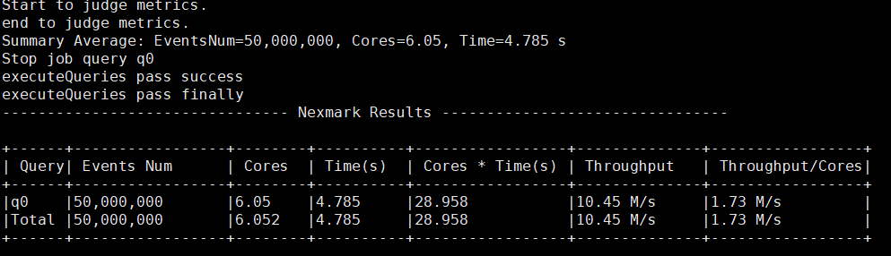
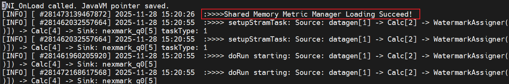
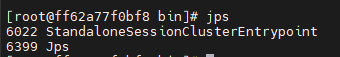
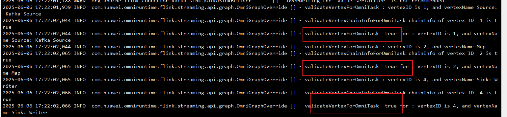

# 用户指南<a name="ZH-CN_TOPIC_0000002549640817"></a>

## 前提条件

请参考[安装指南](./installation_guide.md)完成相应软件的安装。

## 使用特性<a name="ZH-CN_TOPIC_0000002549520803"></a>

### SQL算子和表达式支持情况<a name="ZH-CN_TOPIC_0000002549640813"></a>

介绍在Flink 1.16.3、Flink 1.17.1和Flink 1.20.0引擎下，OmniStream Flink Native化特性对SQL算子及表达式（含数据类型）的支持范围、限制条件与使用规则。

OmniStream Flink Native化特性支持的算子、表达式、函数如[**表 2** 支持的算子列表](#支持的算子列表)和[**表 3** 支持的表达式列表](#支持的表达式列表)所示，表格中使用符号表示算子和表达式是否支持，符号的含义请参见[**表 1** 算子和表达式支持表格中符号的含义](#算子和表达式支持表格中符号的含义)。

> **须知：** 
>
>- [**表 2** 支持的算子列表](#支持的算子列表)和[**表 3** 支持的表达式列表](#支持的表达式列表)中仅描述了OmniStream Flink Native化特性支持或涉及的数据类型，未展示的数据类型是OmniStream Flink Native化特性不支持的。
>- 如果使用OmniStream Flink Native化特性不支持的算子和表达式，会导致执行计划回退为原生执行，对性能会有影响。
>- 使用sql-client交互式界面执行SQL时，推荐将SQL的结果输出到connector为blackhole的数据表中，具体可参考Nexmark Q0的执行方式。
>- 由于内存限制，默认情况下只支持Calc和LookupJoin算子，其他支持的算子需要export FLINK\_PERFORMANCE=false设置环境变量使能。

**表 1** 算子和表达式支持表格中符号的含义<a id="算子和表达式支持表格中符号的含义"></a>

|符号| 含义                                                                |
|--|-------------------------------------------------------------------|
|S| 表示支持该算子或表达式。                                                      |
|PS| 表示部分支持该算子或表达式，但存在一些限定条件。具体的限定条件请参见[约束与限制](../../README.md#约束与限制)。 |
|NS| 表示不支持该算子或表达式。                                                     |
|NA| 表示不涉及该算子或表达式。开源版本Flink也没有此输入场景。                                   |
|[Blank Cell]| 表示不适用或需要确认。                                                       |

**表 2** 支持的算子列表<a id="支持的算子列表"></a>

|支持算子名称|BIGINT|VARCHAR|TIMESTAMP(3)|
|--|--|--|--|
|Calc|S|S|S|
|Sink|S|S|S|
|Csv Source|S|S|S|
|Kafka Source|S|S|S|
|Kafka Sink|S|S|S|
|Join|PS|PS|PS|
|LookupJoin|PS|PS|PS|
|GroupAggregate|PS|PS|PS|
|LocalGroupAggregate|PS|PS|PS|
|GlobalGroupAggregate|PS|PS|PS|
|IncrementalGroupAggregate|PS|PS|PS|
|LocalWindowAggregate|PS|PS|PS|
|GlobalWindowAggregate|PS|PS|PS|
|GroupWindowAggregate|PS|PS|PS|
|WindowAggregate|PS|PS|PS|
|WindowJoin|PS|PS|PS|
|Deduplicate|PS|PS|PS|
|Expand|PS|PS|PS|
|Rank|PS|PS|PS|

**表 3** 支持的表达式列表<a id="支持的表达式列表"></a>

|表达式|函数类型|BIGINT|VARCHAR|NULL|TIMESTAMP(3)|
|--|--|--|--|--|--|
|*|Scalar Functions|S|NS|S|S|
|+|Scalar Functions|S|NS|S|S|
|-|Scalar Functions|S|NS|S|S|
|/|Scalar Functions|S|NS|S|S|
|LOWER|Scalar Functions|NA|S|NA|NA|
|SPLIT_INDEX|Scalar Functions|S|S|NA|NA|
|DATE_FORMAT|Scalar Functions|NA|NA|NA|S|
|COUNT_CHAR|Scalar Functions|NA|S|NA|NA|
|HOUR|Scalar Functions|S|NA|NS|S|
|REGEX_EXTRACT|Scalar Functions|NA|S|NS|NA|
| JSON_VALUE | Scalar Functions | NA | S | S | NA |
| JSON_QUERY | Scalar Functions | NA | S | S | NA |
| COALESCE | Scalar Functions | S | S | S | S |
| PROCTIME_MATERIALIZE | Scalar Functions | NA | NA | NA | S |
| CHAR_LENGTH | Scalar Functions | NA | S | NA | NA |
| TO_TIMESTAMP_LTZ | Scalar Functions | S | NA | S | NA |

### DataStream算子和UDF支持情况<a name="ZH-CN_TOPIC_0000002517961054"></a>

介绍在Flink 1.16.3引擎下，OmniStream Flink Native化特性对DataStream算子及用户自定义函数（UDF）的支持范围、限制条件与性能影响。

> **须知：** 
>如果使用OmniStream Flink Native化特性不支持的DataStream算子和UDF，会导致执行计划回退为原生执行，对性能会有影响。

- OmniStream Flink Native化特性支持的DataStream算子包括Kafka Source、Kafka Sink、Map、Reduce、FlatMap和Filter。
- 从数据传输对象、Function类型、UDF依赖类及接口、Java类型翻译和Java语句翻译多个维度给出支持的UDF白名单，请参见[支持的UDF白名单](#section92601228172312)。

**支持的UDF白名单<a name="section92601228172312"></a>**

支持的数据传输对象包括Long、String和Tuple2<String, Long\>。

支持的依赖类及接口如[**表 1** 支持的表达式列表](#支持的表达式列表_1)所示，其余约束请参见[UDF翻译工具用户指南](https://gitee.com/openeuler/docs/blob/stable-24.03_LTS_SP2/docs/zh/server/development/unt/unt_guide.md#%E7%BA%A6%E6%9D%9F%E4%B8%8E%E9%99%90%E5%88%B6)。环境配置不同可能会导致支持的表达式略有变化，如有差异，请联系华为一线工程师确认。

**表 1** 支持的表达式列表<a id="支持的表达式列表_1"></a>

|Java类|Java类接口|
|--|--|
|Arrays|static \<T> List\<T> asList(Array);|
|HashMap（存取的元素均需要实现hashCode和equals方法）|Object get(Object key);<br> Object put(Object key, Object value);<br> void putAll(HashMap m);<br> boolean containsKey(Object key);<br> int size();<br> boolean remove(Object key)（与Java接口不同，当前不支持使用变量承接返回值。）;<br> Set<Map.Entry<Object,Object>> entrySet();<br> Set\<Object> keySet();<br> HashMap clone();|
|Iterator|boolean hasNext();<br> Object next();|
|ArrayList|Object get(int index);<br> void clear();<br> void add(Object e);<br> Iterator iterator();<br> boolean contains(Object o);<br> int size();<br> boolean isEmpty()|
|LinkedList|Object getFirst();<br> Object getLast();<br> void addLast(Object e);<br> void addFirst(Object e);<br> |
|Map.Entry（mapentry中的元素需实现hash和equals方法）|Object getKey();<br> Object getValue();<br> void setValue(Object value);（与Java接口不同，当前不支持使用变量承接返回值。）|
|HashSet（存取的元素需要实现hash和equals方法）|boolean addAll(ArrayList list);<br> boolean add(Object e);<br> boolean remove(Object o);<br> boolean contains(Object o);<br> int size();<br> void clear();<br> Iterator iterator();<br> |
|StringBuilder|StringBuilder append(String str);<br> String toString();<br> |
|数组（当前只支持对象类型一维数组，不支持基本类型数组及多维数组。）|大小;<br> 取元素;<br> 存元素（只支持顺序存元素）;|
|Integer|String toString();<br> bool equals(Integer *obj);<br> overrideint intValue();<br> static Integer valueOf(String s);<br> static Integer valueOf(int i);|
|Boolean|static Boolean valueOf;<br> (boolean b)boolean booleanValue()|
|Long|int hashCode();<br> boolean equals(Long obj);<br> String toString();<br> Long clone();<br> long longValue();<br> static Long valueOf(String s);<br> static Long valueOf(long l);<br> |
|Object|int hashCode();<br> bool equals(Object *obj);<br> String toString();<br> Object clone();<br> |
|String|int hashCode();<br> boolean equals(String anObject);<br> String toString();<br> Object clone();<br> String replace(String target, String replacement);<br>  String[] split(String regex);（暂时只支持字符串的split，不支持正则表达式。）<br> String replaceAll(String regex, String replacement);<br> int lastIndexOf(String str);<br> int length();<br> String substring(int beginIndex);<br> String substring(int beginIndex, int endIndex);<br> boolean contains(String s);<br> boolean endsWith(String suffix);<br> boolean startsWith(String prefix);<br> |
|Gson|String toJson(HashMap<String,String> map);<br> Map fromJson(String json, Type typeOf);（只支持将String类型转为Map）|
|JsonObject|JsonObject getAsJsonObject(String memberName);（只支持String常量）|
|JsonParser|static JsonObject parseString(String json);|
|JsonPrimitive|boolean getAsBoolean();|
|JsonElement|JsonObject getAsJsonObject();<br> double getAsDouble();<br> float getAsFloat();<br> int getAsInt();<br> long getAsLong();<br> short getAsShort();<br> boolean getAsBoolean();<br> String getAsString();<br> boolean isJsonNull();<br> String toString();<br> String toString();<br> |
|JsonArray|Iterator\<JsonElement> iterator();<br> |

### （SQL场景）使能OmniStream<a name="ZH-CN_TOPIC_0000002549640821"></a>

在SQL场景下，详细描述从启动Flink集群到完成OmniStream使能的操作步骤。

1. 进入flink\_jm\_8c32g容器，启动Flink集群。

    ```bash
    docker exec -it flink_jm_8c32g /bin/bash
    source /etc/profile
    cd /usr/local/flink-1.16.3/bin
    ./start-cluster.sh
    ```

    > **须知：** 
    >每次退出并重新进入容器后，需要执行**source /etc/profile**命令重新注入环境变量，避免运行任务找不到依赖组件。

2. 查看Job Manager和Task Manager是否启动成功。
    1. 在flink\_jm\_8c32g容器中查看是否存在**StandaloneSessionClusterEntrypoint**进程。

        ```bash
        source /etc/profile
        jps
        ```

        存在**StandaloneSessionClusterEntrypoint**进程，表示Job Manager启动成功。

        

    2. 分别进入flink\_tm1\_8c32g、flink\_tm2\_8c32g容器查看是否存在**TaskManagerRunner**进程。下述命令以flink\_tm1\_8c32g容器为例：

        ```bash
        docker exec -it flink_tm1_8c32g /bin/bash
        source /etc/profile
        jps
        ```

        存在**TaskManagerRunner**进程，表示Task Manager启动成功。

        

3. 在flink\_jm\_8c32g容器中启动Nexmark。

    ```bash
    docker exec -it flink_jm_8c32g /bin/bash
    source /etc/profile
    cd /usr/local/nexmark/bin
    ./setup_cluster.sh
    ```

4. 分别进入flink\_tm1\_8c32g、flink\_tm2\_8c32g容器查看Nexmark是否启动成功。下述命令以flink\_tm1\_8c32g容器为例：

    ```bash
    docker exec -it flink_tm1_8c32g /bin/bash
    source /etc/profile
    jps
    exit
    ```

    存在**CpuMetricSender**进程，表示Nexmark启动成功。

    

5. 在flink\_jm\_8c32g容器执行Nexmark用例Query0。

    ```bash
    docker exec -it flink_jm_8c32g /bin/bash
    source /etc/profile
    cd /usr/local/nexmark/bin
    sh run_query.sh q0
    exit
    ```

    观察执行结果输出，预期结果：用例运行完成且无报错。

    

6. 在Task Manager所在容器上查看Flink最新.out日志文件。

    ```bash
    docker exec -it flink_tm1_8c32g /bin/bash
    cd /usr/local/flink-1.16.3/log
    ```

    - 日志中提示`Shared Memory Metric Manager Loading Succeed!`，表示Native so库已经正常加载。
    - 日志中提示`welcome to native`，表示已经成功使能OmniStream。

    

### （DataStream场景）使能OmniStream<a name="ZH-CN_TOPIC_0000002518120974"></a>

在DataStream场景下，详细描述从启动Flink集群到完成OmniStream使能的操作步骤。

1. 如果是在多Task Manager场景下运行DataStream任务，需要在flink-conf.yaml文件中添加配置omni.batch: true，以提升多该场景下的shuffle效率，以达到更优性能。
    1. 进入容器flink_jm_8c32g在flink-conf.yaml文件中添加配置omni.batch: true。

        ```bash
        docker exec -it flink_jm_8c32g /bin/bash
        ```

    2. 打开`/usr/local/flink/conf/flink-conf.yaml`文件。

         ```bash
        vi /usr/local/flink/conf/flink-conf.yaml
         ```

    3. 按`i`进入编辑模式，增加如下配置。

         ```bash
        omni.batch: true
         ```

    4. 按`Esc`键，输入 **:wq!**，按`Enter`保存并退出编辑。
    5. 依次进入容器flink_tm1_8c32g和flink_tm2_8c32g在flink-conf.yaml文件中添加配置omni.batch: true。

         ```bash
        docker exec -it flink_tm1_8c32g /bin/bash
        vi /usr/local/flink/conf/flink-conf.yaml
        omni.batch: true
        
        docker exec -it flink_tm2_8c32g /bin/bash
        vi /usr/local/flink/conf/flink-conf.yaml
        omni.batch: true
         ```

2. 进入flink\_jm\_8c32g容器，启动Flink集群。

    ```bash
    docker exec -it flink_jm_8c32g /bin/bash
    source /etc/profile
    cd /usr/local/flink-1.16.3/bin
    ./start-cluster.sh
    ```

    > **须知：** 
    > 每次退出并重新进入容器后，需要执行**source /etc/profile**命令重新注入环境变量，避免运行任务找不到依赖组件。

3. 查看Job Manager和Task Manager是否启动成功。
    1. 在flink\_jm\_8c32g容器中查看是否存在**StandaloneSessionClusterEntrypoint**进程。

        ```bash
        source /etc/profile
        jps
        ```

        存在**StandaloneSessionClusterEntrypoint**进程，表示Job Manager启动成功。

        

    2. 分别进入flink\_tm1\_8c32g、flink\_tm2\_8c32g容器查看是否存在**TaskManagerRunner**进程。下述命令以flink\_tm1\_8c32g容器为例。

        ```bash
        docker exec -it flink_tm1_8c32g /bin/bash
        source /etc/profile
        jps
        ```

        存在**TaskManagerRunner**进程，表示Task Manager启动成功。

        

4. 创建并配置Kafka消费者和生产者配置文件。
    1. 进入flink_tm1_8c32g容器。

        ```bash
        docker exec -it flink_tm1_8c32g /bin/bash
        ```

    2. 创建`/opt/conf`目录。 <a id="4.2"></a>

        ```bash
        mkdir /opt/conf
        cd /opt/conf
        ```

    3. 新增Kafka消费者配置文件kafka\_consumer.conf。

        ```bash
        fetch.queue.backoff.ms=20
        group.id=omni
        max.poll.records=10000
        ```

    4. 新增Kafka生产者配置文件kafka_producer.conf。<a id="4.4"></a>

        ```bash
        queue.buffering.max.messages=2000000
        queue.buffering.max.kbytes=20971520
        queue.buffering.max.ms=5
        linger.ms=5
        batch.num.messages=200000
        batch.size=3145728
        max.push.records=10000
        ```

    5. 进入flink_tm2_8c32g，执行步骤[4.ii](#4.2)～[4.iv](#4.4)。

        ```bash
        docker exec -it flink_tm2_8c32g /bin/bash
        ```

5. 在物理机上启动ZooKeeper和Kafka，详情请参见《[Kafka 部署指南](https://www.hikunpeng.com/document/detail/zh/kunpengbds/ecosystemEnable/Kafka/kunpengkafka_04_0011.html)》。

6. 使用Kafka创建Topic并生成数据。

    > **说明：** 
    >实际操作过程中，请将命令或脚本中所有物理机IP地址替换为实际的Kafka服务端的IP地址。

    1. 创建Source和Sink的Topic。

        ```bash
        cd /usr/local/kafka
        bin/kafka-topics.sh --create --bootstrap-server Kafka服务端的物理机IP地址:9092 --replication-factor 1 --partitions 1 --topic source_abcd
        bin/kafka-topics.sh --create --bootstrap-server Kafka服务端的物理机IP地址:9092 --replication-factor 1 --partitions 1 --topic result
        ```

    2. 将下面的内容保存为脚本文件producer.sh。

        ```bash
        #!/bin/bash
        
        # Kafka安装目录（请根据实际路径修改）
        KAFKA_HOME="/usr/local/kafka"
        TOPIC_NAME="source_abcd"  # Kafka Topic名称
        BROKER="IP地址:9092"  # Kafka Broker服务端的IP地址
        MESSAGE_COUNT=10             # 发送消息条数
        
        # 检查Kafka console-producer.sh是否存在
        if [ ! -f "$KAFKA_HOME/bin/kafka-console-producer.sh" ]; then
            echo "错误: 未找到 kafka-console-producer.sh，请检查 KAFKA_HOME路径"
            exit 1
        fi
        
        # 生成随机字符串并发送到Kafka
        for ((i=1; i<=$MESSAGE_COUNT; i++)); do
            # 生成4个随机字母（大小写混合） + 空格 + 1
            RAND_STR=$(cat /dev/urandom | tr -dc 'a-d' | fold -w 4 | head -n 1)
            MESSAGE="${RAND_STR} 1" # 格式: 4字母 + 空格 + 1
        
        # 调用Kafka Producer发送消息
            echo "$MESSAGE" | "$KAFKA_HOME/bin/kafka-console-producer.sh" \
                --bootstrap-server "$BROKER" \
                --topic "$TOPIC_NAME"
            echo "已发送: $MESSAGE"
        done
        ```

    3. 执行脚本文件，生成测试数据并写入Source Topic。

        ```bash
        ./producer.sh
        ```

7. 构建作业JAR包。
    1. 进入物理机`/opt`路径，创建`/opt/job/src/main/java/com/huawei/boostkit`路径。

        ```bash
        mkdir -p /opt/job/src/main/java/com/huawei/boostkit
        cd /opt/job/
        ```

    2. 创建Flink作业Java文件。
        1. 打开`/opt/job/src/main/java/com/huawei/boostkit/FlinkWordCount.java`。

            ```bash
            vi /opt/job/src/main/java/com/huawei/boostkit/FlinkWordCount.java
            ```

        2. 按`i`进入编辑模式，添加如下内容。

            ```bash
            package com.huawei.boostkit;
            
            import org.apache.flink.api.common.eventtime.WatermarkStrategy;
            import org.apache.flink.api.common.serialization.SimpleStringSchema;
            import org.apache.flink.connector.base.DeliveryGuarantee;
            import org.apache.flink.connector.kafka.sink.KafkaRecordSerializationSchema;
            import org.apache.flink.connector.kafka.sink.KafkaSink;
            import org.apache.flink.connector.kafka.source.KafkaSource;
            import org.apache.flink.connector.kafka.source.enumerator.initializer.OffsetsInitializer;
            import org.apache.flink.streaming.api.datastream.DataStream;
            import org.apache.flink.streaming.api.datastream.SingleOutputStreamOperator;
            import org.apache.flink.streaming.api.environment.StreamExecutionEnvironment;
            import org.apache.kafka.clients.consumer.ConsumerConfig;
            import org.apache.kafka.clients.producer.ProducerConfig;
            import org.apache.kafka.common.serialization.ByteArrayDeserializer;
            
            import java.util.Properties;
            
            public class FlinkWordCount {
                public static void main(String[] args) throws Exception {
                    String broker = "ip:port";
                    String sourceTopic = "source_abcd";
                    String targetTopic = "result";
                    StreamExecutionEnvironment env = StreamExecutionEnvironment.getExecutionEnvironment();
                    env.setParallelism(1);
                    Properties properties = new Properties();
                    properties.put(ConsumerConfig.BOOTSTRAP_SERVERS_CONFIG, broker);
                    properties.put(ConsumerConfig.AUTO_OFFSET_RESET_CONFIG, "earliest");
                    properties.setProperty(ConsumerConfig.KEY_DESERIALIZER_CLASS_CONFIG,
                        ByteArrayDeserializer.class.getCanonicalName());
                    properties.put(ConsumerConfig.VALUE_DESERIALIZER_CLASS_CONFIG,
                        ByteArrayDeserializer.class.getCanonicalName());
                    KafkaSource<String> kafkaSource = KafkaSource.<String>builder()
                        .setBootstrapServers(broker)
                        .setTopics(sourceTopic)
                        .setGroupId("your-group-id")
                        .setStartingOffsets(OffsetsInitializer.earliest())
                        .setValueOnlyDeserializer(new SimpleStringSchema())
                        .setProperties(properties)
                        .build();
                    
                    properties.put(ProducerConfig.BOOTSTRAP_SERVERS_CONFIG, broker);
                    properties.setProperty(ProducerConfig.KEY_SERIALIZER_CLASS_CONFIG,
                        "org.apache.kafka.common.serialization.ByteArraySerializer");
                    properties.put(ProducerConfig.VALUE_SERIALIZER_CLASS_CONFIG,
                        "org.apache.kafka.common.serialization.ByteArraySerializer");
                    properties.put(ProducerConfig.ACKS_CONFIG, "0");
                    properties.put(ProducerConfig.COMPRESSION_TYPE_CONFIG, "lz4");
                    properties.put(ProducerConfig.CLIENT_ID_CONFIG, "DataGenerator");
                    KafkaSink<String> sink = KafkaSink.<String>builder()
                        .setBootstrapServers(broker)
                        .setRecordSerializer(
                            KafkaRecordSerializationSchema.builder()
                                .setTopic(targetTopic)
                                .setValueSerializationSchema(new SimpleStringSchema())
                                .build())
                        .setDeliveryGuarantee(DeliveryGuarantee.AT_LEAST_ONCE)
                        .setKafkaProducerConfig(properties)
                        .build();
                    DataStream<String> source;
                    source = env.fromSource(kafkaSource, WatermarkStrategy.noWatermarks(), "Kafka Source").disableChaining();
                    SingleOutputStreamOperator<String> result = source.map(line ->
                        line
                    );
                    result.sinkTo(sink);
                    result.disableChaining();
                    env.execute("Wordcount");
                }
            }
            ```

        3. 按`Esc`键，输入 **:wq!**，按`Enter`保存并退出编辑。

    3. 创建pom.xml文件。
        1. 打开`/opt/job/pom.xml`。

            ```bash
            vi /opt/job/pom.xml
            ```

        2. 按`i`进入编辑模式，添加如下内容。

            ```bash
            <?xml version="1.0" encoding="UTF-8"?>
            <project xmlns="http://maven.apache.org/POM/4.0.0"
                     xmlns:xsi="http://www.w3.org/2001/XMLSchema-instance"
                     xsi:schemaLocation="http://maven.apache.org/POM/4.0.0 http://maven.apache.org/xsd/maven-4.0.0.xsd">
                <modelVersion>4.0.0</modelVersion>
            
                <groupId>com.huawei.boostkit</groupId>
                <artifactId>ziliao</artifactId>
                <version>1.0-SNAPSHOT</version>
                <packaging>jar</packaging>
            
                <properties>
                   <flink.version>1.16.3</flink.version>
                   <maven.compiler.source>1.8</maven.compiler.source>
                   <maven.compiler.target>1.8</maven.compiler.target>
                </properties>
            
                <dependencies>
                   <!-- Flink dependencies -->
                   <dependency>
                      <groupId>org.apache.flink</groupId>
                      <artifactId>flink-java</artifactId>
                      <version>${flink.version}</version>
                      <exclusions>
                         <exclusion>
                            <groupId>org.lz4</groupId>
                            <artifactId>lz4</artifactId>
                         </exclusion>
                      </exclusions>
                   </dependency>
                   <dependency>
                      <groupId>org.apache.flink</groupId>
                      <artifactId>flink-streaming-java</artifactId>
                      <version>${flink.version}</version>
                      <exclusions>
                         <exclusion>
                            <groupId>org.lz4</groupId>
                            <artifactId>lz4</artifactId>
                         </exclusion>
                      </exclusions>
                   </dependency>
                   <dependency>
                      <groupId>org.apache.flink</groupId>
                      <artifactId>flink-clients</artifactId>
                      <version>${flink.version}</version>
                      <exclusions>
                         <exclusion>
                            <groupId>org.lz4</groupId>
                            <artifactId>lz4</artifactId>
                         </exclusion>
                      </exclusions>
                   </dependency>
                   <dependency>
                      <groupId>org.apache.flink</groupId>
                      <artifactId>flink-connector-kafka</artifactId>
                      <version>${flink.version}</version>
                      <exclusions>
                         <exclusion>
                            <groupId>org.lz4</groupId>
                            <artifactId>lz4</artifactId>
                         </exclusion>
                      </exclusions>
                   </dependency>
                   <dependency>
                      <groupId>org.apache.kafka</groupId>
                      <artifactId>kafka-clients</artifactId>
                      <version>2.5.0</version>
                      <exclusions>
                         <exclusion>
                            <groupId>org.lz4</groupId>
                            <artifactId>lz4</artifactId>
                         </exclusion>
                      </exclusions>
                   </dependency>
                   <dependency>
                      <groupId>org.apache.flink</groupId>
                      <artifactId>flink-statebackend-rocksdb</artifactId>
                      <version>1.16.3</version>
                   </dependency>
                </dependencies>
            
                <build>
                   <plugins>
                      <plugin>
                         <groupId>org.apache.maven.plugins</groupId>
                         <artifactId>maven-assembly-plugin</artifactId>
                         <version>3.3.0</version>
                         <configuration>
                            <descriptorRefs>
                               <descriptorRef>jar-with-dependencies</descriptorRef>
                            </descriptorRefs>
                         </configuration>
                         <executions>
                            <execution>
                               <id>make-assembly</id>
                               <phase>package</phase>
                               <goals>
                                  <goal>single</goal>
                               </goals>
                            </execution>
                         </executions>
                      </plugin>
                   </plugins>
                </build>
            
            </project>
            ```

        3. 按`Esc`键，输入 **:wq!**，按`Enter`保存并退出编辑。

    4. 执行**mvn clean package**打包命令后，将会在target目录下生成ziliao-1.0-SNAPSHOT-jar-with-dependencies.jar。再将该JAR包上传到flink\_jm\_8c32g容器的`/usr/local/flink`目录。

        ```bash
        mvn clean package
        docker cp /opt/job/target/ziliao-1.0-SNAPSHOT-jar-with-dependencies.jar flink_jm_8c32g:/usr/local/flink
        ```

8. 在flink\_jm\_8c32g容器导出环境变量。

    ```bash
    export CPLUS_INCLUDE_PATH=${JAVA_HOME}/include/:${JAVA_HOME}/include/linux:/opt/udf-trans-opt/libbasictypes/include:/opt/udf-trans-opt/libbasictypes/OmniStream/include:/opt/udf-trans-opt/libbasictypes/include/libboundscheck:/opt/udf-trans-opt/libbasictypes/OmniStream/core/include:/usr/local/ksl/include:$CPLUS_INCLUDE_PATH
    export C_INCLUDE_PATH=${JAVA_HOME}/include/:${JAVA_HOME}/include/linux:/opt/udf-trans-opt/libbasictypes/include:/opt/udf-trans-opt/libbasictypes/OmniStream/include:/opt/udf-trans-opt/libbasictypes/include/libboundscheck:/opt/udf-trans-opt/libbasictypes/OmniStream/core/include:/usr/local/ksl/include:$C_INCLUDE_PATH
    export LIBRARY_PATH=${JAVA_HOME}/jre/lib/aarch64:${JAVA_HOME}/jre/lib/aarch64/server:/opt/udf-trans-opt/libbasictypes/lib:/usr/local/ksl/lib:$LIBRARY_PATH
    export LD_LIBRARY_PATH=${JAVA_HOME}/jre/lib/aarch64:${JAVA_HOME}/jre/lib/aarch64/server:/opt/udf-trans-opt/libbasictypes/lib:/usr/local/ksl/lib:$LD_LIBRARY_PATH
    ```

9. 修改UDF配置文件。
    1. 设置运行用例包名udf\_package和主类名main\_class。

        ```bash
        vim /opt/udf-trans-opt/udf-translator/conf/udf_tune.properties
        ```

    2. 按`i`进入编辑模式，修改udf\_package和main\_class，修改为以下内容。

        ```bash
        udf_package=com.huawei.boostkit
        main_class=com.huawei.boostkit.FlinkWordCount
        ```

    3. 按`Esc`键，输入 **wq!**，按`Enter`保存并退出编辑。

10. 翻译测试用例JAR包。

    ```bash
    sh /opt/udf-trans-opt/udf-translator/bin/udf_translate.sh /usr/local/flink/ziliao-1.0-SNAPSHOT-jar-with-dependencies.jar flink
    ```

11. 在flink\_jm\_8c32g容器提交作业。

    ```bash
    cd /usr/local/flink
    bin/flink run -c com.huawei.boostkit.FlinkWordCount ziliao-1.0-SNAPSHOT-jar-with-dependencies.jar
    ```

12. 查看Sink Topic的数据。
  
    消费Kafka数据查看作业是否正常运行。

    ```bash
    cd /usr/local/kafka
    bin/kafka-console-consumer.sh --bootstrap-server 服务端的物理机IP地址:9092 --topic result --from-beginning
    ```

    

13. 在flink\_jm\_8c32g容器上查看最新的Flink客户端日志flink-root-client-xxx.log。

    ```bash
    cd /usr/local/flink-1.16.3/log
    ```

    确认无报错信息，表示已经成功使能OmniStream。

    

## 维护特性<a name="ZH-CN_TOPIC_0000002517961044"></a>

升级或卸载OmniStream时请满足操作规范。

**升级软件<a name="section1255684918527"></a>**

> **须知：** 
>当前暂不支持通过工具进行升级，因此如需要升级，请下载安装包重新安装。

请通过[鲲鹏社区](https://www.hikunpeng.com/zh/developer/download?title=%E5%A4%A7%E6%95%B0%E6%8D%AE&subTitle=OmniRuntime)下载要升级的OmniStream Flink Native化软件安装包。

**卸载软件<a name="section1939611410533"></a>**

> **须知：** 
>
>- 当前步骤仅供需要卸载OmniStream时参考，不属于部署OmniStream的必要操作步骤。
>- 卸载OmniStream之前，请确保Flink引擎没有处于任务执行的状态。

下述卸载过程以安装目录为`/opt/Dependency_library`和`/usr/local/OmniStream`为例进行说明。

1. 删除`/opt/Dependency_library`和`/usr/local/OmniStream`部署软件时加入的依赖软件包。
2. 修改`$FLINK_HOME/bin`目录下的config.sh文件，恢复Flink默认配置。

    具体操作为，将[安装指南-安装OmniStream-步骤3](installation_guide.md)中的修改还原至未修改前的状态。

3. 修改`$FLINK_HOME/conf`目录下的flink-conf.yaml文件，恢复Flink默认配置。

    具体操作为，将[安装指南-安装OmniStream-步骤4](installation_guide.md)中的修改还原至未修改前的状态。
